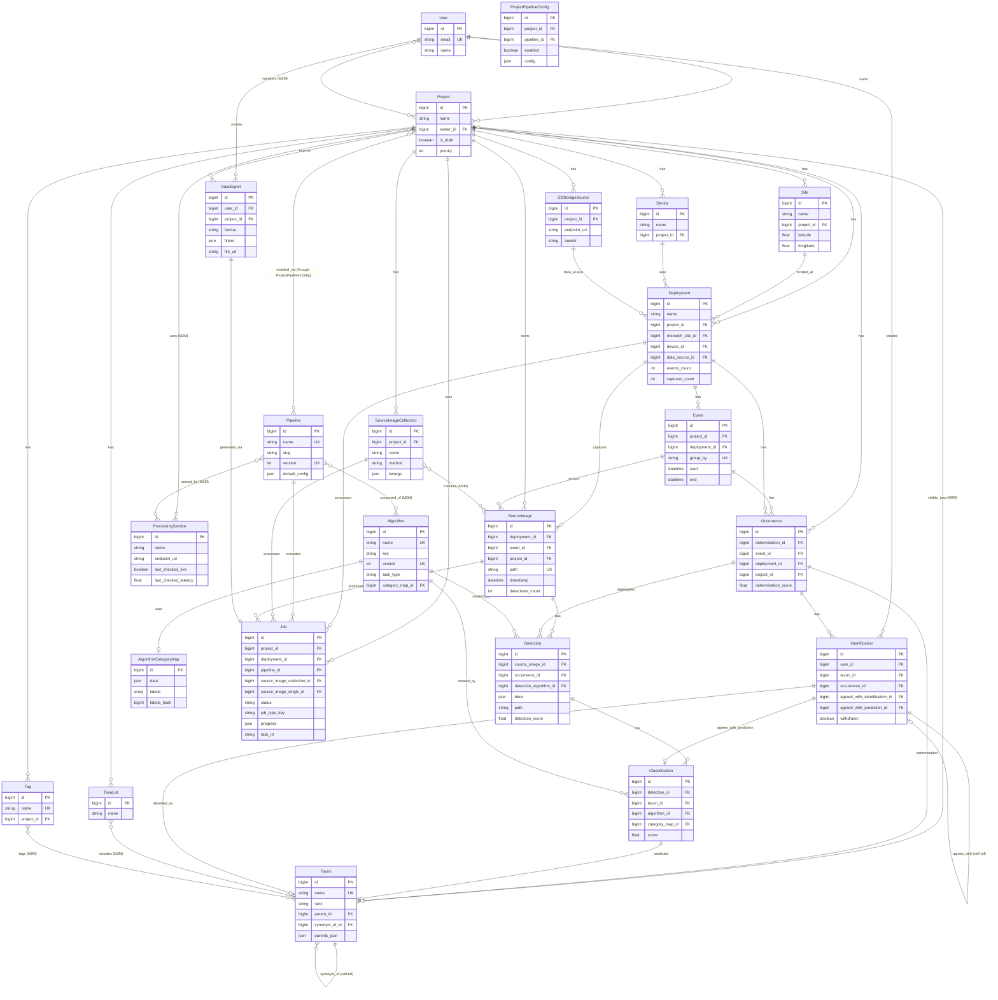

# Database Schema - Entity Relationship Diagram

This diagram shows the Antenna database schema organized by domain layers, with key relationships between them.



## Diagram Organization

- **Layer 1**: User authentication and project ownership
- **Layer 2**: Physical infrastructure (sites, devices, monitoring stations)
- **Layer 3**: Data collection (images, events, collections)
- **Layer 4**: ML processing results (detections, classifications, occurrences)
- **Layer 5**: Taxonomy and human review (species, identifications)
- **Layer 6**: ML pipeline orchestration (algorithms, pipelines, services)
- **Layer 7**: Asynchronous processing (jobs, exports)

## Key Relationship Patterns

- `||--o{` = One-to-Many (FK relationship)
- `}o--o{` = Many-to-Many (M2M relationship)
- `||--o|` = One-to-One or Many-to-One (required FK)
- `UK` = Unique constraint
- `PK` = Primary key
- `FK` = Foreign key

## Generating Updated Diagrams

If the schema changes, regenerate the Django model graph with:

```bash
docker compose run --rm django python manage.py graph_models -a -o models.dot --dot
dot -Tsvg models.dot > models.svg
```
