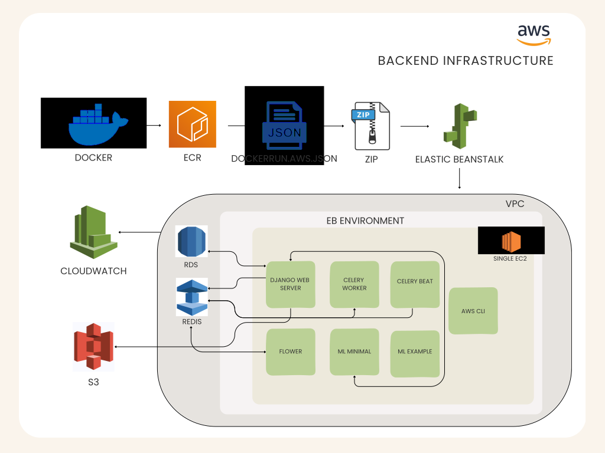
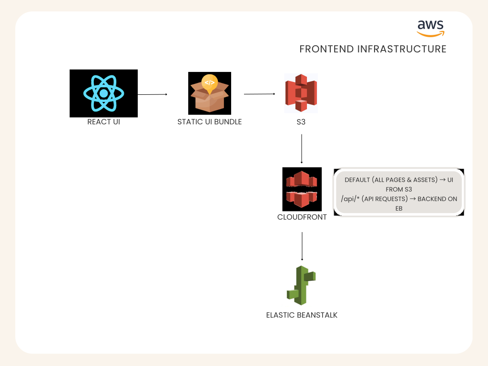

## ⚠️ Experimental AWS Deployment

> **Note:** The AWS deployment described in this document is **experimental and not supported at this time**.  
> It is intended for development, testing, and architectural exploration only and **should not be used in production**.

# Antenna Platform - Deployment & Infrastructure Guide

This document describes the AWS infrastructure and deployment pipeline for the Antenna platform.  
It is intended for maintainers and contributors who need to understand, update, or reproduce the deployed environment.

## 1. Overview

Antenna consists of two major parts:

1. **Backend (Django API + Celery Worker + Celery Beat + Flower + ML processing services + AWS CLI)** running as multiple Docker containers.
2. **Frontend (React + Vite)** built into static files, hosted on **S3**, and delivered globally via **CloudFront**.


## 1.1 Backend components (AWS)

The backend is deployed as a **multi-container** service on AWS:

- **Elastic Beanstalk (Docker on ECS)**: runs all backend containers (Django, Celery Worker, Celery Beat, Flower, ML services, AWS CLI containers as needed).
- **Amazon ECR**: stores Docker images that Elastic Beanstalk pulls at deploy/runtime.
- **Amazon RDS (PostgreSQL)**: primary application database.
- **Amazon ElastiCache (Redis with TLS)**: Celery broker and Django cache.
- **Amazon S3**: object storage (e.g., uploaded files/static/media).
- **Amazon CloudWatch**: logs, health monitoring, and Elastic Beanstalk instance metrics.

## 1.2 Frontend components (AWS)

- **S3:** Hosts the compiled **React (Vite)** static assets (HTML, JS, CSS, images).
- **CloudFront:** Delivers the UI globally from S3 and forwards **`/api/*`** requests to the backend so the UI and API are served from a single domain.

---

## 2. High-level AWS architecture

This section provides a visual, end-to-end view of how Antenna is deployed and how requests flow at runtime.
Details for each component are documented in the sections that follow.

### 2.1 Backend: build + deploy + runtime



**Figure:** AWS deployment + runtime architecture for the Antenna backend.  
Docker images for each service are built locally and pushed to Amazon ECR; Elastic Beanstalk is deployed using a ZIP bundle that includes `Dockerrun.aws.json` (pointing to the ECR image URIs). At runtime, a single Elastic Beanstalk environment (Docker on ECS, single EC2 instance) pulls those images from ECR and runs seven containers: Django (API), Celery Worker, Celery Beat (scheduler), Flower (monitoring), an AWS CLI helper container, and ML processing services.


### 2.2 Frontend: global delivery + API proxy




**Figure:** Antenna frontend web app deployment flow.
The React frontend is built into static website files and stored in Amazon S3, then delivered globally via CloudFront. CloudFront serves the UI for normal page requests and forwards /api/* requests to the Elastic Beanstalk backend (Django + Celery), which connects privately to RDS (PostgreSQL) and ElastiCache (Redis).

  
---

## 3. Elastic Beanstalk (EB)

## 3.1. Elastic Beanstalk environment

- Platform: ECS on Amazon Linux 2 (Multicontainer Docker)
- Deployment bundle includes:
  - `Dockerrun.aws.json` 
  - `.ebextensions/00_setup.config`
- Environment type:
  - Single-instance environment (used for development/testing to reduce cost). 
  - Can be upgraded later to a load-balanced environment for production.
- **Instance Configuration**
  - Architecture: `x86_64`
  - Instance types (preferred order):
    - `t3.large`
    - `t3.small`
  - Capacity type: **On-Demand instances**

- **Auto Scaling Group**
  - Uses a **single-instance ASG** (managed automatically by Elastic Beanstalk)
  - EB performs health checks on the instance

- **Security Groups**
  - EB-managed instance security group (default inbound + outbound rules)
  - Additional outbound egress security group  

- **Enhanced health reporting**  
  - Real-time system + application monitoring  
  - Free custom metric: `EnvironmentHealth`

- **Health Event Streaming**
  - Log streaming to CloudWatch Logs: Enabled  
  - Retention: 7 days  
  - Lifecycle: Keep logs after terminating environment  

- **Managed Platform Updates**
  - Enabled
  - Weekly maintenance window: Thursday @ 22:40 UTC
  - Update level: Apply **minor and patch** updates
  - Instance replacement enabled : EB replaces instance if no other updates apply.

- **Rolling Updates & Deployments**
  - Deployment policy: All at once  
  - Batch size type: Percentage
  - Rolling updates: Disabled (not needed for single instance)
  - **Deployment preferences:**
    - Ignore health check: `False`
    - Health threshold: `OK`
    - Command timeout: `600 seconds`


---

### 3.2. Docker Containers

EB ECS runs the following containers:

1. **django** - web application (the container listens on port 5000, which is exposed as port 80 on the Elastic Beanstalk host)
2. **celeryworker** - asynchronous task worker
3. **celerybeat** - scheduled task runner
4. **flower** - Celery monitoring UI (port 5555)
5. **awscli** - lightweight helper container for internal AWS commands
6. **ml-backend-minimal** - A lightweight, minimal ML processing service used to test Antenna’s processing-service API and verify ML integration. It provides basic pipelines only.
7. **ml-backend-example** - A demonstration ML backend that includes more advanced pipelines and shows how to build custom algorithms and processing flows. Intended as an example/template for extending ML capabilities.

---

### 3.3. ECR Repositories Used

All application containers pull from:

- **antenna-backend**  
  `<ECR_URI>/antenna-backend`

The AWS CLI helper container pulls from:

- **antenna-awscli**  
  `<ECR_URI>/antenna-awscli`

The ML processing services pull from:

- **antenna-ml-minimal**  
  `<ECR_URI>/antenna-ml-minimal`

- **antenna-ml-example**  
  `<ECR_URI>/antenna-ml-example`
  

All repositories are **mutable**, support versioned tags, and **AES-256 encrypted**.

---

## 3.4. Environment Variables

In this setup, **all required environment variables—including secrets—are defined inside**  
`.ebextensions/00_setup.config`.

Elastic Beanstalk automatically reads the values from this file and writes them into its  
**Environment Properties** at deployment time.  
This ensures a fully automated bootstrap with no manual EB console entry.

The deployment uses the following environment variables across these categories:

### Django
- `DJANGO_SETTINGS_MODULE`
- `DJANGO_SECRET_KEY`
- `DJANGO_ALLOWED_HOSTS`
- `DJANGO_SECURE_SSL_REDIRECT`
- `DJANGO_ADMIN_URL`
- `DJANGO_DEBUG`
- `EB_HEALTHCHECK`

### AWS / S3
- `DJANGO_AWS_ACCESS_KEY_ID`
- `DJANGO_AWS_SECRET_ACCESS_KEY`
- `DJANGO_AWS_STORAGE_BUCKET_NAME`
- `DJANGO_AWS_S3_REGION_NAME`

### Database (RDS)
- `POSTGRES_DB`
- `POSTGRES_USER`
- `POSTGRES_PASSWORD`
- `POSTGRES_HOST`
- `POSTGRES_PORT`
- `DATABASE_URL`

### Redis / Celery
- `REDIS_URL`
- `CELERY_BROKER_URL`

### ML Processing Service
- `DEFAULT_PROCESSING_SERVICE_ENDPOINT`

### Third-Party Integrations
- `SENDGRID_API_KEY`
- `SENTRY_DSN`


### 3.5. Elastic Beanstalk EC2 Instance 

- **Instance type:** `t3.large`
- **Instance profile:** `aws-elasticbeanstalk-ec2-role`
- **Service role:** `aws-elasticbeanstalk-service-role`
- Create an EC2 key pair in your AWS account and attach it to the EB environment when launching the backend. (Each developer should use their own key pair.)
- **Public IP:** Assigned
- **Security groups:**
  - EB default instance SG
  - Outbound-only egress SG (`antenna-eb-sg`)  
 

### 3.6. IAM Roles and Policies

**1. EC2 Instance Profile – `aws-elasticbeanstalk-ec2-role`**  
Attached AWS-managed policies (default from EB):
- `AWSElasticBeanstalkWebTier`
- `AWSElasticBeanstalkWorkerTier`
- `AmazonEC2ContainerRegistryReadOnly` (ECR pull)
- `CloudWatchAgentServerPolicy` (log streaming)
- S3 read/write access granted through `AWSElasticBeanstalkWebTier`  
  (used for EB deployment bundles, log archives, temp artifacts)

This role is used **by the EC2 instance itself**.  
It allows the instance to:
- Pull container images from ECR  
- Upload logs to CloudWatch  
- Read/write to the EB S3 bucket  
- Communicate with ECS agent inside the EB environment  

---

**2. Service Role – `aws-elasticbeanstalk-service-role`**  
Attached AWS-managed policies (default from EB):
- `AWSElasticBeanstalkEnhancedHealth`  
- `AWSElasticBeanstalkService`  

This role is used **by the Elastic Beanstalk service**, not the EC2 instance.  
It allows EB to:
- Manage environment health monitoring  
- Launch/update/terminate EC2 instances  
- Interact with Auto Scaling  
- Register container tasks and update ECS configuration  


---

### 3.7. Networking (EB Environment)

- **VPC:** default VPC
- **Subnets:**
  - EB instance runs in a **public subnet**
  - RDS + Redis run in **private subnets** (via their subnet groups)
- **Public access:**
  - EB EC2 instance receives a public IP
  - No load balancer (single-instance environment)
- **Connectivity:**
  - EB instance can reach RDS & Redis via SG rules
  - Internet connectivity available through AWS default routing

---

## 4. Backend Deployment Workflows 

### 4.0. Configuration Files

- `Dockerrun.aws.json`  
  Multi-container definition for Elastic Beanstalk (images + ports + container config)

- `.ebextensions/00_setup.config`  
  Elastic Beanstalk environment settings + environment variables


### 4.1 Backend deploy (Docker -> ECR -> EB)

#### Step 1 - Create the ECR repository, then build + push (Linux / AMD64)

Create an ECR repository named antenna-backend (one-time). Then build the Linux AMD64 image, tag it with the repo URI, and push:

```bash
# Build a Linux AMD64 image locally (creates a local image tag: antenna-backend:latest)
docker buildx build --platform linux/amd64 -t antenna-backend:latest --load .

# Tag the same image for the ECR repository (creates: <ECR_REPO_URI>:v10)
docker tag antenna-backend:latest <ECR_REPO_URI>:v10

# Push the image to Amazon ECR (uploads: <ECR_REPO_URI>:v10)
docker push <ECR_REPO_URI>:v10
```

#### Step 2 - Update Dockerrun.aws.json

Update the tag:

"image": "<ECR_URI>:v10"

```md
### About Docker Image Versions
`v10` is only an example placeholder.

You can use any version tag (v1, v2, v3, etc.).

How to choose a version:
- Increase the number with every build, OR
- Use semantic versions (1.0.0, 1.1.0)

Use the same tag in both:
1. `docker tag`and `docker push` commands
2. `Dockerrun.aws.json`

```

### Step 3 — Create EB bundle

zip -r deploy.zip Dockerrun.aws.json .ebextensions .ebignore


### Step 4 — Deploy to Elastic Beanstalk

- EB Console → Environment → Upload & Deploy  
- Upload `deploy.zip`  
- Wait for ECS tasks to start

### Step 5 — Validate Deployment

- `/api/v2/` returns `200`
- Django container remains healthy
- Celery worker connects to Redis successfully
- Celery Beat schedules run successfully
- Flower UI loads on port 5555 (if security groups permit)

>
> ### How to Validate this deployment?
> The points listed above describe the expected state of a successful AWS deployment.  
>
> ---
>
> ### 1. Confirming that `/api/v2/` returns a successful response
> When you open:
> ```
> https://<EB-URL>/api/v2/
> ```
> the browser shows the JSON content returned by Django.  
> This means that simply opening the URL visually confirms “the API is working,” but not the status code.
>
> To check the actual HTTP status code, use:
> ```bash
> curl -I https://<EB-URL>/api/v2/
> ```
> This command returns the HTTP headers. A successful response looks like:
> ```
> HTTP/1.1 200 OK
> ```
> This confirms:
> - Django is reachable  
> - Routing is working  
> - The container is serving requests normally  
>
> ---
>
> ### 2. Verifying that the Django container is healthy inside Elastic Beanstalk
> Elastic Beanstalk uses several internal checks to determine whether a container is “Healthy.”  
> EB marks the Django container as Healthy only if:
> - the Docker container starts without crashing. If Django crashes on startup, health becomes "Severe".
> - the app listens on the correct port (port 8000 in this project). If nothing is listening, health becomes "Warning".
> - the configured application URL returns a successful response  
>
> In this deployment, we used the `/api/v2/` endpoint for testing.  
> Once this endpoint consistently returned **HTTP 200 OK**, Elastic Beanstalk updated the  
> environment status to **Healthy**.
>
> You can confirm this in the EB Console under:  
> **Elastic Beanstalk -> Environments -> Health**
>
> ---
>
> ### 3. Confirming Celery Worker successfully connects to Redis
> Celery Worker logs show whether the process booted correctly and whether it could authenticate with Redis over TLS.
>
> We retrieved logs using:
> ```bash
> eb logs --all
> ```
> In the worker logs, we verified the connection with entries such as:
> ```
> Connected to rediss://<redis-endpoint>:6379/0
> ```
> This confirms:
> - the worker process started  
> - Redis TLS (`rediss://`) worked  
> - certificate verification settings were correct  
> - no connection retries or SSL errors occurred  
>
> ---
>
> ### 4. Confirming Celery Beat is running and scheduling tasks
> Celery Beat regularly prints a log line every time a scheduled task becomes due.
>
> In the logs retrieved above, we saw messages like:
> ```
> celery.beat: Scheduler: Sending due task <task-name>
> ```
> This indicates:
> - Beat is running continuously  
> - it is reading the schedule correctly  
> - scheduled tasks are being dispatched to the worker  
>
> ---
>
> ### 5. Confirming Flower UI loads on port 5555
> Flower exposes a monitoring dashboard on port **5555**, but it will only load if the EC2 instance’s Security Group allows inbound traffic on that port.
>
> After enabling access, visiting:
> ```
> http://<EC2-instance-public-ip>:5555
> ```
> displayed the Flower dashboard, confirming that:
> - the Flower container is running  
> - it can communicate with Redis  
> - it can display worker and task activity  
>
> ---
>
> Together, these checks confirm that the full Django + Celery + Redis deployment is healthy and functioning as expected on AWS.
---


## 5. Other Backend AWS Infrastructure Units

### 5.1. RDS (PostgreSQL)

- **Engine:** PostgreSQL 17.6
- **Instance class:** `db.t4g.small`  
- **Availability:** Single-AZ deployment (`us-west-2b`)

- **Networking**
  - Runs inside the **default VPC**
  - Uses the **private DB subnet group**: `antenna-private-db-subnet-group`
  - **Public accessibility:** Disabled (RDS is fully private)
  - Accessible only from resources inside the VPC

- **Security Group (`antenna-rds-sg`) **
  - **Inbound:**  
    - Port **5432** allowed **only** from the Elastic Beanstalk security group (`antenna-eb-sg`)
  - **Outbound:**  
    - Allowed to `0.0.0.0/0` (default outbound rule)

---

### 5.2. ElastiCache (Redis)

- **Engine:** Redis 7.1
- **Node type:** `cache.t4g.micro`
- **Cluster mode:** Disabled (single node)
- **Multi-AZ:** Disabled
- **Auto-failover:** Disabled

- **Security**
  - **Encryption in transit:** Enabled  
  - **Encryption at rest:** Enabled  
  - Redis connections must use:
    - `rediss://` (TLS endpoint)
    - `ssl_cert_reqs=none` (required for Celery / Django Redis clients)
  - **Security Group (`antenna-redis-sg`)**
    - **Inbound:**
      - Port **6379** allowed **only from the Elastic Beanstalk SG** (`antenna-eb-sg`)  
        *(Only the Django app can talk to Redis — fully private.)*
    - **Outbound:**  
      - Default allow to `0.0.0.0/0` (standard for ElastiCache)

- **Networking:**
  - Deployed into private subnets (via its subnet group)
  - Runs within the same VPC as EB and RDS

---

## 6. Frontend deployment workflow (S3 + CloudFront + EB API proxy)

This section documents how the Antenna **React + Vite** frontend is deployed to AWS using:

- **S3** to host compiled static files
- **CloudFront** to serve the UI globally and proxy API calls
- **Elastic Beanstalk (EB)** as the backend API origin for **`/api/*`**

---

### 6.1 Build the UI locally

```bash
cd ui
nvm use
yarn install
yarn build
```

This generates optimized static web assets (HTML, JS, CSS, images) that do not require a Node server.

The build output directory depends on the UI build configuration (commonly `dist/` for Vite-based projects).

### 6.2 Upload the build output to S3

- **S3 bucket:** `antenna-prod-ssec`
- Upload the **contents** of the build output directory (not the directory itself)

Expected structure in the bucket root:

- `index.html`
- `assets/` (and other static files)

### 6.3 Create / configure the CloudFront distribution

- **Distribution name:** `antenna-ui-prod`
- **Default root object:** `index.html`

#### Origins

- **S3 origin:** `antenna-prod-ssec` (serves UI static assets)
- **EB origin:** Elastic Beanstalk environment URL (serves API requests)

#### Behaviors

- **Path pattern:** `/api/*`
  - Origin: EB origin
  - Caching: Disabled
  - Viewer protocol policy: Redirect HTTP to HTTPS (or HTTPS only)

- **Default behavior:** `*`
  - Origin: S3 origin
  - Caching: Optimized
  - Viewer protocol policy: Redirect HTTP to HTTPS (or HTTPS only)

### 6.4 Invalidate CloudFront after every frontend deployment

After uploading a new UI build to S3, create a CloudFront invalidation:

- **Invalidation path:** `/*`

This forces CloudFront to fetch the latest files from S3.

### 6.5 Test production

- **UI:** `https://<CLOUDFRONT_DOMAIN>`
- **API (via CloudFront):** `https://<CLOUDFRONT_DOMAIN>/api/projects`

Request flow:

- UI requests → CloudFront → S3
- API requests (`/api/*`) → CloudFront → Elastic Beanstalk

---

## 7. Common Issues & Fixes

### Redis SSL Errors

ElastiCache requires TLS. Missing SSL args causes:

ssl.SSLCertVerificationError

**Fix:**  
Use `rediss://` and `ssl_cert_reqs=none`.

```md
### Where the Redis TLS Fix Is Applied

This project reads Redis and Celery connection settings from **Elastic Beanstalk environment variables**,  
not from Django code.

The TLS configuration (`rediss://` + `ssl_cert_reqs=none`) is defined in:

**`.ebextensions/00_setup.config`**, for example:


REDIS_URL: "rediss://<redis-endpoint>:6379/0?ssl_cert_reqs=none"
CELERY_BROKER_URL: "rediss://<redis-endpoint>:6379/0?ssl_cert_reqs=none"


Elastic Beanstalk automatically loads these values and sets them as environment variables  
inside the running containers. Django and Celery then read:

- `REDIS_URL`
- `CELERY_BROKER_URL`

directly from the EB environment.
```


### Health Check Redirect Loops

EB health checks cannot handle HTTPS.

**Fix:**  
Set `EB_HEALTHCHECK=1` and temporarily disable SSL redirect for health checks.

### Early Migrations Failure

EB sometimes runs migrations before services are ready.

**Fix:**  
`.ebextensions` migration command is set to ignore failures and retry.

---

## 8. Future Improvements

To harden the deployment and move toward a production-grade architecture, the following enhancements are recommended:

- **Move secrets to AWS Secrets Manager**  
  Centralize all sensitive variables (DB password, Redis URL, Django secret key, Sentry key, SendGrid, etc.) and replace `.ebextensions` injection with runtime retrieval.

- **Enable ElastiCache Multi-AZ + Auto-Failover**  
  Improves high availability for Celery and Django caching; eliminates single-node Redis failure risks.

- **IAM hardening and least-privilege review**  
  Replace broad EB-managed policies with reduced IAM policies scoped only to required S3, ECR, CloudWatch, and ECS resources.

- **Add CI/CD pipeline (GitHub Actions -> ECR -> EB)**  
  Automate build, tag, push of images and deployments to Elastic Beanstalk for consistent, reproducible releases.

- **Add staging environment**  
  Separate EB environment (staging) for testing migrations, image builds, and infrastructure changes before production.

- **Migrate to load-balanced EB environment (optional)**  
  Enables rolling deployments, zero-downtime updates, and better scalability.

- **Enable RDS Multi-AZ + automated backups**  
  Ensures database failover and improves disaster recovery readiness.

- **Add health checks for Celery worker & beat**  
  Custom EB or CloudWatch alarms to alert on worker failures, broker connectivity issues, or long task queues.

- The S3 bucket policy currently includes a public read rule (`Principal: "*"`, `s3:GetObject`), so objects are accessible directly from S3. There is also a CloudFront-specific   allow rule. If we want stricter security later, we can remove the public rule and allow reads **only via CloudFront (OAC).


