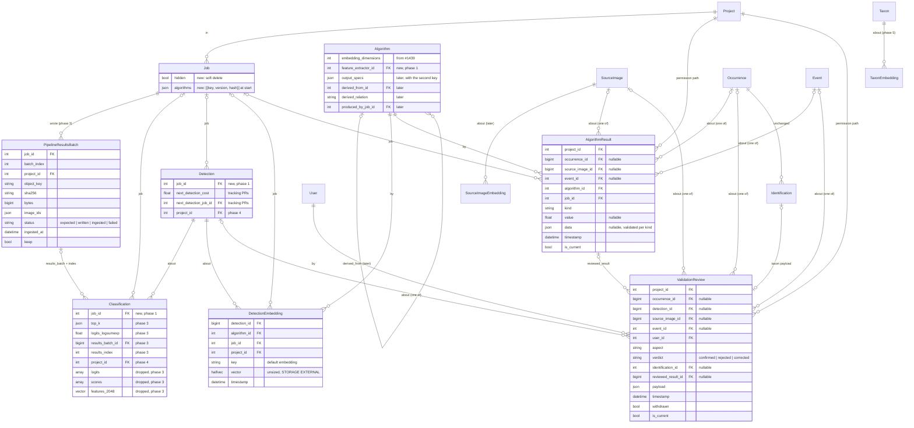

# Model outputs and human reviews: where vectors, logits, run decisions and verifications live

Status: **settled design, 2026-10-01**, after three rounds of discussion and ten research notes.
Implementation starts with phase 1 (section 10). Supersedes
`docs/claude/planning/2026-09-16-algorithm-outputs-design.md` and the storage parts of #1431
(option C there; the parts of option D that a real producer needed are back, the rest stayed out).
The alternatives that were weighed and rejected are in section 13 so the reasoning is not lost.

Sections: 1 summary · 2 what we measured · 3 how outputs are used, now and later · 4 what the
research found · 5 the design · 6 entity diagram · 7 ORM usage and endpoints · 8 the six original
questions · 9 migration · 10 phases · 11 how #1439 splits and converges with #1407 · 12 export
mapping · 13 alternatives considered · 14 verify before building · 15 decision log.

## 1. Summary

Two abstract bases and five tables, plus two that exist. Every machine-produced row names the
algorithm and the job that produced it; every human verdict names the person and what it answers.

| Table | One row is… | Target | Payload |
|---|---|---|---|
| `DetectionEmbedding` (later `SourceImageEmbedding`, `TaxonEmbedding`) | a vector from one extractor for one thing | detection / capture / taxon | `halfvec`, unsized |
| `AlgorithmResult` | what a job decided about one thing, or a number about it | occurrence, capture or session | `value` float and/or `data` JSON per `kind` |
| `Classification` (exists; a *taxon* classification) | a species label that may become the occurrence's name | detection | taxon, score, top-k, pointer to the batch file |
| `ValidationReview` | a person's verdict on one thing, per aspect | occurrence, detection, capture or session | verdict, correction, what it answers |
| `Identification` (exists) | the taxon a person chose | occurrence | taxon |
| `PipelineResultsBatch` (phase 3) | one raw service response written to object storage | job | key, hash, bytes, ingest status, retention |
| `Job` (exists; gains `hidden`, `algorithms`) | the run: settings, who, when, which models | – | params |

Logits leave Postgres: the processing service writes each batch's raw response to a presigned
URL, Antenna ingests from the file, and the file is the record for replay. Every project-scoped
row carries `project`, enforced in the database once the parents are repaired.

## 2. What we measured

Local copy of the production database, 2026-09-29 to 2026-10-01 (measured unless marked).

| Classification table | |
|---|---|
| Rows | 834,500, every one with a taxon |
| Rows with `logits` / `scores` | 307,968 / 309,384 (1,416 have scores and no logits, all from one day, 6 MB) |
| Rows with `features_2048` | 604 |
| Heap / indexes / TOAST (the two `float8[]` arrays) | 118 MB / 103 MB / **4.3 GB** |
| Where the TOAST goes | 2,497-class classifier 2.0 GB (91k rows); **29,176-class** classifier 1.6 GB (7.7k rows); 2,603-class 0.4 GB |
| `scores == softmax(logits)` | within 1e-4 for every algorithm but one 79-class model (84 rows); masked rows carry the mask only in `scores` |
| Duplicate `(detection, algorithm)` groups | 103,787; **37,776 disagree** on taxon or score |
| Logits with NaN or ±inf | 0 |

| Other | |
|---|---|
| pgvector on the production copy / on the tracking demo | 0.5.1 / 0.8.6; tracking branches install 0.8.* |
| float16 on 600 real 2,048-d vectors | max cosine shift 1.5e-4, top-1 agreement 0.982 (top-10 overlap 0.853 is a tie artefact: 3,470 pairs above 0.9999) |
| Copied `project` columns (section 4.6) | 254,814 captures with no project, 81,157 disagreeing with their deployment; 4,354 / 1,704 occurrences |
| Async results | arrive by HTTP POST to the job result endpoint; NATS carries task messages only (default 1 MB payload untouched) |

Facts that shaped the design: nothing on the hot path reads the arrays (determinations read
taxon, score, terminal; the API exposes arrays only on the classification endpoint; `top_n()`
reads one row); tracking, merge ranking and head retraining pull vectors into numpy; pgvector
stores at most 16,000 dimensions and indexes `vector` to 2,000 and `halfvec` to 4,000, so a
2,048-d backbone vector is indexable only as `halfvec`.

## 3. How the outputs are used, now and later

### 3.1 Feature vectors

| # | Use | Phase | Query shape |
|---|---|---|---|
| V1 | Link detections across adjacent captures (tracking) | 1 | vectors for ~10–100 ids, one extractor |
| V2 | Rank merge candidates, extend-mode preview | 1 | same, two captures, interactive |
| V3 | Which detections still lack a vector; coverage per extractor | 1 | anti-join; count per session and extractor |
| V4 | Retrain a classifier head from verified crops (#1407) | 1 | every vector of one backbone under verified occurrences, streamed |
| V5 | Crops that look like this one, within a project | 5 | ANN per `(algorithm, key)`, project pre-filter |
| V6 | Zero-shot suggestions against taxon text vectors (BioCLIP) | 5 | detection vector vs taxon vectors of the same algorithm, restricted to a tagged taxa set |
| V7 | Cross-night clustering, bulk annotate or flag a cluster | 6 | bulk read of one extractor for a project; clusters as tags |
| V8 | Most distinct captures of a night | 6 | farthest-first over capture vectors; result stored per session |
| V9 | Out-of-distribution scoring | 6 | detection vectors vs taxon class means, prototypes or a reference set; score stored per occurrence |
| V10 | Reduced vectors for plots (PCA, UMAP) | 6 | computed from stored raw vectors; PCA as a derived algorithm, UMAP never stored |

Every one filters on **one algorithm and key** and on a set of targets. None needs the vector
on the `Detection` row.

### 3.2 Logits and scores

| # | Use | Phase | Served by |
|---|---|---|---|
| L1 | Top-N labels of one classification | 3 | `Classification.top_k` |
| L2 | Class masking | 3 | logits in memory at ingest; re-mask later from batch files |
| L3 | Calibration and OOD research | 3 | batch files, read in bulk |
| L4 | Full array on the API | 3 | on-demand read from the batch file |
| L5 | Determination, evaluation, exports, list views | – | never read the arrays |

### 3.3 Run decisions and numbers

| # | Use | Phase | Served by |
|---|---|---|---|
| P1 | Occurrence timeline (#1433) | 2 | `AlgorithmResult` by occurrence, merged with reviews, identifications, predictions |
| P2 | What did this job do | 2 | `AlgorithmResult` by job; `job` on every output table |
| P3 | Compare two tracking runs on one session | 2 | by job, grouped by occurrence |
| P4 | Score tracking against confirmed tracks | 2 | `AlgorithmResult × ValidationReview` on occurrence, `kind = aspect` |
| P5 | Tune the cost threshold from real links | tracking PRs | link cost on `Detection`; candidate matrices in a file per job |
| P6 | Filter and sort occurrences by a number (OOD, novelty, track stats) | 6 | `AlgorithmResult.value` with `is_current` |
| P7 | Capture quality flags: person present, test image, blur, exposure | 6 | `AlgorithmResult` with the capture target |
| P8 | Representative captures per session; night-level validity | 6 | `AlgorithmResult` with the session target |
| P9 | A verdict with reasons from an LLM or decision model | later | `AlgorithmResult.data` with a registered kind |

### 3.4 Human verification

| # | Use | Phase | Served by |
|---|---|---|---|
| R1 | Confirm or correct a species | 2 | `Identification` (unchanged) + a `ValidationReview(aspect=identification)` row |
| R2 | Mark a track complete and accurate | 2 | `ValidationReview(aspect=grouping)` with the detection ids at review time |
| R3 | Accept, reject, adjust a bounding box | later | `ValidationReview` with the detection target |
| R4 | Confirm a capture flag (person present, test image); count | 6 | capture target |
| R5 | Evaluate any algorithm against people, per aspect | 2 | one symmetric join |
| R6 | Which occurrences count as verified for training and exports | 2 | `ValidationReview.current(aspect=identification)` |

## 4. What the research found

Full notes with sources in `docs/claude/research/` (index in its README). The findings that
decided something:

1. **Prediction stores and provenance** (`2026-09-29-mlops-prediction-stores-and-provenance.md`):
   row key is (input, model version); every system has one run row that outputs reference and
   nobody copies settings per output; derived models carry a typed parent relation and the
   producing run; top-k without the normaliser biases calibration.
2. **Postgres arrays and pgvector** (`2026-09-29-postgres-float-arrays-and-pgvector.md`): float
   arrays compress ~1.2x, so `STORAGE EXTERNAL`; in-place vector updates bloat TOAST, so
   insert-mostly; `real[]` casts to `halfvec` with partial expression indexes.
3. **Machine vs human records** (`2026-09-29-biodiversity-and-annotation-platforms.md`): TRAPPER
   (AI, USER, FINAL rows, never overwrite the AI row, a pointer to what was approved), Label
   Studio (prediction vs annotation), iNaturalist (withdrawn rows kept; CV suggestions not stored
   and therefore not evaluable), Camtrap DP and Darwin Core field mappings.
4. **Table topology and naming** (`2026-09-29-polymorphic-output-tables-and-naming.md`): nouns
   are named by role, never by target; exclusive-arc FKs are fine for integrity but not for mixing
   millions of cold wide rows with hot small ones; Wagtail avoided generic FKs for permission
   paths.
5. **InvokeAI** (`2026-10-01-invokeai-storage-schema.md`): run record as one JSON blob, tensors
   on disk with a name in the row, model identity pinned by hash in the run.
6. **Denormalised `project`** (`2026-10-01-denormalised-project-fk.md`): the copies already
   drift (table above); composite foreign keys make drift impossible; issue #1453.
7. **Vector databases** (`2026-10-01-vector-database-data-models.md`): `(target, algorithm, key,
   vector)` is the relational form of named vectors; model identity on the field, tenancy as a
   filterable key with co-location; re-embed by adding a key and dropping the old.
8. **Applications** (`2026-10-01-applications-storing-embeddings.md`): PhotoPrism, FiftyOne,
   clip-retrieval and the BioCLIP authors' TreeOfLife parquet record the model on the row or run
   and run several side by side; Immich records nothing and can only wipe and recompute.
9. **Lifecycle** (`2026-10-01-embedding-lifecycle-practices.md`): selective filters break HNSW
   (exact scan for small projects); kNN OOD beats Mahalanobis but needs a reference set; CLIP
   image vectors are reconstructible, so gate capture embeddings on people detection.
10. **Verification pass** (`2026-10-01-verification-pass.md`): Django 4.2 is sufficient;
    composite FKs stay raw SQL; pgvector 0.7 for `halfvec`, 0.8 for iterative scans; store
    BioCLIP's projected, normalised output; results travel by HTTP.

## 5. The design

### 5.1 Provenance: `Job` is the run

`Job` already is the execution record (project, type, pipeline or task, `params.config`,
status, timestamps, who started it). It gains `hidden` (soft delete: jobs with outputs are never
hard-deleted) and `algorithms`, a snapshot `[{key, version, hash?}]` taken at start so a replay
survives a re-registration. Every writer runs inside a job, management commands included,
through a one-line helper. Every algorithm-output table carries `job` (`PROTECT`), including
`Classification` and `Detection`, which gain a nullable `job` in phase 1 (existing rows stay
null). A retry keeps the job id; a comparison of settings is two jobs.

### 5.2 Result files: the raw response is the record

Phase 3. The processing service writes each batch's raw `PipelineResultsResponse` (gzipped
JSON) to a presigned URL that Antenna generated; the HTTP response or NATS message carries only
`{results_ref: {key, sha256, bytes}}`. The inline response stays as a fallback and services
declare `supports_result_upload` in `/info`. `PipelineResultsBatch(job, batch_index, project,
object_key, sha256, bytes, image_ids, status: expected → written → ingested → failed,
ingested_at, keep)` is the ledger: ingest is retryable per batch, a lost notification is
recovered by listing rows still expected, the results-stage progress is derived from it, and the
admin shows kept and missing files per job. Ingest parses the file with the same pydantic model
as today, creates detections (box-matched), classifications with `top_k`, `logits_logsumexp`,
`results_batch` and `results_index`, embeddings, then runs class masking in memory when the
project has a list. `Classification.logits()` loads from the file on demand with a per-process
cache. `logits`, `scores`, `features_2048` and `Detection.similarity_vector` are dropped after a
one-time export of the existing arrays to batch files.

### 5.3 Embeddings

Abstract `AlgorithmOutput` (algorithm, job, timestamp) → abstract `Embedding` (key, vector,
project, a dims check) → one concrete table per target, five lines each:

- `DetectionEmbedding(detection, …)` in phase 1, `project_accessor = "project"`.
- `SourceImageEmbedding(source_image, …)` when a capture-level extractor exists, gated on a
  people-detection flag.
- `TaxonEmbedding(taxon, …)` in phase 5; public like `Taxon` (no project); keys `text`,
  `text_taxonomic`, later `class_mean` and `prototype`.

Column: `halfvec`, unsized, `STORAGE EXTERNAL`; non-finite values rejected on write. Unique
`(target, algorithm, key)`; insert-mostly (a re-run with an identical vector skips the write; a
new vector is delete + insert). `key` defaults to `embedding`; a second key (projection, CLS,
text side) is declared in `Algorithm.output_specs` when it first appears; until then
`Algorithm.embedding_dimensions` from #1439 is enough. Variants rule: **produced in the same
forward pass ⇒ another key of the same algorithm; computed later from stored outputs (PCA,
prototypes, a retrained head) ⇒ a derived `Algorithm`** with `derived_from`, `derived_relation`
and `produced_by_job`, added when the first one exists. `Algorithm.feature_extractor` (the
backbone whose `embedding` a head consumes) is added in phase 1 because #1407 needs it.
Comparisons are always within one `(algorithm, key)`; the queryset API has no method that mixes
two. Store BioCLIP's projected, L2-normalised output. ANN: a partial HNSW index per `(algorithm,
key)` when the first similarity endpoint ships; small projects use an exact scan.

### 5.4 `AlgorithmResult`

One table for everything a job decided or measured about an occurrence, capture or session:
`(project, occurrence? | source_image? | event?, algorithm, job, kind, value?, data?, timestamp,
is_current)`, `CHECK num_nonnulls(targets) = 1`, at least one of `value` and `data` set. `data`
is validated by a registry per `kind` (tracking: frames linked, merged ids, cost stats, taxon
before and after, per-frame link costs; class masking; size filter; representative captures;
future LLM verdicts). `value` is the number lists filter and sort on (OOD score, novelty, track
motion, person-present probability, blur); the writer clears `is_current` on the previous row
for the same target, algorithm and kind, so history stays and "current" is one indexed lookup.
Partial unique `(target, algorithm, kind) WHERE is_current`; partial index `(project, kind,
value) WHERE is_current AND value IS NOT NULL`; index `(occurrence, -timestamp)` and `(job)`.
It is #1439's `OccurrenceHistoryRecord(kind=algorithm_result)` renamed and widened; the reviews
it held move out. Rows are narrow; no array ever goes here.

### 5.5 `Classification` is a taxon classification

Every one of 834,500 rows has a taxon; category maps map labels to taxa; `predictions()` and the
determination read it. It is treated as `TaxonClassification` and the docstring says so;
non-taxon labels never enter it. Non-taxon outputs have homes: a probability per capture or
occurrence is an `AlgorithmResult.value`; a structured verdict is `AlgorithmResult.data`;
multi-label tags per detection get a small `DetectionTag` table when a tagger exists.
Changes to `Classification`: `job` (phase 1); `top_k` `[[class_index, score], …]`,
`logits_logsumexp`, `results_batch`, `results_index` (phase 3); `logits`, `scores`,
`features_2048` dropped (phase 3); `project` (phase 4).

### 5.6 `ValidationReview`

One table for every human verdict, mirroring `AlgorithmResult`: `(project, occurrence? |
detection? | source_image? | event?, user, aspect, verdict, identification?, reviewed_result?,
payload, timestamp, withdrawn, is_current)`. `aspect` is one vocabulary across targets
(`identification`, `grouping`, `bbox`, `count`, `person_present`, `night_valid`); `verdict` is
`confirmed | rejected | corrected`, the correction in `payload` or via `identification`;
`reviewed_result` points at the `AlgorithmResult` the verdict answers (TRAPPER's source pointer,
Web Annotation's target); `is_current` holds one active row per `(target, aspect, user)`, with
history kept through `withdrawn`. `Identification` stays (it feeds the determination and has
agreement links) and writes a review row on save; `grouping_verified_at/by` on `Occurrence`
remain as the cache of the latest grouping review. Evaluation of any algorithm against people
is one symmetric join: `AlgorithmResult × ValidationReview` on the same target column with
`kind = aspect`; "truly out of distribution" is derivable as a reviewed taxon outside the
classifier's category map, with no new aspect.

### 5.7 `project` on every project-scoped row

Every new table carries `project`, NOT NULL, with `project_accessor = "project"`. Enforcement is
a composite foreign key `(parent_id, project_id) REFERENCES parent (id, project_id)` added by
`RunSQL` beside Django's FK, `ON UPDATE CASCADE`, which makes a wrong or stale copy impossible
including through bulk writes. It needs `UNIQUE (id, project_id)` on the parent and a non-null
parent project, so the order is: repair the existing capture and occurrence rows and add a
mismatch check (#1453, phase 0) → `Detection.project` retrofit (phase 4) → constraints on the
new tables. Until then one shared helper fills `project` from the parent in `save()` and every
bulk path, and the check watches it. `TaxonEmbedding` has no project.

### 5.8 Sets, tags and the processing-service contract

Occurrence sets and tags on occurrences and taxa are coming; evaluation sets, training-set
membership, cluster membership and bulk annotation are then one mechanism (a tag with `job` or
`user` on the assignment), and "taxa in a list" becomes "taxa with a tag". Nothing here designs
a cluster-membership table. The wire contract keeps `DetectionResponse.embeddings`
(`{algorithm, features}`) as #1439 and the processing-service PRs define it; phase 3 adds the
result sink; phase 5 adds a text-embedding call. `ami/ml/schemas.py` stays free of Antenna
concepts, so #1407's `training_info.job_id` moves out of it.

### 5.9 What goes where, by producer

| Producer | Writes |
|---|---|
| Classifier pipeline | `Classification` (+ `top_k`, batch pointer) · `DetectionEmbedding` when vectors are sent · `PipelineResultsBatch` |
| Feature-only pipeline | `DetectionEmbedding` only |
| Tracking | `Detection.next_detection` + cost + job · `AlgorithmResult(kind=tracking)` per occurrence · a determination `Classification` when the name changed · candidate matrix as a file |
| Class masking | new `Classification` · `AlgorithmResult(kind=class_masking)` |
| Size filter | new `Classification` · `AlgorithmResult(kind=size_filter)` |
| OOD, quality flags, representative captures | `AlgorithmResult` with `value` (and per-frame `data`) on occurrence, capture or session |
| Head retraining (#1407) | reads `DetectionEmbedding(algorithm=head.feature_extractor)`; writes a derived `Algorithm` |
| Prototypes, PCA | derived `Algorithm` + `TaxonEmbedding(key=prototype)` / `DetectionEmbedding` under it |
| A person | `Identification` + `ValidationReview(aspect=identification)`; "mark complete" → `ValidationReview(aspect=grouping, reviewed_result=…)` |

## 6. Entity diagram



Constraints and indexes: `DetectionEmbedding` unique `(detection, algorithm, key)`; partial
HNSW per `(algorithm, key)` later. `AlgorithmResult` and `ValidationReview`: `CHECK
num_nonnulls(targets) = 1`; partial unique on `(target, algorithm | user, kind | aspect) WHERE
is_current`; indexes `(occurrence, -timestamp)`, `(job)`, and `(project, kind, value) WHERE
is_current AND value IS NOT NULL`. `PipelineResultsBatch` unique `(job, batch_index)`.
Composite project FKs per section 5.7.

## 7. ORM usage and endpoints

Proposed queryset methods (signatures follow `docs/claude/reference/query-patterns.md`):

| Queryset | Methods |
|---|---|
| `EmbeddingQuerySet` (shared) | `for_algorithm(algorithm, key="embedding")`, `nearest(vector, k)`, `as_dict()`, `as_matrix()`, `coverage()`, `in_project(project)` |
| `DetectionEmbeddingQuerySet` | `for_detections(ids)`, `in_event(event)`, `verified(project)`, `for_taxa(tag_or_list)`, `with_labels()`, `training_arrays()` |
| `DetectionQuerySet` | `missing_embedding(algorithm, key)` |
| `TaxonEmbeddingQuerySet` | `for_taxa(tag_or_list)` |
| `AlgorithmResultQuerySet` | `for_occurrence`, `for_capture`, `for_event`, `for_job`, `of_kind`, `current()`, `with_review(aspect)`, `changed_determination()` |
| `ValidationReviewQuerySet` | `current(aspect, verdict=None)`, `answering(result)`, `in_project` |
| `PipelineResultsBatchQuerySet` | `for_job`, `pending`, `ingested`; instance `load()` |
| `ClassificationQuerySet` | `with_logits()` (batched by file) |

```python
# Tracking: vectors for two adjacent captures, one extractor
vectors = (DetectionEmbedding.objects.for_algorithm(extractor)
           .for_detections([d.pk for d in (*current, *nxt)]).as_dict())

# Feature-only job: what still needs a vector; coverage for the tracking form
todo = Detection.objects.valid().filter(source_image__event=event).missing_embedding(extractor)
coverage = DetectionEmbedding.objects.in_event(event).coverage()

# GET /detections/{id}/similar/?algorithm=12&k=20&project_id=18   (phase 5)
anchor = get_object_or_404(DetectionEmbedding, detection_id=pk, algorithm=algorithm, key="embedding")
hits = (DetectionEmbedding.objects.for_algorithm(algorithm).in_project(project)
        .exclude(detection_id=pk).nearest(anchor.vector, k=20)
        .select_related("detection__occurrence__determination"))

# GET /detections/{id}/suggested-taxa/?algorithm=bioclip&taxa=<tag>   (phase 5, zero-shot)
taxa = (TaxonEmbedding.objects.for_algorithm(bioclip, key="text_taxonomic")
        .for_taxa(tag).nearest(anchor.vector, k=5).select_related("taxon"))

# Train a logistic-regression head on verified crops for a tagged set of taxa
rows = (DetectionEmbedding.objects.for_algorithm(backbone).verified(project)
        .for_taxa(tag).with_labels().order_by("pk"))
X, y, detection_ids, occurrence_ids = rows.training_arrays()
split = split_by_occurrence(occurrence_ids, salt=job.params["config"]["split_salt"])
clf = LogisticRegression(max_iter=1000).fit(X[split.train], y[split.train])
head = Algorithm.objects.register_derived(
    name=f"{backbone.name} head · {tag.name}", derived_from=previous_head or backbone,
    derived_relation="head_retrain", feature_extractor=backbone, produced_by_job=job,
    category_map=AlgorithmCategoryMap.for_taxa(tag), uri=store_head(job, clf))

# Prototypes per taxon (nearest-centroid classes, no training)
centroids = (DetectionEmbedding.objects.for_algorithm(backbone).verified(project).with_labels()
             .values("taxon_id").annotate(vector=Avg("vector"), n=Count("pk")).filter(n__gte=5))
TaxonEmbedding.objects.bulk_create(
    [TaxonEmbedding(taxon_id=c["taxon_id"], algorithm=prototype_alg, job=job, key="prototype", vector=c["vector"])
     for c in centroids],
    update_conflicts=True, unique_fields=["taxon", "algorithm", "key"], update_fields=["vector", "job"])

# Ingest a batch the service wrote; mask while the logits are in memory   (phase 3)
for batch in PipelineResultsBatch.objects.for_job(job).pending():
    results = batch.load()
    detections = create_detections(results, batch)
    classifications = create_classifications(results, detections, batch)   # top_k, logsumexp, batch pointer
    create_embeddings(results, detections, batch)
    if (taxa := project.default_taxa_list):
        mask_in_memory(results, classifications, taxa)                      # + AlgorithmResult(kind=class_masking)
    batch.mark_ingested()
logits = classification.logits()                                            # on demand, from the file

# OOD scoring run: one value per occurrence, per-frame detail in data   (phase 6)
AlgorithmResult.objects.record(
    occurrence=occ, algorithm=ood_alg, job=job, kind="ood_knn",
    value=max(scores.values()), data={"per_detection": scores, "reference": ref_alg.key})

# Occurrence list filter: current OOD score above a threshold
Occurrence.objects.filter(
    algorithm_results__kind="ood_knn", algorithm_results__is_current=True,
    algorithm_results__value__gt=0.8, project=project)

# Timeline and job audit
timeline = merge_by_time(
    AlgorithmResult.objects.for_occurrence(occ).select_related("algorithm", "job"),
    ValidationReview.objects.filter(occurrence=occ, withdrawn=False).select_related("user"),
    occ.identifications.select_related("user", "taxon"), occ.predictions_per_algorithm())
renamed = AlgorithmResult.objects.for_job(job).of_kind("tracking").changed_determination().count()

# Evaluation: tracking vs confirmed tracks; a head vs identifications
pairs = AlgorithmResult.objects.for_job(job).of_kind("tracking").with_review(aspect="grouping")
precision = pairs.filter(review_verdict="confirmed").count() / pairs.exclude(review_verdict=None).count()
truth = (ValidationReview.objects.in_project(project).current(aspect="identification")
         .exclude(verdict="rejected").values_list("occurrence_id", "identification__taxon_id"))

# POST /occurrences/{id}/reviews/   (mark a track complete)
ValidationReview.objects.create(
    occurrence=occ, project=occ.project, user=request.user, aspect="grouping", verdict="confirmed",
    reviewed_result=AlgorithmResult.objects.for_occurrence(occ).of_kind("tracking").latest("timestamp"),
    payload={"detection_ids": list(occ.detections.values_list("pk", flat=True))})
occ.refresh_grouping_cache()
```

Endpoints: `GET /events/{id}/feature-extractors/` (exists on #1439) · `GET
/occurrences/{id}/history/` (exists on #1439) · `POST /occurrences/{id}/reviews/`, `PATCH
…/reviews/{rid}/` (phase 2) · `GET /ml/training-data/?algorithm&taxa&format=npz` (#1407 plus
the taxa filter) · `GET /jobs/{id}/batches/` and a re-ingest action (phase 3) · `GET
/classifications/{id}/?include=logits` (phase 3) · `GET /detections/{id}/similar/` and
`/suggested-taxa/` (phase 5) · `GET /captures/{id}/similar/` (later).

## 8. The six original questions

1. **Logits.** Out of Postgres: the raw batch response in object storage is the record;
   `Classification` keeps `top_k` and `logits_logsumexp` for the UI and calibration-safe
   truncation; masking runs in memory at ingest and can re-run from files.
2. **PCA and reduced versions.** A fitted transform is a derived `Algorithm` with a typed
   parent relation and the producing job; its outputs are ordinary embedding rows under it.
   Matryoshka truncation only applies to models trained for it.
3. **Several embeddings from one algorithm.** Same forward pass ⇒ separate declared keys, each
   with its own dimension; comparisons within one `(algorithm, key)`.
4. **Semantic and text embeddings.** Same algorithm, keys `image_embedding` and
   `text_embedding`; taxon text vectors in `TaxonEmbedding`; query vectors never stored.
5. **LLM or structured verdicts.** `AlgorithmResult.data` with a registered kind, on the
   occurrence, capture or session.
6. **Review model.** `ValidationReview`, one table for every target and aspect, pointing at
   what it answers, with `Identification` kept as the taxon payload.

## 9. Migration

1. **Phase 1 schema**: `DetectionEmbedding`, `job` on `Classification` and `Detection`,
   `Algorithm.feature_extractor`; #1439's `DetectionEmbedding` migrations rewritten (the table
   never held production data; dropped if present on a development database); #1407 drops its
   copy. Soft-delete and snapshot columns on `Job` (phase 2).
2. **Phase 2 data**: #1439's history rows become `AlgorithmResult` (empty outside development);
   one `ValidationReview` per `Identification` (16,642 rows) and per `grouping_verified_at`.
3. **Phase 3 data**: dual-write arrays and files for one release; export the 307,968 rows with
   logits to batch files (scores only where not softmax, the 1,416 scores-only rows as they
   are); switch readers; drop the four array columns; `VACUUM FULL` or `pg_repack` on the
   classification table (operations).
4. **Phase 4 data**: repair capture and occurrence `project` (phase 0 prerequisite), backfill
   `Detection.project` in batches, add composite FKs `NOT VALID` then `VALIDATE`, then
   `NOT NULL`, indexes `CONCURRENTLY`.

## 10. Phases

| Phase | Contents | Depends on |
|---|---|---|
| 0 · Prerequisites | pgvector 0.8 on every database (operations); #1272's 2048 validator relaxed to drop-and-warn; capture and occurrence `project` repair plus a mismatch check as a `check_data_integrity` pair (#1188, #1453); fix the ignored `--dry-run` in `fix_missing_relationships` | – |
| 1 · Embeddings foundation | abstract `AlgorithmOutput` and `Embedding`; `DetectionEmbedding`; `job` on `Classification` and `Detection`; `Algorithm.feature_extractor`; box-matched writer; feature-only job; reader module; tracking and merge ranking read it; `Classification` docstring. Carved from #1439 (section 11). #1407 rebases onto it | 0 |
| 2 · Results and reviews | `AlgorithmResult`; `ValidationReview` with identification rows and the grouping cache; `Job.hidden` and `Job.algorithms`; history endpoint; timeline UI | 1 |
| 3 · Result files | result-sink contract on both sides; `PipelineResultsBatch`; ingest stage with heartbeat and derived progress; `Classification.top_k`, `logits_logsumexp`, `results_batch`, `results_index`; one-time export; drop the array columns; admin metrics on kept and missing files; class masking at ingest | 1 |
| 4 · Project enforcement | `Detection.project` and `Classification.project` retrofit; composite FKs on the new tables; `update_children()` corrects wrong values; the move command covers the new tables | 0, 1, 2 |
| 5 · Similarity and taxon vectors | text-embedding contract; `TaxonEmbedding`; partial HNSW indexes; similar-crops and suggested-taxa endpoints with plan selection by project size; `output_specs` with the second key | 1, 3 |
| 6 · Research features | OOD scores, person and test-image flags, representative captures as `AlgorithmResult` values; prototypes and lineage fields; cross-night clustering with tags; `SourceImageEmbedding` with the people gate | 2, 5 |

Phases 1 and 2 are the tracking sprint's path; 3 and 4 pay for themselves in storage and query
cost; 5 and 6 are what the vectors exist for.

## 11. How #1439 splits and converges with #1407

#1439 commits by destination (hashes on `feat/occurrence-history-and-embeddings`):

| Destination | Commits |
|---|---|
| **Phase 1 PR** (base `main` or #1272) | `eaa654af` store a vector for every detection, `4eae25ed`, `f8b3eb8a` any length + fill in for existing detections, `d86a402c`, `9831afec` `fac78717` `91b9f62e` `23b44ca8` `a122b897` `f5aae46d` `5b95f02b` `32da6cfb` feature-only job rules, `9b2ae7ce` `e2fc8067` tests, `33f4144b` tracks CSV, `2b802541` `a190dd70` `dee996e9` docs; then `95e2bdb6` `0f644ae2` `001485cf` `6f14d0c8` tracking reads the stored vectors (base #1272). Re-targeted at `DetectionEmbedding` with `job`, `project`, `key`, `halfvec` |
| **Phase 2 PR** (base phase 1 + #1432) | `91dbe9a8` history table → `AlgorithmResult` + `ValidationReview`, `4cd69425` writers, `dea7a5ea` endpoint, `f0d1f577`, `b52eb979`, `a3e31dcb` `dc5345cd` `d8c2b13c` review semantics, `1350b819`, `8c892444` `e33406be` tests, `ccf3f3ce`; UI `655a7c9b` `f01bfdfa` `cf02f55e` `6f2b642f` `271515ca` `370ab688` `dd92ce55` `94a68430` `8d672f2c` `1e35f58b` `847b839e` |
| **Phase 3 PR** | new |

**One embeddings model with #1407.** The vector is keyed to the backbone (`algorithm = the
extractor`), unsized `halfvec`, written box-matched with the job recorded, requested at request
time (no post-inference storage flag), on the wire as `DetectionResponse.embeddings`. #1407
keeps its train and evaluate job types, `AlgorithmEvaluation`, `OccurrenceSet` (likely a tag
later), `TrainingSetMembership`, `trainable`, `training_config`, `training_info` (minus
`parent_algorithm_key` and `job_id`), the `/train` dispatch and the training-data endpoint,
reading `DetectionEmbedding.objects.filter(algorithm=head.feature_extractor, key="embedding")`.
It drops `ami/ml/models/embedding.py`, `ml/0029`, its positional writer, `EMBEDDING_DIMENSIONS`,
the `store_classification_embeddings` flag and `GenerateEmbeddingsJob` (the feature-only job
with a "verified only" scope replaces it), and renumbers its migrations after phase 1's.
Landing order: #1272 (validator relaxed) → phase 1 → #1407 rebased → #1432 → phase 2 → #1442;
#1423 after #1407; on the processing-service side, features-for-all-detections before the
BioCLIP classifier.

## 12. Export mapping

| Ours | Camtrap DP observation | Darwin Core |
|---|---|---|
| `Classification` (top label) | `classificationMethod=machine`, `classifiedBy=<algorithm key + version>`, `classificationProbability=score`, `classificationTimestamp`, `observationLevel=media`, `mediaID`, bbox 0–1 | contributes to `basisOfRecord=MachineObservation` when no human identification exists |
| `ValidationReview(aspect=identification)` / `Identification` | `classificationMethod=human`, `classifiedBy=<reviewer>`, `observationLevel=event`, `eventID` | Identification class: `identifiedBy`, `dateIdentified`, `identificationVerificationStatus` (from `verdict`), `identificationRemarks` |
| embeddings, `AlgorithmResult`, batch files | no place; internal | no place; internal |

## 13. Alternatives considered

| Dimension | Rejected | Why |
|---|---|---|
| Topology for arrays | one physical table for all targets (exclusive arc) | millions of cold wide rows would share heap, indexes and vacuum with hot rows; per-target tables cost five lines each |
| Topology for results and reviews | one table per target (`OccurrenceOutput`, `OccurrenceReview`) | rows are few and hot, so the exclusive arc with a `project` column is fine; names by target describe the FK, not the thing |
| Logits in Postgres | `real[]` side table or rows beside embeddings | 4.3 GB cold data in the hot store, a 307k-row backfill, and no raw record for replay; files give replay and research reads for free |
| Array column | `real[]` with pgvector by cast | the 16,000-dim cap only mattered for logits; with logits in files, native `halfvec` indexes 2,048-d and halves storage |
| Run provenance | `AlgorithmRun` table | `Job` already is the run; soft delete and a snapshot close its two gaps |
| Measurements | `OccurrenceMeasurement`, `SourceImageMeasurement` | `AlgorithmResult.value` + `is_current` covers them and keeps history |
| Per-detection scalars and links | `DetectionMeasurement`, `DetectionLink` | detections × candidates is tens of millions of rows per re-track; accepted link on `Detection`, candidates in a file |
| Variants | a `kind` enum, or a new algorithm for every variant | declared keys for same-pass outputs, derived algorithms for computed ones |
| Generic JSON output table for every target | #1431 option B / September's `AlgorithmOutputRecord` | no permission path; `AlgorithmResult.data` per target gives the same flexibility |
| Lineage fields now | `derived_from`, `derived_relation`, `produced_by_job`, `output_specs` in phase 1 | deferred to the first derived model or second key; `feature_extractor` is the only one #1407 needs |

## 14. Verify before building

- Phase 1: `EXPLAIN (ANALYZE)` V1 and V3 on the largest project with the unique index only; the
  feature-only job on a development stack to produce real 1,024-d vectors, then the float16
  neighbour check on them; pgvector 0.8 confirmed on production and staging.
- Phase 2: `is_current` writer under concurrent runs; query count on the timeline with a
  multi-row fixture.
- Phase 3: gzipped size of one real batch; masking-at-ingest latency on a large batch; S3 read
  throughput for a re-mask over one project; the export of old arrays on the copy, with
  `top_n()` identical before and after; `cachalot` exclusions for the new tables.
- Phase 4: the capture repair on the copy; composite FK `VALIDATE` time on the detection table;
  Detection count `EXPLAIN` before and after.
- Phase 5: the partial HNSW index on `halfvec` builds and the planner uses it under the project
  filter; recall on our models; exact-scan threshold by project size.
- Still open from research: a neutral ANN benchmark; which BioCLIP tap suits head training best
  (the paper uses the projected output for nearest-centroid).

## 15. Decision log

| Date | Decision |
|---|---|
| 2026-09-29 | Reopen #1431's storage design; design for post-processing outputs first; one home for vectors and logits; explore several approaches; think about practical use; treat #1407 as first-class; research external systems |
| 2026-10-01 | Names: abstract `AlgorithmOutput`; `DetectionEmbedding`; `AlgorithmResult`. No per-target "Output" names |
| 2026-10-01 | No `DetectionLink` table; candidates to files |
| 2026-10-01 | `AlgorithmResult` polymorphic over occurrence, capture, session with `project` |
| 2026-10-01 | `Job` is the run; soft delete; `job` on every output table including `Classification` and `Detection` |
| 2026-10-01 | Measurements folded into `AlgorithmResult.value` with `is_current`; capture quality flags served the same way |
| 2026-10-01 | Logits leave Postgres via the presigned result sink; `PipelineResultsBatch` is a model, phase 3 only; export old arrays once; keep files with visibility; masking at ingest |
| 2026-10-01 | `halfvec`; the first deployment with vectors starts on pgvector 0.8 |
| 2026-10-01 | `Classification` is a taxon classification, said in the docstring |
| 2026-10-01 | `ValidationReview`, one table for every target |
| 2026-10-01 | Prototypes public; private taxa lists and managed public lists are coming; sets and clusters as tags |
| 2026-10-01 | Issue #1453 posted as a preliminary plan for the project column |
| 2026-10-01 | Six phases; landing #1272 → phase 1 → #1407 rebased |

## References

- Issues and PRs: #1431, #1433, #1417, #1439, #1407, #1442, #1272, #1432, #1423, #1133, #1188,
  #1192, #1453; processing-service PRs for features on all detections and the BioCLIP classifier.
- Code: `ami/main/models.py` `Classification`, `Detection`, `Occurrence`; `ami/ml/models/algorithm.py`;
  `ami/ml/schemas.py`; `ami/ml/models/pipeline.py` `save_results`; `ami/ml/post_processing/`;
  `ami/base/models.py` `get_project_accessor`; `ami/jobs/models.py` `Job`.
- Research: `docs/claude/research/README.md`.
