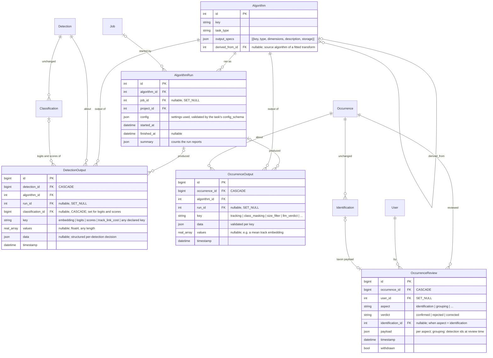

# Model outputs and human reviews: one home for vectors, logits and post-processing decisions

Status: design exploration, not decided. Date: 2026-10-02. Supersedes the storage parts of
`docs/claude/planning/2026-09-16-algorithm-outputs-design.md` and refines #1431 (option C
chosen there; the reasoning below reopens the parts of option D that a real producer now needs).

The owner's steer for this round: design first for the **outputs of post-processing tasks**
(tracking, class masking, the size filter, future registered tasks): what each run decided per
detection or per occurrence, with its settings and provenance. Give **embeddings and logits one
home** (per detection, per algorithm, any dimension) with a migration path from
`Classification.logits/scores` and from #1439's `DetectionEmbedding`. Reconsider a **dedicated
Review model** so "what the model said" can always be joined to "what a person verified" per
target and aspect. Explore several approaches; judge them by how they will be used in practice.

Sections: 1 what we measured · 2 how outputs are used in practice · 3 design dimensions, each
with options and a recommendation · 4 three assembled bundles · 5 recommended schema · 6 the
six questions answered · 7 migration path · 8 how #1439 splits · 9 decisions for the owner ·
10 what to verify before building.

## 1. What we measured

All numbers below are from a local copy of the production database (measured, not estimated)
unless marked otherwise.

| Classification table | |
|---|---|
| Rows | 834,500 |
| Rows with `logits` / with `scores` | 307,968 / 309,384 (1,416 have scores and no logits) |
| Rows with `features_2048` | 604 |
| Heap / indexes | 118 MB / 103 MB |
| TOAST (the two `float8[]` arrays) | **4.3 GB** |
| Average stored bytes per row, `logits` / `scores` (20k sample) | 12.4 KB / 13.9 KB |
| Logits containing NaN or ±inf | 0 |
| Duplicate `(detection, algorithm)` groups | 103,787 groups, 265,426 rows |
| … of which the rows disagree on taxon or score | **37,776 groups** |
| pgvector extension version on the local stack | 0.5.1 (no `halfvec`, no `sparsevec`) |

Where the TOAST goes, by classifier:

| Classifier | rows with logits | width | logits + scores |
|---|---|---|---|
| species classifier, 2,497 classes | 91,672 | 2,497 | 2.0 GB |
| species classifier, 29,176 classes | 7,721 | 29,176 | 1.6 GB |
| species classifier, 2,603 classes | 16,850 | 2,603 | 0.4 GB |
| everything else (188k rows are the 2-class moth/non-moth filter) | ~190,000 | ≤ 1,060 | < 0.1 GB |

Is `scores` derivable from `logits`? On 20 recent rows per algorithm, `softmax(logits)` equals
`scores` to within 1e-4 for **every algorithm but one** (a 79-class model, 84 rows, which is
calibrated differently: max difference 0.95). Class masking rows are the other exception by
design: masking keeps the logits and records the mask only in `scores` (dropped classes set to
0), so for those rows the scores are the information. So `scores` is redundant for > 99.9 % of
rows and essential for a few hundred.

Two facts about pgvector that constrain the column type (from the upstream README, v0.8.6):

- `vector` and `halfvec` store at most **16,000 dimensions** and reject NaN and ±inf. The
  29,176-class classifier's logits cannot go in either.
- A `real[]` column casts to `vector`/`halfvec` and can carry an expression + partial HNSW
  index (`USING hnsw ((values::halfvec(1024)) halfvec_cosine_ops) WHERE algorithm_id = X`), so
  approximate nearest-neighbour search stays available without a pgvector column.
- Index limits are separate from storage limits: HNSW indexes `vector` up to 2,000 dimensions
  and `halfvec` up to 4,000. A 2,048-d backbone vector needs `halfvec` (pgvector ≥ 0.7) to be
  indexed at all; a 1,024-d BioCLIP vector indexes as plain `vector`.

Other facts that matter:

- Nothing on the hot path reads the arrays. Determinations read `Classification.taxon`,
  `score`, `terminal` (`ami/main/models.py:2965`); the API exposes `scores` and `logits` only on
  the classification endpoint (`ami/main/api/serializers.py:1060`); `top_n()` reads `scores`
  for one classification at a time (`ami/main/models.py:3088`).
- Tracking, merge ranking and #1407's head retraining all pull vectors into numpy and compare
  there. No similarity query runs in SQL today.
- `Detection.next_detection` (main migration 0098 on the tracking branches) is the per-detection
  tracking link. The link *cost* is computed and thrown away after being averaged into the
  occurrence's history payload.
- PR #1407 (BioCLIP head retraining, based on `main`) adds a **second** `DetectionEmbedding`
  model in the `ml` app (`halfvec(1024)`, fixed width, keyed to the classifier *head*, first
  write wins, vectors paired to crops by list position, stored only when a per-project flag is
  on and only for crops that reached a classifier; migration `ml/0029`). It collides with
  #1439's `main.DetectionEmbedding` (unsized `vector`, keyed to the *extractor*, box-matched,
  last write wins, `job` recorded) and with #1439's `ml/0029`. Both stacks load the same frozen
  backbone with the same preprocessing and L2 normalisation, so one row per detection and
  backbone serves retraining and tracking. Section 8.1 says how they converge; whatever is
  chosen here is the table both PRs use. #1407 also brings `AlgorithmEvaluation`,
  `TaxonEvaluation`, `OccurrenceSet` (a fixed list of verified occurrences to score against),
  `TrainingSetMembership`, and `Algorithm.training_info` with a `parent_algorithm_key`: the
  evaluation half of the review join in section 2.4, and a lineage field this design generalises.

## 2. How the outputs are used in practice

The schema has to serve these access patterns. Each one names who reads or writes, the query
shape, and the volume, because those are what decide the key, the index and the column type.

### 2.1 Feature vectors

| # | Use | Who | Query shape | Volume |
|---|---|---|---|---|
| V1 | Link detections across consecutive captures (tracking) | tracking task | vectors for ~10–100 detection ids, one extractor | per capture pair, thousands of pairs per run |
| V2 | Rank merge candidates, extend-mode preview | occurrence edit endpoints | same as V1 for two captures | interactive, must be fast |
| V3 | "Which detections still lack a vector from extractor X" | feature-only job, session feature-extractor endpoint | anti-join per detection, count per event and algorithm | per job scope, whole sessions |
| V4 | Retrain a classifier head from verified crops (#1407) | training job | every vector of one algorithm under verified occurrences of a project, streamed to a file | hundreds of thousands of rows, once per retrain |
| V5 | Find detections that look like this one (future) | UI, research | ANN over one extractor within a project | interactive |
| V6 | Cluster unknowns, discover new species (future) | research | bulk read of one extractor for a project, or a per-occurrence mean vector | bulk |
| V7 | Zero-shot and text queries (BioCLIP joint space, future) | UI, research | query vector computed by the service, compared against stored image vectors of the same algorithm; one stored text vector per taxon | interactive |
| V8 | Reduced vectors for plots and cheap clustering (PCA, UMAP) | research | computed offline from stored raw vectors, written back, read like V6 | bulk |

Every one of these filters on **one algorithm** and on a set of detections (by id, by event, or
by project through the detection). None needs the vector on the `Detection` row itself.

### 2.2 Logits and scores

| # | Use | Who | Query shape | Volume |
|---|---|---|---|---|
| L1 | Show the top-N labels of one classification | occurrence detail, classification endpoint | one classification's scores | one row at a time |
| L2 | Class masking | post-processing task | logits of every terminal classification of one algorithm in a project, streamed | tens of thousands of rows per run |
| L3 | Calibration research (temperature scaling, OOD scores) | research | logits + human label for one algorithm over verified occurrences | bulk export, like V4 |
| L4 | Full-array API access | scripts | `?include=logits` on one classification | rare |
| L5 | Determination, evaluation (#1407), exports, list views | everything else | **never read the arrays** | hot path |

L1 is the only interactive reader and it wants scores for a specific classification row, which
is why the logits' key has to stay the classification, not `(detection, algorithm)`: 37,776
duplicate groups hold rows that disagree, and a re-keyed table would silently attach one row's
logits to another row's taxon.

### 2.3 Post-processing decisions

| # | Use | Who | Query shape |
|---|---|---|---|
| P1 | Occurrence timeline (#1433): everything that happened to this occurrence, newest first | occurrence page | by occurrence id |
| P2 | What did this run do? Which occurrences and detections did it touch? | job page, admin | by run |
| P3 | Compare two tracking runs on the same session (settings A vs B) | tuning (#1442), research | by run, grouped by occurrence |
| P4 | Score tracking against confirmed tracks | evaluation | tracking output per occurrence joined to the latest grouping review |
| P5 | Tune the cost threshold from real links | tuning (#1442) | per-detection link cost from a run, joined to whether a person confirmed that link |
| P6 | Class masking per detection | masking task | new terminal `Classification` (it must change the determination) plus its masked scores |
| P7 | Size filter per detection | size filter | new "not identifiable" `Classification`, optionally the measured relative area |
| P8 | A verdict with reasons from an LLM or a decision model, per occurrence (future) | research | JSON payload by occurrence, registered schema |

P5 is the one per-detection decision that has no home today: the cost of each link a run made.
It is exactly what threshold tuning needs, and it is a scalar per detection per run.

### 2.4 Human reviews

| # | Use | Who | Query shape |
|---|---|---|---|
| R1 | Confirm or correct a species | reviewers | `Identification` (exists, feeds the determination) |
| R2 | Mark a track complete and accurate | reviewers | grouping review with the detection set at the time |
| R3 | Accept, reject or adjust a bounding box (future) | reviewers | detection-level review |
| R4 | Count insects on a capture (future) | reviewers | capture-level review |
| R5 | Evaluate any algorithm against people, per aspect | evaluation, #1407 | latest human verdict per target and aspect, joined to each algorithm's output |
| R6 | Which occurrences are "verified" for training and benchmark exports | #1407 training set, tracks CSV | reads `Identification` and `grouping_verified_*` today |

The join in R5 is the reason for a review table: today it means three different joins
(`Identification`, `grouping_verified_*`, history rows of kind `review`) that each new aspect
would add to.

## 3. Design dimensions

Each dimension lists the options considered, judged against section 2, with a recommendation.
They are mostly independent, which is why they are separated: the owner can pick per dimension.

### D1. Table topology for numeric outputs

| Option | Shape | Serves | Fails |
|---|---|---|---|
| a. Two typed tables | `DetectionEmbedding` + `ClassificationScores` (1:1 side table) | V1–V6, L1–L3 | not one home; a third array kind (PCA output, per-detection cost) means a third table |
| b. One per-detection table, `kind` column | `DetectionOutput(detection, algorithm, key, values, classification?)` | V1–V8, L1–L4, P5 | two uniqueness regimes (see D3) |
| c. One table for every target | `AlgorithmOutput(detection?, source_image?, occurrence?, …)` | everything | no single `project_accessor`, so permission filtering breaks (#1431 option B, rejected there and still true) |

**Recommend b**, one table per *target*, with an abstract spine shared across targets
(`DetectionOutput`, `OccurrenceOutput`, later `SourceImageOutput` and `TaxonOutput`). Same
shape everywhere, one `project_accessor` per table.

### D2. Column type for the array

| Option | Bytes/dim | Max dims | Similarity in SQL | Notes |
|---|---|---|---|---|
| a. `float8[]` (today) | 8 | none | cast | the 4.3 GB |
| b. `real[]` (`float4[]`) | 4 | none | cast to `vector`/`halfvec`; expression + partial HNSW index per extractor | models emit float32; halves storage; holds 29,176-wide logits |
| c. pgvector `vector` | 4 | 16,000 | native | rejects the 29,176-class logits; rejects NaN/inf (none stored today) |
| d. pgvector `halfvec` | 2 | 16,000 | native | pgvector ≥ 0.7 on every deployment (local has 0.5.1, production unknown); float16 loses ~3 significant digits, fine for embeddings, questionable for raw logits |
| e. `vector` for embeddings + `real[]` for logits (two columns, one non-null) | 4 | mixed | native for vectors | two read paths; "one home" only nominally |

**Recommend b** for a single shared column. Every current reader pulls arrays into numpy (V1,
V2, V4, L2, L3); none runs a distance in SQL, so a pgvector column buys nothing today. When V5
arrives, a partial expression index per extractor (`(values::halfvec(1024))` where
`algorithm_id = X AND key = 'embedding'`) gives ANN on the same column, which pgvector documents
as a supported pattern. Storage policy per algorithm (D6) covers the two classifiers that
dominate the TOAST. Option e is the fallback if the owner wants native operators from day one.

Django note: `ArrayField(FloatField())` produces `double precision[]`; a small
`Float4Field(models.FloatField)` with `db_type = "real"` gives `real[]` with the same Python
interface (a list of floats). The `-inf` concern from the earlier design is moot: no stored
logits contain it, and `real[]` accepts it anyway.

On `halfvec`: #1407 measured a 1,024-d `halfvec` row at about 5 KB including its share of an
HNSW index at 20k rows, and float16 loses nothing a tracking cosine or a head fit can notice
(estimate: ~1e-3 relative rounding against an appearance-term separation of 0.959 vs 0.889).
Halving embedding storage is real money on a table that will hold a row per detection. The
cost is a second column type (option e, `halfvec` for embeddings and `real[]` for logits) or a
pgvector ≥ 0.7 requirement on every deployment before the foundation PR can migrate. If the
owner wants the 2-byte storage, the cleanest form is **e with `halfvec`**: `vector halfvec NULL`
for keys whose spec says `type = embedding`, `values real[] NULL` for everything else, one
non-null per row, both behind one Python accessor. Verify first that pgvector-python's
`HalfVectorField(dimensions=None)` yields an unsized column and that the tracking regression
tests pass on float16 vectors.

### D3. Row key for logits and scores

| Option | Key | Serves | Fails |
|---|---|---|---|
| a. `(detection, algorithm, key)` newest wins | like embeddings | V-uses | L1: attaches one row's logits to another row's taxon in 37,776 disagreeing duplicate groups; loses the `applied_to` lineage of masked rows |
| b. `(classification, key)` | the classification row | L1–L4 exactly as today | none; the row still carries `detection` and `algorithm` for bulk reads |
| c. both, as partial unique constraints in one table | `(classification, key) WHERE classification IS NOT NULL` and `(detection, algorithm, key) WHERE classification IS NULL` | all | slightly unusual; Django expresses it with `UniqueConstraint(condition=…)` |

**Recommend c**: embeddings are keyed to the detection and extractor and overwritten on re-save
(deterministic backbone); logits and scores are bound to the classification row that owns them.
`classification` is `SET_NULL`? No: **`CASCADE`**, because logits without their prediction are
meaningless, and the duplicate-cleanup task deletes classifications.

### D4. Provenance: where do a run's settings live?

| Option | Shape | Serves | Fails |
|---|---|---|---|
| a. `job` FK (SET_NULL) on every output row, settings read from `Job.params` | as #1439 | P1 | P2/P3 break when the job is deleted (users delete jobs); jobless runs (management commands, tests) have no provenance |
| b. `job` FK + a copy of the settings on every occurrence row | as #1439's tracking payload | P1–P3 | settings duplicated once per occurrence touched (a tracking run over a large project writes them hundreds of thousands of times) |
| c. `AlgorithmRun` row: `(algorithm, job?, project, config, started, finished, summary)`; outputs FK the run | one row per run | P1–P5 with one FK; jobless runs get a row; survives job deletion | one more table; every writer creates a run first |

**Recommend c.** It is the standard provenance shape (an *activity* that used a *model* with
*parameters* and produced *outputs*), it is small (one row per run, not per output), and it is
what P3 and P5 need: "all outputs of run 17" and "run 17 vs run 18 on the same session". For ML
pipeline jobs the run's config is the pipeline config the job sent; for post-processing it is
`config_schema` serialised. `job` stays on the run as `SET_NULL`. Outputs FK the run with
`CASCADE`? No: **`SET_NULL`** on the output, so deleting a run's bookkeeping never deletes a
stored vector that tracking still uses.

Hmm, one honest caveat: a run row per ML job means the pipeline save path creates it once per
job, not per batch, and async results arriving after the job row is gone need the run to exist
independently. That is the point of the table, but it is a change to `save_results`.

### D5. Variants: PCA-reduced, softmaxed copies, different taps of one network

The two inline questions on #1439 ("softmax-ed copy or PCA-reduced version", "penultimate vs
projection head") are the same question: is a variant a new *algorithm* or a new *output* of
the same algorithm?

| Option | Rule | Serves | Fails |
|---|---|---|---|
| a. Always a new `Algorithm` | every variant gets a key, version, dimension | one-extractor rule stays `algorithm_id` | a service that returns raw + projection in one pass registers two algorithms for one model; `Algorithm.category_map` is meaningless for the second |
| b. Always a `kind` enum on the row | `embedding`, `embedding_projection`, `logits`, … | simple | the enum grows per model family; dimension per (algorithm, kind) has no home; PCA fitted on project A is not the same transform as PCA fitted on project B, and an enum cannot say which |
| c. Declared output keys + derived algorithms | An algorithm **declares its outputs** in `/info`: `[{key, type, dimensions, description}]`. Anything produced **in the same forward pass** is another key of that algorithm (raw and projection; logits and scores; CLS and pooled). Anything **computed later from stored outputs** (PCA, UMAP, an offline calibration, a softmaxed copy Antenna makes itself) is a **derived `Algorithm`** with `derived_from` → source algorithm and `uri`/`version` naming the fitted transform | V7 (BioCLIP: `image_embedding` and `text_embedding` keys, one joint space, one algorithm); V8 (a PCA is a fitted model with weights and a training set: exactly what `Algorithm` already records, and what #1407 already does for retrained heads with `training_info`) | needs `output_specs` on `Algorithm` (replaces `embedding_dimensions` from #1439) |

**Recommend c.** The rule is decidable by anyone: *did the same call produce it?* The
description the owner asked for ("what does this vector represent") lives on the output spec,
declared by the service, not typed by hand per row. "One feature extractor per similarity query"
becomes "one `(algorithm, key)` per similarity query", enforced where `vectors_for_detections`
already enforces the algorithm.

Two relations on `Algorithm`, not one, because #1407 needs both:

- `derived_from` (FK to `Algorithm`, nullable): **lineage**. A retrained head's parent head
  (#1407 stores this as `training_info.parent_algorithm_key`; the FK replaces the string), or
  the source algorithm of a fitted PCA.
- `feature_extractor` (FK to `Algorithm`, nullable): **input dependency**. The algorithm whose
  `embedding` output this one consumes. A trainable head names its frozen backbone here, so
  every retrained version reads the same `DetectionOutput(algorithm=backbone, key=embedding)`
  rows and starts with full coverage instead of zero. This is the fix for #1407 keying vectors
  to the head.

### D6. Storage policy for logits

| Option | Serves | Cost |
|---|---|---|
| a. Store logits and scores for every row, as today | L1–L4 | 4.3 GB now, doubling with each large classifier deployment |
| b. Store logits only; compute scores on read; store scores only when they are not `softmax(logits)` (masked rows, the calibrated 79-class model) | L1–L4 | about half of a: measured, scores are derivable for > 99.9 % of rows |
| c. Per-algorithm policy declared in the output spec: `full`, `top_k(n)` (values + indices), or `none` | L1 always (top-k suffices), L2/L3 only for algorithms kept `full` | the 29,176-class classifier drops from 1.6 GB to a few MB at `top_k(50)`; calibration on that model needs a decision |
| d. Compress: float4 (D2) | all | halves everything again |

**Recommend b + d now, c as a knob with default `full`.** Class masking derives everything from
logits already (`ami/ml/post_processing/class_masking.py:134`), so scores-on-read changes no
behaviour. The owner decides whether the 29,176-class model keeps full logits.

### D7. Occurrence-level outputs and the history table

| Option | Shape |
|---|---|
| a. Keep `OccurrenceHistoryRecord` as in #1439 (algorithm results and reviews in one table) | one timeline table, two kinds |
| b. Split: `OccurrenceOutput` (algorithm results, on the spine) + `OccurrenceReview` (D8); the history endpoint merges them with identifications and predictions, as it already merges four sources | two tables, each about one thing; outputs carry `run`, reviews carry `user` |

**Recommend b.** #1439's algorithm-result rows already have the spine's shape (occurrence,
algorithm, job, timestamp, typed payload). Renaming them `OccurrenceOutput` and adding `run`
makes them the occurrence-level member of the family with no data migration (the table is empty
outside development stacks). P1 is unchanged: the endpoint reads outputs, reviews,
identifications and predictions and sorts by time.

### D8. The review model

| Option | Shape | Serves | Fails |
|---|---|---|---|
| a. Status quo | `Identification` + `grouping_verified_*` + history rows of kind `review` | R1, R2 | R5 is three joins and grows per aspect; R3/R4 have no home |
| b. One `Review` table for every target | `Review(occurrence?, detection?, source_image?, aspect, …)` | R1–R5 | no single `project_accessor` (same reason as D1c) |
| c. One review table per target, same spine as outputs | `OccurrenceReview(occurrence, user, timestamp, aspect, verdict, payload, identification?)`; later `DetectionReview`, `SourceImageReview` | R1–R6 | one more table now, one per target later |

**Recommend c**, with `Identification` kept as the taxon payload: it feeds the determination
and has agreement links, so it stays. Every identification also writes an `OccurrenceReview`
row (`aspect = identification`, `identification` FK), so R5 is one join per target:
`<Target>Output` × `<Target>Review` on `(target, aspect)`. `grouping_verified_at/by` stay as the
cache of the latest `aspect = grouping` review. `verdict` is `confirmed | rejected | corrected`;
the payload is per aspect (for grouping: the detection ids at review time, as #1439's
`TrackCompleteReviewPayload` already records).

### D9. Wire contract

Keep `DetectionResponse.embeddings` (`{algorithm, features}`) exactly as #1439 and the
processing-service PRs define it, mapped to `key = "embedding"`. A general
`outputs: [{algorithm, key, values | data}]` field is cheap to add later and nothing produces it
yet. `ami/ml/schemas.py` stays free of Antenna concepts either way.

## 4. Three assembled bundles

| | Bundle A: one family (D1b, D2b, D3c, D4c, D5c, D6b+d, D7b, D8c) | Bundle B: same family, pgvector column (D2c or D2e) | Bundle C: minimal (D1a, D2 unchanged, D4a, D8a) |
|---|---|---|---|
| Meets "one home for embeddings and logits" | yes | yes, with a top-k or exclusion rule for logits wider than 16,000 | no |
| Post-processing outputs per detection and occurrence, with run provenance | yes | yes | no (occurrence only, settings copied per row) |
| Variants (PCA, taps, text side) | declared keys + derived algorithms | same | none |
| Reviews joinable per target and aspect | yes | yes | no |
| Similarity in SQL | by cast, partial index per extractor when needed | native | none |
| Migration weight | logits/scores backfill (307k rows), table renames on unmerged branches | same | none beyond #1439 |
| Risk | one more table (`AlgorithmRun`) and two partial unique constraints to get right | pgvector version per deployment; the 29,176-class model | the next output kind needs a fourth table |

Bundle A is what section 5 draws. Bundle B differs only in the column and the logits policy.
Bundle C is the fallback if the owner decides the logits move is out of scope this quarter, in
which case #1439's `DetectionEmbedding` should still gain `run` and `key` so it can become
`DetectionOutput` later without a rename.

## 5. Recommended schema (bundle A)

Constraints and indexes on `DetectionOutput`:

- `UNIQUE (classification_id, key) WHERE classification_id IS NOT NULL`
- `UNIQUE (detection_id, algorithm_id, key) WHERE classification_id IS NULL` (its index leads
  with `detection_id` and serves V1–V3 and V5's filter; no separate detection index)
- `CHECK ((values IS NULL) <> (data IS NULL))`: one payload per row
- `INDEX (run_id)` for P2/P3/P5; `INDEX (algorithm_id, key)` only if V4/V6 measure a need
  (they filter through the detection's occurrence and project first)
- `project_accessor = "detection__source_image__project"`

`OccurrenceOutput`: `INDEX (occurrence_id, -timestamp)` (P1, as #1439), `INDEX (run_id)`.
`OccurrenceReview`: `INDEX (occurrence_id, aspect, -timestamp)` (R5 wants "latest per aspect").

The abstract spine (no table): `algorithm`, `run`, `timestamp`, `key`, `values`, `data`, and a
`build()` that validates `data` against the registry for `(algorithm.task_type or key)` before
`bulk_create`, as #1439's `OccurrenceHistoryRecord.build()` does.

What goes where, by producer:

| Producer | Writes |
|---|---|
| Classifier pipeline (sync or async) | `Classification` (unchanged) + `DetectionOutput(classification, key=logits)`; `scores` only when not softmax; `DetectionOutput(detection, algorithm, key=embedding)` when the service sends vectors |
| Feature-only pipeline (#1439) | `DetectionOutput(key=embedding)` only |
| Tracking | `Detection.next_detection` (unchanged), `DetectionOutput(key=track_link_cost, values=[cost], data={next_detection_id})` per link, `OccurrenceOutput(key=tracking)` per occurrence changed, `record_tracking_determination` classification when the name changed |
| Class masking | new `Classification` + `DetectionOutput(classification, key=scores)` (the mask), `OccurrenceOutput(key=class_masking)` |
| Size filter | new `Classification`, `OccurrenceOutput(key=size_filter)` |
| Head retraining (#1407) | reads `DetectionOutput(key=embedding, algorithm=backbone)`; writes a derived `Algorithm` (already does) |
| Offline PCA / UMAP | derived `Algorithm(derived_from=backbone)` + `DetectionOutput(key=embedding)` under it |
| BioCLIP text side (future) | `TaxonOutput(taxon, algorithm=bioclip, key=text_embedding)`; query vectors are never stored |
| LLM / decision model verdict (future) | `OccurrenceOutput(key=<registered>, data=…)`; per detection the same on `DetectionOutput.data` |

## 6. The six questions, answered

1. **Logits.** Move `logits` and `scores` off `Classification` into `DetectionOutput` rows bound
   to the classification (`classification` FK, `key = logits | scores`), stored as `real[]`
   (float4). Store `scores` only when it is not `softmax(logits)`; compute on read otherwise.
   Per-algorithm policy `full | top_k | none` for the widest label spaces. Hot path never joins
   the arrays; `top_n()` and the classification endpoint fetch them by classification id.
2. **PCA and reduced versions.** A fitted transform is a model: a derived `Algorithm` with
   `derived_from`, its own `key`, `version`, `output_specs` (dimensions) and `uri` naming the
   stored transform (weights file in project storage or a model registry). Its outputs are
   ordinary `DetectionOutput(key=embedding)` rows under that algorithm. Same treatment #1407
   gives retrained heads.
3. **Different embeddings from one algorithm.** Produced in the same forward pass, they are
   separate declared **output keys** of that algorithm (`embedding`, `projection`, `cls`), each
   with its own dimension and description in `Algorithm.output_specs`; the rows share
   `algorithm_id` and differ in `key`. Comparisons are always within one `(algorithm, key)`.
4. **Semantic and text embeddings.** Same algorithm (one joint space), two keys
   (`image_embedding`, `text_embedding`). Image vectors are `DetectionOutput`; taxon text
   vectors are a future `TaxonOutput` on the same spine; a free-text query vector is computed by
   the service per request and never stored. Cross-modal similarity is then a normal
   one-algorithm comparison.
5. **LLM text or structured verdicts.** They justify the **per-target** JSON payload (the
   `data` column on each `<Target>Output`), validated by a registered schema per key, not a
   three-target generic table. `OccurrenceOutput` is that table for occurrences today; a
   `SourceImageOutput` is added the day a capture-level producer exists.
6. **Review model.** `OccurrenceReview(user, timestamp, aspect, verdict, payload,
   identification?)` on the same spine, one per target. `Identification` stays and gains a
   review row on save; `grouping_verified_*` becomes the cache of the latest grouping review;
   #1439's review history rows migrate into it. Evaluation is one join per target on
   `(target, aspect)`.

## 7. Migration path

Ordered so each step ships alone and nothing is rewritten twice.

1. **Schema PR (empty tables).** `AlgorithmRun`, `DetectionOutput`, `OccurrenceOutput`,
   `OccurrenceReview`, `Algorithm.output_specs`, `Algorithm.derived_from`. #1439's migrations
   0102–0104 and `ml/0029` are rewritten rather than migrated: `DetectionEmbedding` has never
   held production data (it exists empty on some development databases; the migration drops it
   if present). #1407 drops its `ml.DetectionEmbedding` and reads `DetectionOutput`.
2. **Writers switch.** Pipeline save path writes embeddings and logits to `DetectionOutput`
   (both columns still written on `Classification` for one release: dual write, so a rollback
   loses nothing). Post-processing tasks create a run and write outputs. Reviews written on
   identification save and on "mark complete".
3. **Backfill, in batches of a few thousand rows by classification id**, inside
   `cachalot_disabled()`, resumable by high-water mark: `logits` → `DetectionOutput(key=logits)`
   as float4; `scores` only where `max|softmax(logits) − scores| > 1e-4` or logits are null
   (the 1,416 scores-only rows keep their scores); `features_2048` (604 rows) → `key=embedding`
   under the classifier's algorithm. Measured on the copy before running in production.
   Estimated result: ~1.9 GB of `real[]` in place of 4.3 GB of `float8[]` (halved bytes, scores
   mostly dropped); not measured until the backfill runs on the copy.
4. **Readers switch.** `top_n()`, the classification serializer (`logits`/`scores` become
   opt-in fields), class masking, admin counts, `models_future/embeddings.py`.
5. **Drop columns.** `Classification.logits`, `scores`, `features_2048`;
   `Detection.similarity_vector` (0 of 642,729 rows carry a value). `VACUUM FULL` or
   `pg_repack` on `main_classification` to return the TOAST space; an operations step.
6. **Reviews backfill.** One `OccurrenceReview` per `Identification` (16,642 rows), one per
   `grouping_verified_at` occurrence, one per #1439 review history row on the development stacks.

## 8. How #1439 splits

#1439's commits, by destination. Hashes are on `feat/occurrence-history-and-embeddings`.

| Destination | Commits | Note |
|---|---|---|
| **PR 1: outputs foundation** (base `main` or #1272, whichever lands first) | `eaa654af` store a vector for every detection, `4eae25ed` name the column and record the job, `f8b3eb8a` any length + fill in for existing detections, `d86a402c` length repair, `9831afec` `fac78717` `91b9f62e` `23b44ca8` `a122b897` `f5aae46d` `5b95f02b` `32da6cfb` feature-only job rules and fixes, `9b2ae7ce` `e2fc8067` tests, `33f4144b` tracks CSV counts an embedding, `2b802541` `a190dd70` `dee996e9` docs | Re-targeted at `DetectionOutput(key=embedding)`, `Algorithm.output_specs` in place of `embedding_dimensions`, `run` in place of `job`. This is also what #1407 needs first (its memory note and the parallel reconciliation review agree on landing it before #1407 rebases) |
| **PR 2: tracking reads the stored vectors** (base PR 1 + #1272) | `95e2bdb6` compare by stored embeddings, `0f644ae2` `001485cf` default extractor per session, `6f14d0c8` style | Unchanged in substance; `vectors_for_detections(ids, algorithm_id, key)` |
| **PR 3: occurrence outputs + history endpoint** (base PR 1 + #1432) | `91dbe9a8` history table → `OccurrenceOutput` + `OccurrenceReview`, `4cd69425` writers, `dea7a5ea` endpoint, `f0d1f577`, `b52eb979`, `a3e31dcb` `dc5345cd` `d8c2b13c` review semantics, `1350b819` size-filter batch fix, `8c892444` `e33406be` tests, `ccf3f3ce` merge | Reviews move to the review table; `record_tracking_determination` stays |
| **PR 4: timeline UI** (base PR 3) | `655a7c9b` `f01bfdfa` `cf02f55e` `6f2b642f` `271515ca` `370ab688` `dd92ce55` `94a68430` `8d672f2c` `1e35f58b` `847b839e` | Reads the endpoint; unchanged |
| **PR 5: logits move** (base PR 1) | new | Dual write, backfill, reader switch, column drop (section 7 steps 2–5) |

#1442 (tracking cost terms) rebases onto PR 2 and gains the `track_link_cost` rows (P5) as its
first consumer.

### 8.1 One embeddings model: converging with #1407

The table shape is the decision; the carrier is whichever PR is ready first, and today that is
the foundation PR carved out of #1439 (#1407's backend tests are red, it has no human review
yet, and its own self-review lists three blockers). The reconciliation note (local, read-only)
already argues the key identity, writer, wire and gating points; this design adopts them and
adds the output family around them.

**The one model**, whatever its final name (`DetectionOutput` here; `DetectionEmbedding` if
bundle C is chosen):

| Aspect | Decision | Taken from |
|---|---|---|
| Identity of a vector | `(detection, algorithm = the feature extractor / backbone, key)` | #1439; #1407's head-keyed rows would restart at zero per retrain |
| Width | unsized; per `(algorithm, key)` in `Algorithm.output_specs` | #1439's `embedding_dimensions`, generalised |
| Column | `real[]` (D2b) or `halfvec` for embeddings (D2e) | #1407's halfvec measurement; #1439's unsized column |
| Writer | box-matched, last write wins, run/job recorded, unmatched boxes reported | #1439; #1407's positional writer is dropped |
| Wire | `DetectionResponse.embeddings[{algorithm, features}]` keyed by the extractor; `ClassificationResponse.features` accepted for legacy 2048-d classifiers with the #1272 validator relaxed to drop-and-warn | #1439 + reconciliation note |
| Gate | the request decides (`include_features`, feature-only pipelines); no post-inference storage flag | reconciliation note; #1407's `store_classification_embeddings` is dropped |
| Backfill for existing detections | the feature-only `ml` job, with "verified detections only" as a scope option | #1439; #1407's `generate_embeddings` job type (and `jobs/0025`) folds into it |
| Head → backbone | `Algorithm.feature_extractor` FK | new (D5); replaces #1407's per-head storage |
| Lineage | `Algorithm.derived_from` FK | replaces #1407's `training_info.parent_algorithm_key` string |

**What #1407 keeps unchanged:** `train_classifier` and `evaluate_algorithm` job types,
`AlgorithmEvaluation` / `TaxonEvaluation`, `OccurrenceSet`, `TrainingSetMembership`,
`Algorithm.trainable` / `training_config` / `training_info` (minus the parent key, and with
`job_id` moved out of `ami/ml/schemas.py` since it is an Antenna concept), the `/train`
dispatch, the training-data endpoint and npz export. They read
`DetectionOutput.objects.filter(algorithm=head.feature_extractor, key="embedding", …)` instead
of `DetectionEmbedding.objects.filter(algorithm=head)`, which is a one-line change in
`training_data.py` and the training-data viewset.

**What #1407 drops:** `ami/ml/models/embedding.py`, `ml/0029_detectionembedding_and_more`,
`create_detection_embeddings`, `EMBEDDING_DIMENSIONS`, the `store_classification_embeddings`
flag, `GenerateEmbeddingsJob` (or keeps it as a thin preset over the feature-only run), and
renumbers `main/0096–0099` and `ml/0030–0033` after the foundation PR's migrations.

**How evaluation fits the review model:** `AlgorithmEvaluation` scores an algorithm's
classifications against `Occurrence.determination` on a fixed `OccurrenceSet`. With
`OccurrenceReview` in place, "verified" becomes "has a review with `aspect = identification`
and `verdict != rejected`", and the same scorer can evaluate tracking against
`aspect = grouping` reviews. `OccurrenceSet` stays as the fixture that keeps two evaluations
comparable; nothing in this design replaces it.

**Landing order** (unchanged from the reconciliation note): #1272 with the validator relaxed →
foundation PR (section 8, PR 1) → #1407 rebased → #1432 → PR 2, PR 3, PR 4 → #1442; #1423
(the UI half of #1407) after #1407; on the processing-service side, the features-for-all-
detections PR before the BioCLIP classifier PR. If #1407 becomes ready first, it carries the
agreed shape and the foundation PR drops its copy.

## 9. Decisions for the owner

1. Column type: `real[]` with pgvector by cast (D2b) or a pgvector column (D2c/e).
2. `AlgorithmRun` now (D4c), or `job` FK only and settings copied per row for this round (D4a/b).
3. Scores policy: drop where `softmax(logits)` matches (D6b) or keep every row (D6a).
4. The 29,176-class classifier: keep full logits (1.6 GB float8 today, ~0.8 GB as float4) or
   `top_k`.
5. Rename `OccurrenceHistoryRecord` → `OccurrenceOutput` and split reviews out (D7b), or keep
   one history table (D7a).
6. Reviews: `OccurrenceReview` with a row per identification (D8c), or leave identifications
   out and start with grouping only.
7. Logits move in scope this quarter (PR 5), or the foundation only (PRs 1–4) with the columns
   left in place.
8. Landing order with #1407: foundation PR before #1407 rebases (recommended), or #1407 first
   and its table renamed after.
9. Embedding storage precision: `real[]` for everything (one column), or `halfvec` for
   embeddings beside `real[]` for logits (two columns, pgvector ≥ 0.7 everywhere).
10. `Algorithm.feature_extractor` and `derived_from` as FKs now, or keep #1407's
    `parent_algorithm_key` string and add the FKs when the second derived model appears.
11. `generate_embeddings` folds into the feature-only `ml` job with a "verified only" scope, or
    stays as its own job type.

## 10. What to verify before building

- `EXPLAIN (ANALYZE)` V1 and V3 on the largest project in the copy with the partial unique
  index only, and P1 with `(occurrence_id, -timestamp)`.
- The backfill on the copy: wall time, resulting size, and that `top_n()` returns identical
  results before and after for a sample of classifications per algorithm.
- Class masking on a project after the move produces byte-identical new classifications.
- pgvector: `real[]::halfvec(1024)` expression index builds on 0.8.x and the planner uses it
  under `WHERE algorithm_id = X AND key = 'embedding'`; and the extension version on production
  and staging (operations).
- The `-inf`/NaN claim: re-check on the copy after the next processing-service release, since
  the 0 count is a property of today's models, not of the contract.
- `cachalot`: the new tables must be listed where `CACHALOT_UNCACHABLE_TABLES` or the
  invalidation settings name array-heavy tables, if any, so a bulk backfill does not thrash the
  cache.

## References

- #1431 (design history, option D kept at the bottom), #1433 (timeline), #1417 (vectors for
  rejected crops), #1439 (this PR), #1407 (head retraining), #1442 (tracking cost terms),
  #1272 / #1432 (tracking server and UI).
- `ami/main/models.py:2965` `Classification`; `:2982` `logits`; `:3088` `top_n`;
  `:3198` `similarity_vector`.
- `ami/ml/models/algorithm.py:228` `Algorithm`; `:20` `AlgorithmCategoryMap`.
- `ami/ml/schemas.py:124` `ClassificationResponse`; `:171` `DetectionResponse`.
- `ami/ml/models/pipeline.py:858` `create_classifications`; `:1012` `save_results`.
- `ami/ml/post_processing/base.py` `BasePostProcessingTask`; `class_masking.py:126–182`.
- `ami/base/models.py:72` `get_project_accessor`.
- pgvector README (v0.8.6): storage limits, arrays, expression and partial indexes.
