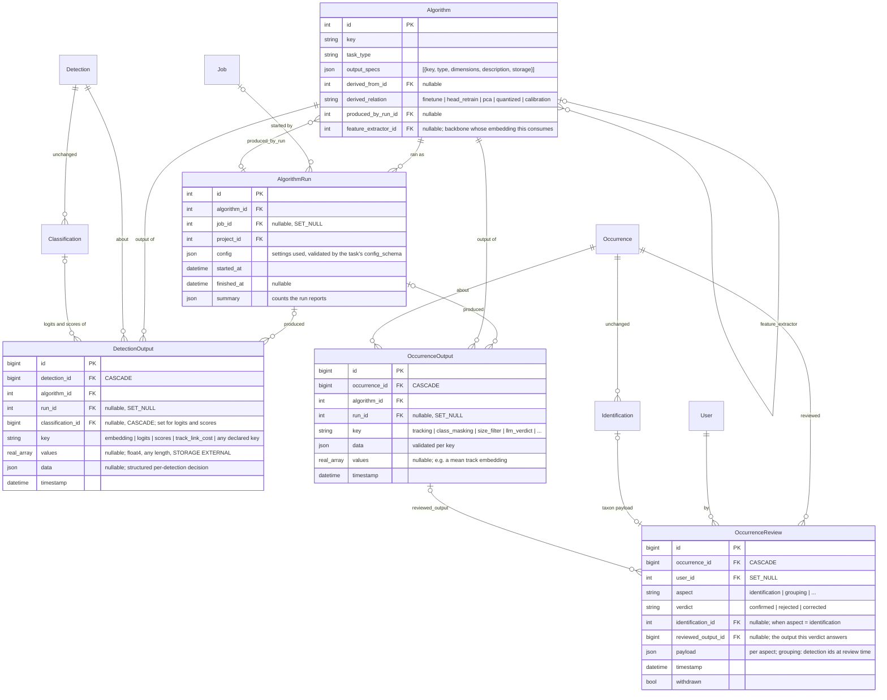

# Model outputs and human reviews: one home for vectors, logits and post-processing decisions

Status: design exploration, not decided. Date: 2026-10-02 (revised the same day after external
research). Supersedes the storage parts of
`docs/claude/planning/2026-09-16-algorithm-outputs-design.md` and refines #1431 (option C chosen
there; the reasoning below reopens the parts of option D that a real producer now needs).

The owner's steer: design first for the **outputs of post-processing tasks** (tracking, class
masking, the size filter, future registered tasks): what each run decided per detection or per
occurrence, with its settings and provenance. Give **embeddings and logits one home** (per
detection, per algorithm, any dimension) with a migration path from `Classification.logits/scores`
and from #1439's `DetectionEmbedding`. Reconsider a **dedicated review model** so "what the model
said" can always be joined to "what a person verified" per target and aspect. Treat #1407 as a
first-class input: there must be one embeddings model. Explore several approaches, judge them by
how they will be used in practice, and check them against how external systems do it rather than
against our own earlier drafts.

Sections: 1 what we measured · 2 how outputs are used in practice · 3 what comparable systems do ·
4 design dimensions with options · 5 three assembled bundles · 6 recommended schema · 7 the six
questions answered · 8 migration path · 9 how #1439 splits and converges with #1407 · 10 export
mapping · 11 decisions for the owner · 12 what to verify before building.

## 1. What we measured

All numbers below are from a local copy of the production database (measured, not estimated)
unless marked otherwise.

| Classification table | |
|---|---|
| Rows | 834,500 |
| Rows with `logits` / with `scores` | 307,968 / 309,384 (1,416 have scores and no logits) |
| Rows with `features_2048` | 604 |
| Heap / indexes | 118 MB / 103 MB |
| TOAST (the two `float8[]` arrays) | **4.3 GB** |
| Average stored bytes per row, `logits` / `scores` (20k sample) | 12.4 KB / 13.9 KB |
| Logits containing NaN or ±inf | 0 |
| Duplicate `(detection, algorithm)` groups | 103,787 groups, 265,426 rows |
| … of which the rows disagree on taxon or score | **37,776 groups** |
| pgvector extension version on the local stack | 0.5.1 (no `halfvec`, no `sparsevec`) |

Where the TOAST goes, by classifier:

| Classifier | rows with logits | width | logits + scores |
|---|---|---|---|
| species classifier, 2,497 classes | 91,672 | 2,497 | 2.0 GB |
| species classifier, 29,176 classes | 7,721 | 29,176 | 1.6 GB |
| species classifier, 2,603 classes | 16,850 | 2,603 | 0.4 GB |
| everything else (188k rows are the 2-class moth/non-moth filter) | ~190,000 | ≤ 1,060 | < 0.1 GB |

Is `scores` derivable from `logits`? On 20 recent rows per algorithm, `softmax(logits)` equals
`scores` to within 1e-4 for **every algorithm but one** (a 79-class model, 84 rows, calibrated
differently: max difference 0.95). Class masking rows are the other exception by design: masking
keeps the logits and records the mask only in `scores` (dropped classes set to 0), so for those
rows the scores are the information. So `scores` is redundant for > 99.9 % of rows and essential
for a few hundred.

The 1,416 scores-only rows all date from one day and belong to two algorithms: 920 rows of the
2-class filter (negligible bytes) and 496 rows of the 2,497-class classifier (5.9 MB). They need
no reprocessing: reprocessing would create *new* classification rows (the duplicate groups
above), not restore logits on the old ones. The plan keeps their scores as they are (6 MB) and
assumes nothing about re-running those images.

Two facts about pgvector that constrain the column type (upstream README, v0.8.6):

- `vector` and `halfvec` store at most **16,000 dimensions** and reject NaN and ±inf. The
  29,176-class classifier's logits cannot go in either.
- A `real[]` column casts to `vector`/`halfvec` and can carry an expression + partial HNSW index
  (`USING hnsw ((values::halfvec(1024)) halfvec_cosine_ops) WHERE algorithm_id = X`), which the
  README documents as the way to store arrays or mixed widths and still index per model.
- Index limits are separate from storage limits: HNSW indexes `vector` up to 2,000 dimensions
  and `halfvec` up to 4,000. A 2,048-d backbone vector needs `halfvec` (pgvector ≥ 0.7) to be
  indexed; a 1,024-d BioCLIP vector indexes as plain `vector`.

Other facts that matter:

- Nothing on the hot path reads the arrays. Determinations read `Classification.taxon`, `score`,
  `terminal` (`ami/main/models.py:2965`); the API exposes `scores` and `logits` only on the
  classification endpoint (`ami/main/api/serializers.py:1060`); `top_n()` reads `scores` for one
  classification at a time (`ami/main/models.py:3088`).
- Tracking, merge ranking and #1407's head retraining all pull vectors into numpy and compare
  there. No similarity query runs in SQL today.
- `Detection.next_detection` (main migration 0098 on the tracking branches) is the per-detection
  tracking link. The link *cost* is computed and thrown away after being averaged into the
  occurrence's history payload.
- PR #1407 (BioCLIP head retraining, based on `main`) adds a **second** `DetectionEmbedding`
  model in the `ml` app (`halfvec(1024)`, fixed width, keyed to the classifier *head*, first
  write wins, vectors paired to crops by list position, stored only when a per-project flag is
  on and only for crops that reached a classifier; migration `ml/0029`). It collides with
  #1439's `main.DetectionEmbedding` (unsized `vector`, keyed to the *extractor*, box-matched,
  last write wins, `job` recorded) and with #1439's `ml/0029`. Both stacks load the same frozen
  backbone with the same preprocessing and L2 normalisation, so one row per detection and
  backbone serves retraining and tracking. Section 9.1 says how they converge. #1407 also brings
  `AlgorithmEvaluation`, `TaxonEvaluation`, `OccurrenceSet` (a fixed list of verified
  occurrences to score against), `TrainingSetMembership`, and `Algorithm.training_info` with a
  `parent_algorithm_key`: the evaluation half of the review join in section 2.4, and a lineage
  field this design generalises.

## 2. How the outputs are used in practice

The schema has to serve these access patterns. Each one names who reads or writes, the query
shape, and the volume, because those decide the key, the index and the column type.

### 2.1 Feature vectors

| # | Use | Who | Query shape | Volume |
|---|---|---|---|---|
| V1 | Link detections across consecutive captures (tracking) | tracking task | vectors for ~10–100 detection ids, one extractor | per capture pair, thousands of pairs per run |
| V2 | Rank merge candidates, extend-mode preview | occurrence edit endpoints | same as V1 for two captures | interactive, must be fast |
| V3 | "Which detections still lack a vector from extractor X" | feature-only job, session feature-extractor endpoint | anti-join per detection, count per event and algorithm | per job scope, whole sessions |
| V4 | Retrain a classifier head from verified crops (#1407) | training job | every vector of one algorithm under verified occurrences of a project, streamed to a file | hundreds of thousands of rows, once per retrain |
| V5 | Find detections that look like this one (future) | UI, research | ANN over one extractor within a project | interactive |
| V6 | Cluster unknowns, discover new species (future) | research | bulk read of one extractor for a project, or a per-occurrence mean vector | bulk |
| V7 | Zero-shot and text queries (BioCLIP joint space, future) | UI, research | query vector computed by the service, compared against stored image vectors of the same algorithm; one stored text vector per taxon | interactive |
| V8 | Reduced vectors for plots and cheap clustering (PCA, UMAP) | research | computed offline from stored raw vectors, written back, read like V6 | bulk |

Every one of these filters on **one algorithm** and on a set of detections (by id, by event, or
by project through the detection). None needs the vector on the `Detection` row itself.

### 2.2 Logits and scores

| # | Use | Who | Query shape | Volume |
|---|---|---|---|---|
| L1 | Show the top-N labels of one classification | occurrence detail, classification endpoint | one classification's scores | one row at a time |
| L2 | Class masking | post-processing task | logits of every terminal classification of one algorithm in a project, streamed | tens of thousands of rows per run |
| L3 | Calibration research (temperature scaling, OOD scores) | research | logits + human label for one algorithm over verified occurrences | bulk export, like V4 |
| L4 | Full-array API access | scripts | `?include=logits` on one classification | rare |
| L5 | Determination, evaluation (#1407), exports, list views | everything else | **never read the arrays** | hot path |

L1 is the only interactive reader and it wants scores for a specific classification row, which
is why the logits' key has to stay the classification, not `(detection, algorithm)`: 37,776
duplicate groups hold rows that disagree, and a re-keyed table would silently attach one row's
logits to another row's taxon.

### 2.3 Post-processing decisions

| # | Use | Who | Query shape |
|---|---|---|---|
| P1 | Occurrence timeline (#1433): everything that happened to this occurrence, newest first | occurrence page | by occurrence id |
| P2 | What did this run do? Which occurrences and detections did it touch? | job page, admin | by run |
| P3 | Compare two tracking runs on the same session (settings A vs B) | tuning (#1442), research | by run, grouped by occurrence |
| P4 | Score tracking against confirmed tracks | evaluation | tracking output per occurrence joined to the latest grouping review |
| P5 | Tune the cost threshold from real links | tuning (#1442) | per-detection link cost from a run, joined to whether a person confirmed that link |
| P6 | Class masking per detection | masking task | new terminal `Classification` (it must change the determination) plus its masked scores |
| P7 | Size filter per detection | size filter | new "not identifiable" `Classification`, optionally the measured relative area |
| P8 | A verdict with reasons from an LLM or a decision model, per occurrence (future) | research | JSON payload by occurrence, registered schema |

P5 is the one per-detection decision that has no home today: the cost of each link a run made.
It is exactly what threshold tuning needs, and it is a scalar per detection per run.

### 2.4 Human reviews

| # | Use | Who | Query shape |
|---|---|---|---|
| R1 | Confirm or correct a species | reviewers | `Identification` (exists, feeds the determination) |
| R2 | Mark a track complete and accurate | reviewers | grouping review with the detection set at the time |
| R3 | Accept, reject or adjust a bounding box (future) | reviewers | detection-level review |
| R4 | Count insects on a capture (future) | reviewers | capture-level review |
| R5 | Evaluate any algorithm against people, per aspect | evaluation, #1407 | latest human verdict per target and aspect, joined to each algorithm's output |
| R6 | Which occurrences are "verified" for training and benchmark exports | #1407 training set, tracks CSV | reads `Identification` and `grouping_verified_*` today |

The join in R5 is the reason for a review table: today it means three different joins
(`Identification`, `grouping_verified_*`, history rows of kind `review`) that each new aspect
would add to.

## 3. What comparable systems do

Four research passes (September 2026) over MLOps stores, provenance standards, Postgres vector
storage, biodiversity platforms and annotation tools. Each claim carries its source; things the
research could not confirm are listed at the end of the section and are not relied on below.

### 3.1 Prediction stores: row key, and what they keep per input

- The common row key is **(input id, model id, model version)**; a run id is layered on top for
  provenance, not part of the identity. Arize requires a caller-supplied `prediction_id` plus
  `model_id`/`model_version`, and stores embeddings beside the prediction as *named*
  embedding features (https://docs.arize.com/arize/machine-learning/concepts-ml/model-schema-reference).
  SageMaker Data Capture writes one record per request with an inference id for joining ground
  truth later (https://docs.aws.amazon.com/sagemaker/latest/dg/model-monitor-data-capture.html).
- None of the surveyed stores documents keeping full logits by default: they keep a label and a
  score, and embeddings as a separate named field. Wildlife Insights keeps only the most recent
  identification per image with a `cv_confidence` (https://wildlifeinsights.org/node/3079);
  MegaDetector's batch format keeps `[class_id, confidence]` pairs sorted descending, i.e. top-k
  (https://github.com/agentmorris/MegaDetector/blob/main/megadetector-output-format.md).
- The counter-example is instructive: iNaturalist does **not** store its computer-vision
  suggestions, generating them on demand, and therefore cannot evaluate a past model against
  what people later decided (https://forum.inaturalist.org/t/downloading-ai-suggested-ids-for-observations/49559/6).
- On truncation: caching only top-k probabilities gives biased, over-confident estimates because
  the tail mass is lost; unbiased estimates need either the full vector or a sampled tail
  (https://arxiv.org/abs/2503.16870, a knowledge-distillation result on LLM vocabularies, not
  vision classifiers). Calibration methods such as temperature scaling operate on logits.

### 3.2 Run provenance: one execution row, outputs point at it

Every provenance system surveyed normalises parameters onto **one run/execution row** and has
outputs reference it; none copies settings onto each output.

- MLflow: a Run holds params, tags, metrics, artifacts (https://www.mlflow.org/docs/latest/ml/tracking/).
- OpenLineage: Job (definition) → Run (an execution, UUID) → Datasets consumed and produced;
  parameters travel as facets on the Run (https://openlineage.io/docs/spec/object-model/).
- Vertex ML Metadata / MLMD: Artifact, Execution (one step with runtime parameters), Context,
  joined by Events (https://docs.cloud.google.com/vertex-ai/docs/ml-metadata/data-model).
- SageMaker Lineage: Context, Action, Artifact and typed Associations
  (https://docs.aws.amazon.com/sagemaker/latest/dg/lineage-tracking-entities.html).
- W3C PROV: Entity, Activity, Agent; `wasGeneratedBy`, `used`, `wasDerivedFrom`,
  `wasAttributedTo`; revision and invalidation are first-class (https://www.w3.org/TR/prov-o/).

The vocabulary is consistent: the noun for an execution is **Run**; the noun for what it produces
is named by **role** (Metric, Artifact, Prediction, Entity), never by the thing it is about.

### 3.3 Lineage of derived models

Derived-model lineage is a **parent pointer with a typed relation** plus a link to the producing
run: Hugging Face model cards carry `base_model` and `base_model_relation` (adapter, merge,
quantized, finetune) (https://huggingface.co/docs/hub/model-cards); MLflow model versions link
to the run that produced them, and mutable aliases such as "champion" point at immutable
versions (https://mlflow.org/docs/latest/ml/model-registry/); Vertex and SageMaker express
derivation as graph edges (an execution consumed model X and produced model Y). No system has a
first-class "PCA fitted on X" concept; it falls out as "a new model version whose producing run
used X's outputs".

### 3.4 Machine output versus human verification

- **TRAPPER** (camera-trap platform) is the closest match to what we need: one classification
  table with types AI, USER, FEEDBACK and FINAL; exactly one FINAL per resource, carrying
  `is_approved` and a `source_classification` pointer to the AI or USER row that was approved;
  the AI row is never overwritten
  (https://trapper-project.readthedocs.io/en/docs-docs-refactor/explanation/classification-model/).
- **Label Studio** keeps `predictions[]` (read-only, `model_version`, `score`) and
  `annotations[]` as separate objects on a task; predictions can be copied into annotations
  (https://labelstud.io/guide/predictions). **FiftyOne** keeps `ground_truth` and `predictions`
  as separate label fields and writes per-object evaluation results under an `eval_key`
  (https://docs.voxel51.com/user_guide/evaluation/detections.html).
- **iNaturalist**: one active identification row per user per observation, withdrawn rows kept
  and filterable (`current=true|false|any`); the community taxon is *derived* from the rows, not
  stored as an input (https://help.inaturalist.org/en/support/solutions/articles/151000170241).
  **Zooniverse** keeps raw per-volunteer classifications and derives consensus separately
  (https://help.zooniverse.org/next-steps/data-exports).
- **Camtrap DP**: one observation row is either machine or human (`classificationMethod`),
  with `classifiedBy`, `classificationTimestamp`, `classificationProbability`, and
  `observationLevel` media or event; machine and human rows coexist for the same media
  (https://camtrap-dp.tdwg.org/data/). It has no place for vectors, logits or tracking decisions.
- **Darwin Core**: Identification is its own class (`identifiedBy`, `dateIdentified`,
  `identificationVerificationStatus`, `identificationRemarks`); `basisOfRecord =
  MachineObservation` marks the whole record, not one identification (https://dwc.tdwg.org/terms/).
- **W3C Web Annotation**: body, target, motivation (identifying, classifying, assessing); a
  target may be another annotation, which is the cleanest general pattern for "a review that
  points at the output it judged" (https://www.w3.org/TR/annotation-model/).

The shared pattern: machine outputs are **append-only and never edited**; human verdicts are
**separate rows** that reference the output or target they judge; the "current answer" is
**derived** (or cached with a pointer to its source row, as TRAPPER's FINAL does).

### 3.5 Postgres storage of wide float arrays

- Arrays are variable-length and default to `EXTENDED` storage: compressed, then moved out of
  line above ~2 KB (https://www.postgresql.org/docs/16/storage-toast.html). Float32 embeddings
  compress losslessly by only ~1.2x because mantissa bits are near maximum entropy
  (https://arxiv.org/html/2602.00079v4, a paper's claim), so compression costs CPU on every read
  for little gain: `ALTER TABLE … ALTER COLUMN values SET STORAGE EXTERNAL`.
- Updating vectors in place bloats TOAST: one measurement saw the TOAST table double (81 → 159
  MB) after updating 20,000 768-d rows, and vacuum did not return the space
  (https://dev.to/googleai/embedding-versions-management-toast-and-bloating-in-postgresql-2g2k).
  The same post recommends a side table joined by primary key. So outputs should be
  **insert-mostly**; a "replace" should be delete + insert, and re-runs that produce identical
  vectors should skip the write.
- `real[]` with a `vector_dims(values::vector) = N` check and an expression index per model is a
  documented pgvector pattern (README, "Can I store vectors as arrays?"); a one-table
  `(model_id, item_id, embedding)` shape with a partial HNSW index per model is what others do
  (README FAQ; https://github.com/Aquilo-Solution-S/Proxima/pull/329).
- Index cost: HNSW is roughly 1.5–2× the raw data (https://neon.com/blog/pgvector-30x-faster-index-build-for-your-vector-embeddings,
  estimate); 1M × 1,536-d builds in ~9.5 min with parallel workers, ~87 min single-threaded
  (https://supabase.com/blog/pgvector-fast-builds). Budget `maintenance_work_mem` and
  `max_parallel_maintenance_workers` when V5 arrives.
- Alternatives (pgvectorscale, Lantern, Qdrant, LanceDB) add a second system or an unsupported
  width for our logits; pg_embedding is discontinued. Nothing in section 2 needs them now.

### 3.6 Table topology: per-target tables versus one polymorphic table

- The type-string-plus-id "polymorphic association" (Django `GenericForeignKey`) is an
  antipattern: no real foreign key, no join, no automatic index, `None` on deleted targets
  (Karwin, *SQL Antipatterns*; https://docs.djangoproject.com/en/5.1/ref/contrib/contenttypes/).
- The **exclusive arc** (one nullable FK per target, `CHECK (num_nonnulls(a, b, c) = 1)`) keeps
  referential integrity and costs a bit per null, with one partial unique index per target
  (https://hashrocket.com/blog/posts/modeling-polymorphic-associations-in-a-relational-database).
- Wagtail avoided generic relations for its audit log precisely because reporting needs a
  permission filter with a concrete path, and gives page logs their own model
  (https://docs.wagtail.org/en/latest/extending/audit_log.html.md). That is our
  `project_accessor` rule stated by someone else.
- Hot small rows and cold wide rows in one table share heap pages, indexes and autovacuum
  scheduling; HOT updates need page headroom that wide rows remove
  (https://www.postgresql.org/docs/16/storage-toast.html; general PostgreSQL guidance, no
  PG16 benchmark found).

### What the research could not verify

Vendor storage policies for full logits; Kedro/DVC/Evidently internals; Karwin's exact chapter
text; Sentry/Zulip precedents; a PG16 hot/cold benchmark; the compression ratio of Postgres
float arrays specifically; FiftyOne field names beyond the docs summary; the Darwin Core term
for a "current" identification; Timelapse, TrapTagger, Zamba, Camelot, eMammal, CVAT, Encord,
Roboflow internals; whether Wildlife Insights keeps any history.

## 4. Design dimensions

Each dimension lists the options considered, judged against sections 2 and 3, with a
recommendation. They are mostly independent, so the owner can pick per dimension.

### D1. Table topology for numeric outputs

| Option | Shape | Serves | Fails |
|---|---|---|---|
| a. Two typed tables | `DetectionEmbedding` + `ClassificationScores` (1:1 side table) | V1–V6, L1–L3 | not one home; a third array kind (PCA output, per-detection cost) means a third table |
| b. One table per target on a shared abstract base | `DetectionOutput(detection, algorithm, key, values, classification?)`, `OccurrenceOutput(occurrence, …)` | V1–V8, L1–L4, P1–P8 | two uniqueness regimes on the detection table (D3); one model per target |
| c. One physical table for every target, exclusive arc + denormalised `project` FK | `AlgorithmOutput(project, detection?, occurrence?, source_image?, algorithm, run, key, values, data)` | everything, literally one home; `project_accessor = "project"` removes the permission objection from #1431 | millions of cold 4–8 KB rows share heap, indexes and vacuum with the few hot per-occurrence rows (3.5, 3.6); one partial index per target; a nullable FK per new target; taxon-level rows have no project |

**Recommend b**, with the abstract base named `AlgorithmOutput` (the concept the owner named)
and concrete tables named by target. Section 3.6 is why c is not the default: integrity is fine,
the workload mix is not. c stays on the table as the literal reading of "one home" if the owner
weighs a single reader above heap hygiene; it is a rename and a merge migration away from b, not
a different design.

### D2. Column type for the array

| Option | Bytes/dim | Max dims | Similarity in SQL | Notes |
|---|---|---|---|---|
| a. `float8[]` (today) | 8 | none | cast | the 4.3 GB |
| b. `real[]` (`float4[]`), `STORAGE EXTERNAL` | 4 | none | cast to `vector`/`halfvec`; expression + partial HNSW index per extractor (3.5) | models emit float32; halves storage; holds 29,176-wide logits |
| c. pgvector `vector` | 4 | 16,000 | native | rejects the 29,176-class logits; rejects NaN/inf (none stored today) |
| d. pgvector `halfvec` | 2 | 16,000 | native | pgvector ≥ 0.7 on every deployment (local has 0.5.1, production unknown); float16 is fine for embeddings, questionable for raw logits |
| e. `halfvec` for embeddings + `real[]` for logits (two columns, one non-null) | 2 / 4 | mixed | native for vectors | two read paths behind one accessor; "one home" holds at the table level |

**Recommend b** for a single shared column. Every current reader pulls arrays into numpy (V1,
V2, V4, L2, L3); none runs a distance in SQL, so a pgvector column buys nothing today, and the
array-plus-cast pattern is documented upstream for exactly this case. Set `STORAGE EXTERNAL`
(3.5). When V5 arrives, a partial expression index per extractor gives ANN on the same column.
Option e is the right choice if 2 bytes per dimension on a table with a row per detection is
worth a second column type and the pgvector ≥ 0.7 requirement; #1407 measured a 1,024-d
`halfvec` row at about 5 KB including its share of an HNSW index at 20k rows.

Django note: `ArrayField(FloatField())` produces `double precision[]`; a small
`Float4Field(models.FloatField)` with `db_type = "real"` gives `real[]` with the same Python
interface. Reject non-finite values on write regardless of column type, since any later cast to
pgvector would fail on them (3.5).

### D3. Row key for logits and scores

| Option | Key | Serves | Fails |
|---|---|---|---|
| a. `(detection, algorithm, key)` newest wins | like embeddings | V-uses | L1: attaches one row's logits to another row's taxon in 37,776 disagreeing duplicate groups; loses the `applied_to` lineage of masked rows |
| b. `(classification, key)` | the classification row | L1–L4 exactly as today | none; the row still carries `detection` and `algorithm` for bulk reads |
| c. both, as partial unique constraints in one table | `(classification, key) WHERE classification IS NOT NULL` and `(detection, algorithm, key) WHERE classification IS NULL` | all | Django expresses it with `UniqueConstraint(condition=…)`; two regimes to document |

**Recommend c**: embeddings are keyed to the detection and extractor (the external prediction-key
pattern, 3.1: input id + model version); logits and scores are bound to the classification row
that owns them. `classification` is `CASCADE`: logits without their prediction are meaningless,
and the duplicate-cleanup task deletes classifications. Re-saves that would produce an identical
embedding skip the write; a genuinely new vector is delete + insert (3.5).

### D4. Provenance: where do a run's settings live?

| Option | Shape | Serves | Fails |
|---|---|---|---|
| a. `job` FK (SET_NULL) on every output row, settings read from `Job.params` | as #1439 | P1 | P2/P3 break when the job is deleted (users delete jobs); jobless runs (management commands, tests) have no provenance |
| b. `job` FK + a copy of the settings on every occurrence row | as #1439's tracking payload | P1–P3 | settings duplicated once per occurrence touched |
| c. `AlgorithmRun` row: `(algorithm, job?, project, config, started, finished, summary)`; outputs FK the run | one row per run | P1–P5 with one FK; jobless runs get a row; survives job deletion | one more table; every writer creates a run first; the pipeline save path creates it once per job |

**Recommend c.** Every provenance system surveyed does exactly this (3.2). It is small (one row
per run), and it is what P3 and P5 need. For ML pipeline jobs the run's config is the pipeline
config the job sent; for post-processing it is `config_schema` serialised. `job` stays on the
run as `SET_NULL`; outputs FK the run as `SET_NULL`, so deleting a run's bookkeeping never
deletes a stored vector tracking still uses. Async results arriving after a job is gone attach
to the run, which is the point.

### D5. Variants: PCA-reduced, softmaxed copies, different taps of one network

The two inline questions on #1439 ("softmax-ed copy or PCA-reduced version", "penultimate vs
projection head") are one question: is a variant a new *algorithm* or a new *output* of the same
algorithm?

| Option | Rule | Serves | Fails |
|---|---|---|---|
| a. Always a new `Algorithm` | every variant gets a key, version, dimension | one-extractor rule stays `algorithm_id` | a service that returns raw + projection in one pass registers two algorithms for one model; `category_map` is meaningless for the second |
| b. Always a `kind` enum on the row | `embedding`, `embedding_projection`, `logits`, … | simple | the enum grows per model family; dimension per (algorithm, kind) has no home; a PCA fitted on project A is not the transform fitted on project B, and an enum cannot say which |
| c. Declared output keys + derived algorithms | An algorithm **declares its outputs** in `/info`: `[{key, type, dimensions, description, storage}]`. Anything produced **in the same forward pass** is another key of that algorithm (raw and projection; logits and scores; CLS and pooled). Anything **computed later from stored outputs** (PCA, UMAP, an offline calibration, a softmaxed copy Antenna makes itself) is a **derived `Algorithm`** with a typed parent link and a pointer to the run that produced it | V7 (BioCLIP: `image_embedding` and `text_embedding` keys, one joint space, one algorithm); V8 (a PCA is a fitted model with weights and a training set: what `Algorithm` already records, and what #1407 already does for retrained heads) | needs `output_specs` on `Algorithm` (replaces `embedding_dimensions` from #1439) |

**Recommend c.** The rule is decidable by anyone: *did the same call produce it?* The description
the owner asked for ("what does this vector represent") lives on the output spec, declared by
the service. "One feature extractor per similarity query" becomes "one `(algorithm, key)` per
similarity query".

Three relations on `Algorithm`, following 3.3 and #1407's needs:

- `derived_from` (FK, nullable) + `derived_relation` (`finetune | head_retrain | pca | quantized |
  calibration | …`): **lineage**, the Hugging Face `base_model` + `base_model_relation` pair.
  Replaces #1407's `training_info.parent_algorithm_key` string.
- `produced_by_run` (FK to `AlgorithmRun`, nullable): the execution that fitted this model
  (MLflow's version → run link). #1407's training job is the first writer.
- `feature_extractor` (FK, nullable): **input dependency**. The algorithm whose `embedding` output
  this one consumes. A trainable head names its frozen backbone here, so every retrained version
  reads the same `DetectionOutput(algorithm=backbone, key=embedding)` rows and starts with full
  coverage instead of zero. This is the fix for #1407 keying vectors to the head.

A project's "current default extractor" should be a mutable alias (MLflow "champion" pattern):
a pointer on the project or pipeline config, never a rewrite of which algorithm an output row
names.

### D6. Storage policy for logits

| Option | Serves | Cost |
|---|---|---|
| a. Store logits and scores for every row, as today | L1–L4 | 4.3 GB now, growing with each large classifier |
| b. Store logits only; compute scores on read; store scores only when they are not `softmax(logits)` (masked rows, the calibrated 79-class model, the 1,416 scores-only rows) | L1–L4 | about half of a: measured, scores are derivable for > 99.9 % of rows |
| c. Per-algorithm policy declared in the output spec: `full`, `top_k(n)` (values + class indices + the log-sum-exp normaliser, so kept-class probabilities stay exact), or `none` | L1 always; L2/L3 only for algorithms kept `full` | the 29,176-class classifier drops from 1.6 GB to a few MB at `top_k(50)`; calibration on that model is then limited to the kept classes (3.1) |
| d. float4 (D2) | all | halves everything again |

**Recommend b + d now, c as a knob with default `full`.** Class masking derives everything from
logits already (`ami/ml/post_processing/class_masking.py:134`), so scores-on-read changes no
behaviour. The label space must stay decodable: the row's `category_map` (via the
classification) is the index → label mapping, and a top-k row stores indices into it. The owner
decides whether the 29,176-class model keeps full logits.

### D7. Occurrence-level outputs and the history table

| Option | Shape |
|---|---|
| a. Keep `OccurrenceHistoryRecord` as in #1439 (algorithm results and reviews in one table) | one timeline table, two kinds |
| b. Split: `OccurrenceOutput` (algorithm results, on the base) + `OccurrenceReview` (D8); the history endpoint merges them with identifications and predictions, as it already merges four sources | two tables, each about one thing; outputs carry `run`, reviews carry `user` |

**Recommend b.** Every system in 3.4 keeps machine output and human verdict as separate records.
#1439's algorithm-result rows already have the base's shape; renaming them `OccurrenceOutput`
and adding `run` costs no data migration (the table is empty outside development stacks). P1 is
unchanged.

### D8. The review model

| Option | Shape | Serves | Fails |
|---|---|---|---|
| a. Status quo | `Identification` + `grouping_verified_*` + history rows of kind `review` | R1, R2 | R5 is three joins and grows per aspect; R3/R4 have no home |
| b. One `Review` table for every target | `Review(occurrence?, detection?, source_image?, aspect, …)` | R1–R5 | no single `project_accessor` (same reason as D1c; exclusive arc possible but the volume argument does not apply, reviews are few) |
| c. One review table per target, same base as outputs | `OccurrenceReview(occurrence, user, timestamp, aspect, verdict, payload, identification?, reviewed_output?)`; later `DetectionReview`, `SourceImageReview` | R1–R6 | one more table now, one per target later |

**Recommend c**, with `Identification` kept as the taxon payload (it feeds the determination and
has agreement links). Every identification also writes an `OccurrenceReview` row
(`aspect = identification`, `identification` FK), so R5 is one join per target on
`(target, aspect)`. Two fields come straight from 3.4: `reviewed_output` (nullable FK to the
`OccurrenceOutput` or `Classification` the person was responding to: Web Annotation's
"target may be another annotation", TRAPPER's `source_classification`, our existing
`agreed_with_prediction`), and `withdrawn` (iNaturalist keeps withdrawn rows and filters them).
`verdict` is `confirmed | rejected | corrected`; the payload is per aspect (for grouping: the
detection ids at review time, a frozen reference so a later re-tracking does not invalidate the
review). `grouping_verified_at/by` stay as the cache of the latest `aspect = grouping` review,
with the cache pointing at its source row as TRAPPER's FINAL does.

Reviews are few (16,642 identifications today) and hot, so for them the exclusive-arc single
table (b) is defensible on volume; c is chosen for consistency with the outputs family and the
`project_accessor` rule, and because bounding-box reviews (R3) will carry a geometry payload
that occurrence reviews never do.

### D9. Wire contract

Keep `DetectionResponse.embeddings` (`{algorithm, features}`) exactly as #1439 and the
processing-service PRs define it, mapped to `key = "embedding"`. A general
`outputs: [{algorithm, key, values | data}]` field is cheap to add later; nothing produces it
yet. `ami/ml/schemas.py` stays free of Antenna concepts either way (so #1407's
`training_info.job_id` moves out of it).

## 5. Three assembled bundles

| | Bundle A: one family (D1b, D2b, D3c, D4c, D5c, D6b+d, D7b, D8c) | Bundle B: literal one table (D1c) with pgvector or `real[]` | Bundle C: minimal (D1a, D2 unchanged, D4a, D8a) |
|---|---|---|---|
| Meets "one home for embeddings and logits" | yes, one detection table | yes, one table for everything | no |
| Post-processing outputs per detection and occurrence, with run provenance | yes | yes | no (occurrence only, settings copied per row) |
| Variants (PCA, taps, text side) | declared keys + derived algorithms | same | none |
| Reviews joinable per target and aspect | yes | yes | no |
| Heap and vacuum hygiene (3.5, 3.6) | hot and cold rows separated | shared | shared as today |
| Similarity in SQL | by cast, partial index per extractor when needed | same | none |
| Migration weight | logits/scores backfill (307k rows), table renames on unmerged branches | same, plus a merge of the occurrence rows into the big table | none beyond #1439 |
| Risk | `AlgorithmRun` and two partial unique constraints to get right | exclusive arc, per-target partial indexes, taxon rows without a project | the next output kind needs a fourth table |

Bundle A is what section 6 draws. Bundle B is the literal reading of "one home"; it is A with the
concrete tables merged, and can be reached from A later if the split proves unnecessary. Bundle C
is the fallback if the logits move is out of scope this quarter, in which case #1439's
`DetectionEmbedding` should still gain `run` and `key` so it can become `DetectionOutput`
without a rename.

## 6. Recommended schema (bundle A)



Constraints and indexes on `DetectionOutput`:

- `UNIQUE (classification_id, key) WHERE classification_id IS NOT NULL`
- `UNIQUE (detection_id, algorithm_id, key) WHERE classification_id IS NULL` (its index leads
  with `detection_id` and serves V1–V3 and V5's filter; no separate detection index)
- `CHECK ((values IS NULL) <> (data IS NULL))`: one payload per row
- `INDEX (run_id)` for P2/P3/P5; `INDEX (algorithm_id, key)` only if V4/V6 measure a need
- `project_accessor = "detection__source_image__project"`
- `ALTER COLUMN values SET STORAGE EXTERNAL`

`OccurrenceOutput`: `INDEX (occurrence_id, -timestamp)` (P1, as #1439), `INDEX (run_id)`.
`OccurrenceReview`: `INDEX (occurrence_id, aspect, -timestamp)` (R5 wants "latest per aspect").

The abstract base `AlgorithmOutput` (no table): `algorithm`, `run`, `timestamp`, `key`,
`values`, `data`, and a `build()` that validates `data` against a registry keyed by
`(task_type or key)` before `bulk_create`, as #1439's `OccurrenceHistoryRecord.build()` does.
Constraint names use `%(app_label)s_%(class)s` so each concrete table gets its own.

What goes where, by producer:

| Producer | Writes |
|---|---|
| Classifier pipeline (sync or async) | `Classification` (unchanged) + `DetectionOutput(classification, key=logits)`; `scores` only when not softmax; `DetectionOutput(detection, algorithm, key=embedding)` when the service sends vectors |
| Feature-only pipeline (#1439) | `DetectionOutput(key=embedding)` only |
| Tracking | `Detection.next_detection` (unchanged), `DetectionOutput(key=track_link_cost, values=[cost], data={next_detection_id})` per link, `OccurrenceOutput(key=tracking)` per occurrence changed, `record_tracking_determination` classification when the name changed |
| Class masking | new `Classification` + `DetectionOutput(classification, key=scores)` (the mask), `OccurrenceOutput(key=class_masking)` |
| Size filter | new `Classification`, `OccurrenceOutput(key=size_filter)` |
| Head retraining (#1407) | reads `DetectionOutput(key=embedding, algorithm=head.feature_extractor)`; writes a derived `Algorithm` (`derived_relation=head_retrain`, `produced_by_run`) |
| Offline PCA / UMAP | derived `Algorithm(derived_from=backbone, derived_relation=pca, produced_by_run)` + `DetectionOutput(key=embedding)` under it |
| BioCLIP text side (future) | `TaxonOutput(taxon, algorithm=bioclip, key=text_embedding)`; query vectors are never stored |
| LLM / decision model verdict (future) | `OccurrenceOutput(key=<registered>, data=…)`; per detection the same on `DetectionOutput.data` |
| A person | `Identification` (unchanged) + `OccurrenceReview(aspect=identification)`; "mark complete" → `OccurrenceReview(aspect=grouping, reviewed_output=<tracking output>)` |

## 7. The six questions, answered

1. **Logits.** Move `logits` and `scores` off `Classification` into `DetectionOutput` rows bound
   to the classification (`classification` FK, `key = logits | scores`), stored as `real[]`
   (float4, `STORAGE EXTERNAL`). Store `scores` only when it is not `softmax(logits)`; compute
   on read otherwise. Per-algorithm policy `full | top_k(n) + normaliser | none` for the widest
   label spaces. Hot path never joins the arrays; `top_n()` and the classification endpoint fetch
   them by classification id. External stores keep only label + score (3.1); we keep more because
   calibration and masking need it and because iNaturalist shows what not storing costs.
2. **PCA and reduced versions.** A fitted transform is a model: a derived `Algorithm` with
   `derived_from` + `derived_relation = pca`, `produced_by_run`, its own `key`, `version`,
   `output_specs` and `uri`. Its outputs are ordinary `DetectionOutput(key=embedding)` rows under
   that algorithm. Same treatment #1407 gives retrained heads, and the Hugging Face
   `base_model_relation` shape (3.3).
3. **Different embeddings from one algorithm.** Produced in the same forward pass, they are
   separate declared **output keys** of that algorithm (`embedding`, `projection`, `cls`), each
   with its own dimension and description in `Algorithm.output_specs`; rows share `algorithm_id`
   and differ in `key`. Comparisons are always within one `(algorithm, key)`.
4. **Semantic and text embeddings.** Same algorithm (one joint space), two keys
   (`image_embedding`, `text_embedding`). Image vectors are `DetectionOutput`; taxon text vectors
   are a future `TaxonOutput` on the same base; a free-text query vector is computed by the
   service per request and never stored. Cross-modal similarity is then a normal one-algorithm
   comparison.
5. **LLM text or structured verdicts.** They justify the **per-target** JSON payload (the `data`
   column on each `<Target>Output`), validated by a registered schema per key, not a three-target
   generic table. `OccurrenceOutput` is that table for occurrences today; a `SourceImageOutput`
   is added the day a capture-level producer exists.
6. **Review model.** `OccurrenceReview(user, timestamp, aspect, verdict, payload,
   identification?, reviewed_output?, withdrawn)` on the same base, one per target. This is the
   Label Studio / TRAPPER / Web Annotation shape (3.4): machine rows append-only, human verdicts
   separate and pointing at what they judged, current state derived or cached with a pointer.
   `Identification` stays and gains a review row on save; `grouping_verified_*` becomes the cache
   of the latest grouping review; #1439's review history rows migrate into it. Evaluation is one
   join per target on `(target, aspect)`.

## 8. Migration path

Ordered so each step ships alone and nothing is rewritten twice.

1. **Schema PR (empty tables).** `AlgorithmRun`, `DetectionOutput`, `OccurrenceOutput`,
   `OccurrenceReview`, `Algorithm.output_specs`, `derived_from` + `derived_relation`,
   `produced_by_run`, `feature_extractor`. #1439's migrations 0102–0104 and `ml/0029` are
   rewritten rather than migrated: `DetectionEmbedding` has never held production data (it
   exists empty on some development databases; the migration drops it if present). #1407 drops
   its `ml.DetectionEmbedding` and reads `DetectionOutput`.
2. **Writers switch.** Pipeline save path writes embeddings and logits to `DetectionOutput`
   (both columns still written on `Classification` for one release: dual write, so a rollback
   loses nothing). Post-processing tasks create a run and write outputs. Reviews written on
   identification save and on "mark complete".
3. **Backfill, in batches of a few thousand rows by classification id**, inside
   `cachalot_disabled()`, resumable by high-water mark: `logits` → `DetectionOutput(key=logits)`
   as float4; `scores` only where `max|softmax(logits) − scores| > 1e-4` or logits are null (the
   1,416 scores-only rows keep their scores; no reprocessing); `features_2048` (604 rows) →
   `key=embedding` under the classifier's algorithm. Measured on the copy before running in
   production. Estimated result: ~1.9 GB of `real[]` in place of 4.3 GB of `float8[]` (halved
   bytes, scores mostly dropped, no compression either way); not measured until the backfill
   runs on the copy.
4. **Readers switch.** `top_n()`, the classification serializer (`logits`/`scores` become
   opt-in fields), class masking, admin counts, `models_future/embeddings.py`.
5. **Drop columns.** `Classification.logits`, `scores`, `features_2048`;
   `Detection.similarity_vector` (0 of 642,729 rows carry a value). `VACUUM FULL` or `pg_repack`
   on `main_classification` to return the TOAST space; an operations step.
6. **Reviews backfill.** One `OccurrenceReview` per `Identification` (16,642 rows), one per
   `grouping_verified_at` occurrence, one per #1439 review history row on the development stacks.

## 9. How #1439 splits

#1439's commits, by destination. Hashes are on `feat/occurrence-history-and-embeddings`.

| Destination | Commits | Note |
|---|---|---|
| **PR 1: outputs foundation** (base `main` or #1272, whichever lands first) | `eaa654af` store a vector for every detection, `4eae25ed` name the column and record the job, `f8b3eb8a` any length + fill in for existing detections, `d86a402c` length repair, `9831afec` `fac78717` `91b9f62e` `23b44ca8` `a122b897` `f5aae46d` `5b95f02b` `32da6cfb` feature-only job rules and fixes, `9b2ae7ce` `e2fc8067` tests, `33f4144b` tracks CSV counts an embedding, `2b802541` `a190dd70` `dee996e9` docs | Re-targeted at `DetectionOutput(key=embedding)`, `Algorithm.output_specs` in place of `embedding_dimensions`, `run` in place of `job`. This is also what #1407 needs first |
| **PR 2: tracking reads the stored vectors** (base PR 1 + #1272) | `95e2bdb6` compare by stored embeddings, `0f644ae2` `001485cf` default extractor per session, `6f14d0c8` style | Unchanged in substance; `vectors_for_detections(ids, algorithm_id, key)` |
| **PR 3: occurrence outputs + history endpoint** (base PR 1 + #1432) | `91dbe9a8` history table → `OccurrenceOutput` + `OccurrenceReview`, `4cd69425` writers, `dea7a5ea` endpoint, `f0d1f577`, `b52eb979`, `a3e31dcb` `dc5345cd` `d8c2b13c` review semantics, `1350b819` size-filter batch fix, `8c892444` `e33406be` tests, `ccf3f3ce` merge | Reviews move to the review table; `record_tracking_determination` stays |
| **PR 4: timeline UI** (base PR 3) | `655a7c9b` `f01bfdfa` `cf02f55e` `6f2b642f` `271515ca` `370ab688` `dd92ce55` `94a68430` `8d672f2c` `1e35f58b` `847b839e` | Reads the endpoint; unchanged |
| **PR 5: logits move** (base PR 1) | new | Dual write, backfill, reader switch, column drop (section 8 steps 2–5) |

#1442 (tracking cost terms) rebases onto PR 2 and gains the `track_link_cost` rows (P5) as its
first consumer.

### 9.1 One embeddings model: converging with #1407

The table shape is the decision; the carrier is whichever PR is ready first, and today that is
the foundation PR carved out of #1439 (#1407's backend tests are red, it has no human review
yet, and its own self-review lists three blockers). The local reconciliation note already argues
the key identity, writer, wire and gating points; this design adopts them and adds the output
family around them.

**The one model**, whatever its final name (`DetectionOutput` here; `DetectionEmbedding` if
bundle C is chosen):

| Aspect | Decision | Taken from |
|---|---|---|
| Identity of a vector | `(detection, algorithm = the feature extractor / backbone, key)` | #1439; external prediction-key pattern (3.1); #1407's head-keyed rows would restart at zero per retrain |
| Width | unsized; per `(algorithm, key)` in `Algorithm.output_specs` | #1439's `embedding_dimensions`, generalised |
| Column | `real[]` (D2b) or `halfvec` for embeddings (D2e) | #1407's halfvec measurement; #1439's unsized column; pgvector's documented array pattern |
| Writer | box-matched, insert-mostly, run recorded, unmatched boxes reported | #1439; #1407's positional writer is dropped; 3.5 on TOAST bloat |
| Wire | `DetectionResponse.embeddings[{algorithm, features}]` keyed by the extractor; `ClassificationResponse.features` accepted for legacy 2048-d classifiers with the #1272 validator relaxed to drop-and-warn | #1439 + reconciliation note |
| Gate | the request decides (`include_features`, feature-only pipelines); no post-inference storage flag | reconciliation note; #1407's `store_classification_embeddings` is dropped |
| Backfill for existing detections | the feature-only `ml` job, with "verified detections only" as a scope option | #1439; #1407's `generate_embeddings` job type (and `jobs/0025`) folds into it |
| Head → backbone | `Algorithm.feature_extractor` FK | new (D5); replaces #1407's per-head storage |
| Lineage | `Algorithm.derived_from` + `derived_relation` + `produced_by_run` | replaces #1407's `training_info.parent_algorithm_key` string; Hugging Face / MLflow shape (3.3) |

**What #1407 keeps unchanged:** `train_classifier` and `evaluate_algorithm` job types,
`AlgorithmEvaluation` / `TaxonEvaluation`, `OccurrenceSet`, `TrainingSetMembership`,
`Algorithm.trainable` / `training_config` / `training_info` (minus the parent key, and with
`job_id` moved out of `ami/ml/schemas.py`), the `/train` dispatch, the training-data endpoint
and npz export. They read `DetectionOutput.objects.filter(algorithm=head.feature_extractor,
key="embedding", …)` instead of `DetectionEmbedding.objects.filter(algorithm=head)`: a one-line
change in `training_data.py` and the training-data viewset.

**What #1407 drops:** `ami/ml/models/embedding.py`, `ml/0029_detectionembedding_and_more`,
`create_detection_embeddings`, `EMBEDDING_DIMENSIONS`, the `store_classification_embeddings`
flag, `GenerateEmbeddingsJob` (or keeps it as a thin preset over the feature-only run), and
renumbers `main/0096–0099` and `ml/0030–0033` after the foundation PR's migrations.

**How evaluation fits the review model:** `AlgorithmEvaluation` scores an algorithm's
classifications against `Occurrence.determination` on a fixed `OccurrenceSet`. With
`OccurrenceReview` in place, "verified" becomes "has a review with `aspect = identification`
and `verdict != rejected` and not withdrawn", and the same scorer can evaluate tracking against
`aspect = grouping` reviews (FiftyOne's `eval_key` pattern, 3.4). `OccurrenceSet` stays as the
fixture that keeps two evaluations comparable.

**Landing order** (unchanged from the reconciliation note): #1272 with the validator relaxed →
foundation PR (section 9, PR 1) → #1407 rebased → #1432 → PR 2, PR 3, PR 4 → #1442; #1423 (the
UI half of #1407) after #1407; on the processing-service side, the features-for-all-detections
PR before the BioCLIP classifier PR. If #1407 becomes ready first, it carries the agreed shape
and the foundation PR drops its copy.

## 10. Export mapping

The review and output rows map onto the two standards Antenna already exports to (from 3.4):

| Ours | Camtrap DP observation | Darwin Core |
|---|---|---|
| `Classification` (top label) | `classificationMethod=machine`, `classifiedBy=<algorithm key + version>`, `classificationProbability=score`, `classificationTimestamp`, `observationLevel=media`, `mediaID`, bbox in 0–1 | contributes to `basisOfRecord=MachineObservation` when no human identification exists |
| `OccurrenceReview(aspect=identification)` / `Identification` | `classificationMethod=human`, `classifiedBy=<reviewer>`, `observationLevel=event`, `eventID` | Identification class: `identifiedBy`, `dateIdentified`, `identificationVerificationStatus` (from `verdict`), `identificationRemarks` |
| `DetectionOutput` vectors and logits, `OccurrenceOutput` tracking decisions | no place; stay internal | no place; stay internal |

## 11. Decisions for the owner

1. Table topology: per-target tables on an abstract `AlgorithmOutput` base (D1b, recommended)
   or one physical `AlgorithmOutput` with an exclusive arc and a denormalised `project` (D1c).
2. Concrete names: `DetectionOutput` / `OccurrenceOutput` (what the naming research
   recommends), or `DetectionAlgorithmOutput` / `OccurrenceAlgorithmOutput` if "detection output"
   reads too much like "what the detector produced".
3. Array column: `real[]` everywhere (D2b), or `halfvec` for embeddings beside `real[]` for
   logits (D2e; pgvector ≥ 0.7 on production first).
4. `AlgorithmRun` now (D4c), or `job` FK + settings copied per row for this round.
5. Scores policy: drop where equal to softmax(logits) (D6b), keeping the 1,416 scores-only rows
   as they are.
6. The 29,176-class classifier: full logits (~0.8 GB as float4) or `top_k` + normaliser.
7. Rename `OccurrenceHistoryRecord` → `OccurrenceOutput`, reviews split out (D7b).
8. Reviews: `OccurrenceReview` with a row per identification and a `reviewed_output` pointer
   (D8c), or grouping-only first.
9. Logits migration in scope this quarter (PR 5), or foundation only (PRs 1–4).
10. Landing order with #1407: foundation PR before #1407 rebases (recommended), or #1407 first
    and its table renamed after.
11. Lineage fields as FKs now (`derived_from` + `derived_relation`, `produced_by_run`,
    `feature_extractor`), or keep #1407's `parent_algorithm_key` string until a second derived
    model exists.
12. `generate_embeddings` folds into the feature-only `ml` job with a "verified only" scope, or
    stays as its own job type.

## 12. What to verify before building

- `EXPLAIN (ANALYZE)` V1 and V3 on the largest project in the copy with the partial unique index
  only, and P1 with `(occurrence_id, -timestamp)`.
- The backfill on the copy: wall time, resulting size with `STORAGE EXTERNAL`, and that
  `top_n()` returns identical results before and after for a sample per algorithm.
- Class masking on a project after the move produces byte-identical new classifications.
- pgvector: `real[]::halfvec(1024)` expression index builds on 0.8.x and the planner uses it
  under `WHERE algorithm_id = X AND key = 'embedding'`; the extension version on production and
  staging (operations).
- TOAST behaviour of insert-mostly `real[]` rows over a month on a development stack, against
  the bloat measurement in 3.5, which was for in-place updates.
- The `-inf`/NaN claim: re-check on the copy after the next processing-service release; the 0
  count is a property of today's models, not of the contract. Reject non-finite on write.
- `cachalot`: the new tables must be listed wherever array-heavy tables are excluded from
  caching, so a bulk backfill does not thrash the cache.
- That a head fitted on the feature-only extractor's vectors runs unchanged on the BioCLIP
  classifier's backbone vectors (a cosine check on a few crops), which is what lets one row
  serve #1407 and tracking.

## References

- #1431 (design history, option D kept at the bottom), #1433 (timeline), #1417 (vectors for
  rejected crops), #1439 (this PR), #1407 (head retraining), #1442 (tracking cost terms),
  #1272 / #1432 (tracking server and UI).
- `ami/main/models.py:2965` `Classification`; `:2982` `logits`; `:3088` `top_n`;
  `:3198` `similarity_vector`.
- `ami/ml/models/algorithm.py:228` `Algorithm`; `:20` `AlgorithmCategoryMap`.
- `ami/ml/schemas.py:124` `ClassificationResponse`; `:171` `DetectionResponse`.
- `ami/ml/models/pipeline.py:858` `create_classifications`; `:1012` `save_results`.
- `ami/ml/post_processing/base.py` `BasePostProcessingTask`; `class_masking.py:126–182`.
- `ami/base/models.py:72` `get_project_accessor`.
- External sources are cited inline in section 3.

## Appendix A (revision of 2026-10-01): agreed names, ERD and ORM usage

Decisions taken in discussion after the research round, which supersede the matching parts of
sections 4–6 above (the body text is updated in the next revision):

- **Names.** Abstract base `AlgorithmOutput` (algorithm, run, timestamp). Embeddings are one table
  per target on an abstract `Embedding(AlgorithmOutput)` base: `DetectionEmbedding`,
  `SourceImageEmbedding`, `TaxonEmbedding` (later `OccurrenceEmbedding`). Run decisions are one
  table, `AlgorithmResult`, with nullable targets `occurrence | source_image | event`
  (`CHECK num_nonnulls(...) = 1`) and a denormalised `project` for permissions. `DetectionOutput`
  and `OccurrenceOutput` are dropped as names: they describe the foreign key, not the thing.
- **No `DetectionLink` table.** Accepted links stay on `Detection` (`next_detection`,
  `next_detection_cost`, `next_detection_run`). Candidate matrices (detections × candidates, tens
  of millions of rows per re-track) go to a file per run and session in object storage.
- **Logits leave Postgres.** The processing service writes each batch's raw response to a
  presigned URL (inline response kept as the fallback); a `ResultsBatch(run, batch_index,
  object_key, sha256, bytes, status, keep)` row is the ledger; `Classification` gains `top_k`,
  `results_batch`, `results_index`, `run` and loses `logits` and `scores`. Ingest derives rows
  from the file, runs class masking in memory when the project has a list, and is replayable.
- **Runs pin model identity by hash** (`AlgorithmRun.algorithm_hash`, `Algorithm.hash` from
  `/info`), so replays survive a re-registration under a new key.
- **Embedding column** reopens to native pgvector (`halfvec` on ≥ 0.7, else `vector`): the 16,000
  cap only mattered for logits, and taxon similarity is the interactive query that wants the index.
- **Taxon embeddings** are in scope: keys `text`, `text_taxonomic` (joint-space text encoder) and
  `prototype` (centroid of verified crops, a derived algorithm). Public like `Taxon`.

A rendered version of this appendix with the same diagrams and code: the "Model Outputs and
Reviews" artifact (private, linked from the session).

### A.1 ERD

```mermaid
erDiagram
  Job |o--o{ AlgorithmRun : "started by"
  Algorithm ||--o{ AlgorithmRun : "ran as"
  Project ||--o{ AlgorithmRun : "in"
  AlgorithmRun ||--o{ ResultsBatch : "wrote"
  Algorithm |o--o{ Algorithm : "derived_from"
  Algorithm |o--o{ Algorithm : "feature_extractor"
  AlgorithmRun |o--o{ Algorithm : "produced_by_run"
  AlgorithmRun |o--o{ Classification : "run"
  ResultsBatch |o--o{ Classification : "results_batch + index"
  Detection ||--o{ Classification : "about"
  AlgorithmRun |o--o{ DetectionEmbedding : "run"
  AlgorithmRun |o--o{ SourceImageEmbedding : "run"
  AlgorithmRun |o--o{ TaxonEmbedding : "run"
  Detection ||--o{ DetectionEmbedding : "about"
  SourceImage ||--o{ SourceImageEmbedding : "about"
  Taxon ||--o{ TaxonEmbedding : "about"
  AlgorithmRun |o--o{ AlgorithmResult : "run"
  Project ||--o{ AlgorithmResult : "permission path"
  Occurrence |o--o{ AlgorithmResult : "about (one of)"
  SourceImage |o--o{ AlgorithmResult : "about (one of)"
  Event |o--o{ AlgorithmResult : "about (one of)"
  Detection |o--o| Detection : "next_detection"
  AlgorithmRun |o--o{ Detection : "next_detection_run"
  Occurrence ||--o{ OccurrenceReview : "reviewed"
  User ||--o{ OccurrenceReview : "by"
  Identification |o--o| OccurrenceReview : "taxon payload"
  AlgorithmResult |o--o{ OccurrenceReview : "reviewed_result"

  Algorithm {
    string key
    string hash "new: content hash from /info"
    json output_specs "new: [{key, type, dimensions, description, storage}]"
    int derived_from_id FK "new"
    string derived_relation "new: finetune | head_retrain | pca | prototype | calibration"
    int produced_by_run_id FK "new"
    int feature_extractor_id FK "new: backbone whose embedding this consumes"
  }
  AlgorithmRun {
    int algorithm_id FK
    int job_id FK "nullable, SET_NULL"
    int project_id FK
    string algorithm_hash
    json config
    datetime started_at
    datetime finished_at
    json summary
  }
  ResultsBatch {
    int run_id FK
    int batch_index
    string object_key "raw response, gzipped JSON"
    string sha256
    bigint bytes
    string status "expected | written | ingested | failed"
    bool keep
    datetime ingested_at
  }
  Classification {
    int run_id FK "new"
    json top_k "new: [[class_index, score], ...]"
    bigint results_batch_id FK "new"
    int results_index "new"
    array logits "dropped"
    array scores "dropped"
  }
  Detection {
    bigint next_detection_id FK "cache of the accepted link"
    float next_detection_cost "new"
    int next_detection_run_id FK "new"
  }
  DetectionEmbedding {
    bigint detection_id FK
    int algorithm_id FK
    int run_id FK
    string key "embedding | projection | cls"
    vector vector "unsized; dims per (algorithm, key)"
  }
  SourceImageEmbedding {
    bigint source_image_id FK
    int algorithm_id FK
    int run_id FK
    string key
    vector vector
  }
  TaxonEmbedding {
    int taxon_id FK
    int algorithm_id FK
    int run_id FK
    string key "text | text_taxonomic | prototype"
    vector vector
  }
  AlgorithmResult {
    int project_id FK "denormalised for permissions"
    bigint occurrence_id FK "nullable"
    bigint source_image_id FK "nullable"
    int event_id FK "nullable"
    int algorithm_id FK
    int run_id FK
    string kind "tracking | class_masking | size_filter | llm_verdict"
    json data "validated per kind"
    datetime timestamp
  }
  OccurrenceReview {
    bigint occurrence_id FK
    int user_id FK
    string aspect "identification | grouping | count"
    string verdict "confirmed | rejected | corrected"
    int identification_id FK "nullable"
    bigint reviewed_result_id FK "nullable"
    json payload "grouping: detection ids at review time"
    datetime timestamp
    bool withdrawn
  }
```



Unique keys: `(detection, algorithm, key)` and the same shape on the other embedding tables;
`(run, batch_index)`; reviews indexed `(occurrence, aspect, -timestamp)`; results indexed
`(occurrence, -timestamp)` and `(run)`. Partial HNSW index per `(algorithm, key)` on each
embedding table when the first similarity endpoint ships.

### A.2 Where each kind of data lives

| Data | Home | Why |
|---|---|---|
| Raw service response per batch | object storage (gz JSON, presigned PUT by the service) + `ResultsBatch` | source of truth, replay without GPU, large payloads out of HTTP/NATS bodies |
| Label, score, top-k | `Classification` | determination, UI top-N; ~100 bytes |
| Full logits | the batch file via `results_batch` + `results_index` | bulk reads only (masking, calibration) |
| Embeddings per detection / capture / taxon | pgvector, one table per target | random access by id; ANN per `(algorithm, key)` |
| Accepted link + cost | `Detection` columns | one per detection |
| Candidate links | file per run and session | detections × candidates |
| Run decisions per occurrence / capture / session | `AlgorithmResult` | timeline, run comparison, evaluation |
| Run settings | `AlgorithmRun.config`, once | provenance; survives job deletion |

### A.3 Queryset methods (proposed)

| Queryset | Method | Returns |
|---|---|---|
| `EmbeddingQuerySet` (shared) | `for_algorithm(algorithm, key="embedding")` | one vector space |
| | `nearest(vector, k=20)` | cosine `distance` annotated, ordered, limited |
| | `as_dict()` / `as_matrix()` | `{id: ndarray}` / `(ids, float32 ndarray)`, iterator-backed |
| | `coverage()` | rows and distinct targets per `(algorithm, key)` |
| | `in_project(project)` | scoped via the target's project path |
| `DetectionEmbeddingQuerySet` | `for_detections(ids)`, `in_event(event)` | tracking's reads |
| | `verified(project)` | occurrence has a current identification review, not rejected |
| | `for_taxa_list(taxa_list)`, `with_labels()` | determination in the list (descendants); `taxon_id` annotated |
| | `training_arrays()` | `(X, y, detection_ids, occurrence_ids)` |
| `DetectionQuerySet` | `missing_embedding(algorithm, key)` | anti-join for the feature-only job |
| `TaxonEmbeddingQuerySet` | `in_taxa_list(taxa_list)` | zero-shot restricted to a list |
| `AlgorithmResultQuerySet` | `for_occurrence`, `for_run`, `of_kind`, `with_review(aspect)`, `changed_determination()` | timeline, audit, evaluation |
| `OccurrenceReviewQuerySet` | `current(aspect, verdict=None)`, `answering(result)` | latest non-withdrawn per occurrence |
| `ResultsBatchQuerySet` | `for_run`, `ingested`, `pending`; instance `load()` | validated response from storage, LRU per process |
| `ClassificationQuerySet` | `with_logits()` | batched loader grouped by batch file |

### A.4 Usage

```python
# Tracking: vectors for two adjacent captures, one extractor
vectors = (DetectionEmbedding.objects.for_algorithm(extractor)
           .for_detections([d.pk for d in (*current, *nxt)]).as_dict())

# Feature-only job: what still needs a vector; coverage for the tracking form
todo = Detection.objects.valid().filter(source_image__event=event).missing_embedding(extractor)
coverage = DetectionEmbedding.objects.in_event(event).coverage()

# GET /detections/{id}/similar/?algorithm=12&k=20&project_id=18
anchor = get_object_or_404(DetectionEmbedding, detection_id=pk, algorithm=algorithm, key="embedding")
hits = (DetectionEmbedding.objects.for_algorithm(algorithm).in_project(project)
        .exclude(detection_id=pk).nearest(anchor.vector, k=20)
        .select_related("detection__occurrence__determination"))

# GET /detections/{id}/suggested-taxa/?algorithm=bioclip&taxa_list=7  (zero-shot)
taxa = (TaxonEmbedding.objects.for_algorithm(bioclip, key="text_taxonomic")
        .in_taxa_list(taxa_list).nearest(anchor.vector, k=5).select_related("taxon"))

# Train a logistic-regression head on verified crops for one taxa list
rows = (DetectionEmbedding.objects.for_algorithm(backbone).verified(project)
        .for_taxa_list(taxa_list).with_labels().order_by("pk"))
X, y, detection_ids, occurrence_ids = rows.training_arrays()
split = split_by_occurrence(occurrence_ids, salt=run.config["split_salt"])
clf = LogisticRegression(max_iter=1000).fit(X[split.train], y[split.train])
head = Algorithm.objects.register_derived(
    name=f"{backbone.name} head · {taxa_list.name}",
    derived_from=previous_head or backbone, derived_relation="head_retrain",
    feature_extractor=backbone, produced_by_run=run,
    category_map=AlgorithmCategoryMap.for_taxa(taxa_list), uri=store_head(run, clf))

# Prototypes per taxon (nearest-centroid classes, no training)
centroids = (DetectionEmbedding.objects.for_algorithm(backbone).verified(project).with_labels()
             .values("taxon_id").annotate(vector=Avg("vector"), n=Count("pk")).filter(n__gte=5))
TaxonEmbedding.objects.bulk_create(
    [TaxonEmbedding(taxon_id=c["taxon_id"], algorithm=prototype_alg, run=run, key="prototype", vector=c["vector"])
     for c in centroids],
    update_conflicts=True, unique_fields=["taxon", "algorithm", "key"], update_fields=["vector", "run"])

# Ingest a batch the service wrote; mask while the logits are in memory
for batch in ResultsBatch.objects.for_run(run).pending():
    results = batch.load()
    detections = create_detections(results, batch)
    classifications = create_classifications(results, detections, batch)   # top_k, results_batch, results_index
    create_embeddings(results, detections, batch)
    if (taxa_list := project.default_taxa_list):
        mask_in_memory(results, classifications, taxa_list)                  # + AlgorithmResult(kind="class_masking")
    batch.mark_ingested()
logits = classification.logits()      # on demand, from the batch file

# Timeline and run audit
timeline = merge_by_time(AlgorithmResult.objects.for_occurrence(occ).select_related("algorithm", "run"),
                         OccurrenceReview.objects.filter(occurrence=occ, withdrawn=False).select_related("user"),
                         occ.identifications.select_related("user", "taxon"), occ.predictions_per_algorithm())
renamed = AlgorithmResult.objects.for_run(run).of_kind("tracking").changed_determination().count()

# Evaluation: tracking vs confirmed tracks; a head vs identifications
pairs = AlgorithmResult.objects.for_run(run).of_kind("tracking").with_review(aspect="grouping")
precision = pairs.filter(review_verdict="confirmed").count() / pairs.exclude(review_verdict=None).count()
truth = (OccurrenceReview.objects.in_project(project).current(aspect="identification")
         .exclude(verdict="rejected").values_list("occurrence_id", "identification__taxon_id"))

# POST /occurrences/{id}/reviews/  (mark a track complete)
OccurrenceReview.objects.create(
    occurrence=occ, user=request.user, aspect="grouping", verdict="confirmed",
    reviewed_result=AlgorithmResult.objects.for_occurrence(occ).of_kind("tracking").latest("timestamp"),
    payload={"detection_ids": list(occ.detections.values_list("pk", flat=True))})
occ.refresh_grouping_cache()
```

### A.5 Endpoints

| Endpoint | Serves | Status |
|---|---|---|
| `GET /detections/{id}/similar/?algorithm&key&k` | similar crops in the project | new |
| `GET /detections/{id}/suggested-taxa/?algorithm&taxa_list&k` | zero-shot suggestions on a list | new |
| `GET /captures/{id}/similar/?algorithm&k` | similar frames | new, later |
| `GET /events/{id}/feature-extractors/` | coverage per extractor | exists on #1439 |
| `GET /ml/training-data/?algorithm&taxa_list&format=npz` | verified rows for a head | #1407 + list filter |
| `GET /ml/runs/{id}/`, `/results/`, `/batches/` | what a run did; replay a batch | new |
| `GET /occurrences/{id}/history/` | the timeline | exists on #1439 |
| `POST /occurrences/{id}/reviews/`, `PATCH …/reviews/{rid}/` | human verdicts; withdraw | new |
| `GET /classifications/{id}/?include=logits` | full array from the batch file | changed |

### A.6 Decisions still open after this revision

1. Embedding column: native pgvector (`halfvec` if production ≥ 0.7, else `vector`) vs `real[]`.
2. Result-sink contract: presigned PUT per batch, inline kept as fallback.
3. Old classification rows: export arrays to batch files once, then drop the columns, or leave them without a file.
4. Retention of batch files (`keep` flag for bulk prune).
5. Masking at ingest by default when the project has a list.
6. Prototype vectors from a private project: public like taxa, or project-scoped.
7. Landing order with #1407 (#1272 → foundation PR → #1407 rebased).
8. `AlgorithmResult` targets now: occurrence only, or all three columns with occurrence writers only.

## Appendix B (2026-10-01, later): research on vector storage, and decisions since Appendix A

Three further research passes (vector database data models; open-source applications that store
embeddings; embedding lifecycle practice), one on InvokeAI's schema, and one on denormalised
`project` columns. Sourced findings first, then the decisions they led to. Items the research
could not verify are listed at the end and not relied on.

### B.1 Vector databases (Qdrant, Milvus, Weaviate, Vespa, Elasticsearch, Pinecone, LanceDB, Chroma)

- The `(target, algorithm, key, vector)` row is the relational form of **named vectors**
  (Qdrant: several vectors per point, each with its own size and distance; Weaviate named
  vectors; Milvus multi-vector fields; Vespa tensor fields). Model identity lives on the vector
  field or the collection, never in the payload (https://qdrant.tech/documentation/concepts/vectors/,
  https://docs.weaviate.io/weaviate/config-refs/collections, https://milvus.io/docs/multi-vector-search.md).
- Re-embedding recipe (Qdrant docs): add a new named vector, re-embed in the background, drop the
  old; or a new collection and an alias flip
  (https://qdrant.tech/documentation/tutorials-operations/embedding-model-migration/). Weaviate and
  Chroma make the vectorizer immutable per collection.
- Tenancy is a filterable key with co-location (Qdrant `is_tenant` payload index, Milvus partition
  key, Weaviate shard per tenant). A tenant filter must never need a join
  (https://qdrant.tech/documentation/guides/multiple-partitions/, https://milvus.io/docs/use-partition-key.md).
- Selective filters break HNSW graphs: filtering out 96 % of points leaves under one link per
  node (https://qdrant.tech/articles/filtered-vector-search-acorn/); Weaviate switches to a flat
  scan below a ~15 % match rate (https://docs.weaviate.io/weaviate/concepts/filtering). pgvector
  0.8 adds `hnsw.iterative_scan`; the README recommends partial indexes and partitioning for
  selective filters.
- pgvector HNSW indexes `vector` to 2,000 dimensions and `halfvec` to 4,000, so a **2,048-d
  backbone vector can only be indexed as `halfvec`** (https://github.com/pgvector/pgvector). Qdrant:
  float16 has "virtually no quality impact". Hugging Face (text retrieval): int8 keeps ~99.3 % of
  quality, binary ~92.5 %, ~96 % with rescoring (https://huggingface.co/blog/embedding-quantization).
- No neutral pgvector vs Qdrant/Milvus benchmark was found; blog consensus is that pgvector is
  comfortable to low tens of millions of vectors per index when it fits RAM, with pgvectorscale or
  VectorChord (AGPL / Elastic licence) as the Postgres-side next step before an external store.

### B.2 Applications (Immich, PhotoPrism, FiftyOne, clip-retrieval, Ente, Nextcloud Recognize, TreeOfLife)

Read through summarising fetches at branch heads; permalinks are second-hand.

| App | Storage | Model key | Several models | Model change |
|---|---|---|---|---|
| Immich | one 512-d pgvector/VectorChord column per asset and per face | none; config only | no | truncate the table, re-cast the column, re-queue every asset |
| PhotoPrism | JSON per face marker with `EmbedModel`, `DetectModel`; one row per cluster keyed by a hash of its centroid with sample count and acceptance radius | on the row | implicit | recompute; no ANN, distances in Go |
| FiftyOne Brain | sample field or backend index, model and kwargs on a named `brain_key` run | on the run | yes | new run |
| clip-retrieval | `.npy` + parquet aligned **by position** + FAISS, one named index per CLIP model | per index | yes | new index folder |
| Ente / Recognize | on-device encrypted DB / JSON column, no model column | none | no | not documented |
| TreeOfLife-200M (Imageomics) | one parquet config per model, e.g. `bioclip-2.5-vith14_float16` (1,024-d, L2-normalised), keyed by uuid with taxonomy columns | config name carries model, dtype, normalisation | yes | new config |

The applications that record the model on the row or run can run several models side by side;
those that do not can only wipe and recompute. Position-aligned files are the positional-pairing
defect by design. TreeOfLife's config naming (model, precision, normalisation) is the per-vector
metadata the lifecycle literature asks for, from the BioCLIP authors themselves.

### B.3 Lifecycle practice

- Migration: dual-write, backfill, shadow-compare neighbour overlap, atomic pointer flip, keep
  the old vectors until sign-off (https://formation.dev/blog/embedding-model-upgrade-migration).
  Vectors are derived data: keep the crops and the pinned checkpoint, and any vector is droppable.
- BioCLIP's image and taxonomic-text encoders share one space only for the same checkpoint's
  projected, normalised output (https://arxiv.org/html/2311.18803v3). Matryoshka truncation works
  only for models trained for it (https://proceedings.neurips.cc/paper_files/paper/2022/hash/c32319f4868da7613d78af9993100e42-Abstract.html);
  a 2,048-d classifier tap gets no such guarantee, so a reduced variant stays a derived algorithm.
- OOD: deep kNN distance on normalised features beat Mahalanobis by ~25 % FPR@TPR95 on ImageNet
  and needs no covariance, but needs the training-set vectors (https://arxiv.org/pdf/2204.06507).
  Class means are the cheap first method; a stored reference set per classifier is the better one.
- Clustering at scale: FAISS k-means handles millions; plain HDBSCAN does not go much past a
  million points without UMAP or GPU first. Diverse sampling: k-center greedy (farthest-first)
  (https://arxiv.org/abs/1708.00489).
- Privacy: CLIP image embeddings are reconstructible (https://arxiv.org/html/2508.00756v3).
  Whole-capture embeddings of frames that may contain people are the exposure; gate
  `SourceImageEmbedding` on a people-detection check. Insect crops are low risk.
- Cost per million vectors, no index: 1,024-d is 4.1 GB float32 / 2.0 GB float16 / 1.0 GB int8;
  2,048-d double that.

### B.4 InvokeAI and the denormalised project column

- InvokeAI keeps the whole execution as one JSON column keyed by queue item, tensors on disk
  with only a generated name in the row, model identity pinned by hash inside each stored run,
  intermediates flagged for bulk delete, and lineage as a loose many-to-many. Confirms: large
  arrays out of the DB, raw run record as a blob plus a few queryable columns, hash-pinned runs.
- Antenna's copied `project` columns drift today (measured on a production copy): 254,814
  captures with no project and 81,157 disagreeing with their deployment; 4,354 / 1,704
  occurrences. Nothing in the database enforces the copy. Issue draft:
  `docs/claude/planning/2026-10-01-project-fk-denormalization-ticket-draft.md`.

### B.5 Decisions since Appendix A

1. **`Job` is the run.** `AlgorithmRun` is dropped. Outputs and `ResultsBatch` carry `job`;
   `Algorithm.produced_by_job`; `Detection.next_detection_job`. Jobs that have outputs are hidden,
   not deleted (soft delete or `PROTECT`); every writer runs inside a job, management commands
   included, via a one-line helper; `Job.algorithms` snapshots `{key, hash, version}` at start.
2. **`OccurrenceMeasurement`** replaces any per-detection scalar table: one number per
   occurrence per algorithm per `kind`, newest wins, `job` recorded, indexed `(kind, value)`,
   `project` denormalised. It generalises the `track_*` columns and the old
   `determination_ood_score`. Per-frame detail rides in `AlgorithmResult.data`; link cost stays on
   `Detection`; per-crop research reads come from batch files and embeddings.
3. **No `DetectionLink` table.** Accepted link and cost on `Detection`; candidate matrices to a
   file per job and session.
4. **New uses recorded**: cross-night clustering with bulk annotation (cluster rows with centroid,
   size, exemplar, acceptance radius as PhotoPrism keeps them; membership by nearest centroid or a
   small typed table); most distinct captures of a night (farthest-first over
   `SourceImageEmbedding`, stored as `AlgorithmResult(kind="representative_captures", event=…)`);
   OOD scoring from detection vectors against `TaxonEmbedding(key="class_mean" | "prototype" |
   "text_taxonomic")` or a stored reference set, with the result as an `OccurrenceMeasurement` and
   ground truth derived from identification reviews against the classifier's category map.
5. **`project` on every project-scoped output row**, NOT NULL, enforced with a composite foreign
   key `(parent_id, project_id) REFERENCES parent (id, project_id)` via `RunSQL`, `ON UPDATE
   CASCADE`; one shared derive helper for `save()` and bulk paths; the existing null and
   mismatched parent rows repaired first (a `check_data_integrity` pair). `TaxonEmbedding` has no
   project.
6. **Embedding column leans `halfvec`**: the 2,048-d backbone cannot be HNSW-indexed otherwise,
   float16 is the published form of BioCLIP vectors, and Qdrant reports no measurable loss.
   Requires pgvector ≥ 0.7 on every deployment before the foundation PR migrates. Verify recall
   on our models.
7. **`Algorithm.output_specs` gains `normalized` and `preprocessing_version`** per key, so
   comparability is declared, not assumed. Reduced variants remain derived algorithms.
8. **Similarity endpoints choose the plan by project size**: exact scan for small projects, the
   partial HNSW index per `(algorithm, key)` with `iterative_scan` for large ones.
9. **People gate** on capture embeddings; crops unaffected.

### B.6 What this round could not verify

Neutral ANN benchmarks at 1–100 M rows; the "pgvector is fine until X" threshold; halfvec recall
at 2,048-d on our models; quantization loss on image rather than text embeddings; which BioCLIP
tap is best for retrieval vs head training; named big-company migration posts; Ente's server
schema; Immich's face-model-change handling; whether any camera-trap tool stores embeddings;
Django 5.2 composite-key FK targets; trigger-based alternatives to the composite FK.

## Appendix C (2026-10-01, evening): decisions taken, simplifications, phases

### C.1 Decisions taken by the owner

| # | Decision | Outcome |
|---|---|---|
| 1 | Embedding column | `halfvec` (16-bit floats): half the bytes of `vector`, measured cosine shift ~1e-4, and the only way to index 2,048-d vectors. This is the first deployment of pgvector or any vectors anywhere, so start on pgvector 0.8 and never carry an older column type. Unsized column; one partial index per `(algorithm, key)` when a similarity endpoint ships |
| 2 | Result-sink contract | Yes: the service writes each batch's raw response to a presigned URL, inline response kept as fallback; `ResultsBatch` ledger; logits leave Postgres. Own PR |
| 3 | Existing arrays | Export the 307k rows' arrays to batch files once, in the result-sink PR, then drop the columns |
| 4 | Batch-file retention | Keep, with a `keep` flag; the admin or UI must show what is kept and what is missing per job |
| 5 | Class masking at ingest | Yes by default when the project has a list; own PR |
| 6 | Job deletion | Soft delete (`hidden`); jobs with outputs are never hard-deleted |
| 7 | `AlgorithmResult` targets | occurrence, capture and session columns from the start; occurrence writers first |
| 8 | Prototype vectors | Public like taxa. Note: private taxa lists and taxa, and "managed" public taxa and lists, are coming; a prototype built from a private project may need scoping then |
| 9 | Landing order with #1407 | #1272 → embeddings foundation PR → #1407 rebased; start simple |
| 10 | Project-column ticket | Posted as #1453, framed as a preliminary plan focused on the need |
| 11 | Note body rewrite and visual | when the plan below is settled |
| 12 | `Classification` | treated as a taxon classification and said so in its docstring; non-taxon outputs never enter it |
| 13 | Measurements | folded into `AlgorithmResult` via a nullable `value` and an `is_current` flag; no measurement tables |
| 14 | `SourceImageMeasurement` | wanted now (person present, camera-trap likeness, blur, exposure); served by `AlgorithmResult` with the capture target |

### C.2 Simplifications

1. **One per-target output table.** `AlgorithmResult(project, occurrence? | source_image? | event?, algorithm, job, kind, value?, data?, timestamp, is_current)` replaces `OccurrenceHistoryRecord`, `OccurrenceMeasurement`, `SourceImageMeasurement` and any `EventMeasurement`. Partial unique `(target, algorithm, kind) WHERE is_current`; partial index `(project, kind, value) WHERE is_current AND value IS NOT NULL`.
2. **Family is two bases and five tables.** `AlgorithmOutput` → `Embedding` (`DetectionEmbedding`, later `SourceImageEmbedding`, `TaxonEmbedding`) and `AlgorithmResult`; plus `Classification` (taxon labels), `OccurrenceReview` (humans), `ResultsBatch` (files). Nothing else.
3. **`Job` is the run.** No `AlgorithmRun`. Every algorithm-output table carries `job`, including the existing ones: `Classification` and `Detection` gain a nullable `job` FK (`PROTECT`, since jobs are soft-deleted; index built `CONCURRENTLY`), written by the pipeline save path from the job id it already receives. Existing rows stay null; nothing records which job made them. Owner's call, reversing an earlier simplification: a direct `job` on every output row is what "what did this job produce" and "which job wrote this label" need, without going through the batch file.
4. **Defer `Algorithm.output_specs`.** Phase 1 keeps #1439's `embedding_dimensions` (one key, `embedding`). `output_specs` arrives with the first second output key (projection, text side), as a pydantic-validated JSON list.
5. **Defer lineage fields.** Phase 1 adds only `Algorithm.feature_extractor` (head → backbone, which #1407 needs). `derived_from`, `derived_relation`, `produced_by_job` arrive with the first derived algorithm (prototypes or PCA).
6. **`Job.algorithms` snapshots keys and versions now**, hashes when the processing service sends one.
7. **No per-detection scalar or link tables.** Link cost and job on `Detection` (tracking PRs); candidate matrices and anything detections × candidates to a file per job.
8. **Wire stays `DetectionResponse.embeddings`.** No generic `outputs` field.
9. **Composite-FK enforcement of `project` arrives with the Detection retrofit**, not phase 1; phase 1 fills `project` through the shared helper and the integrity check watches it.
10. **`SourceImageEmbedding` waits for a capture-level extractor**; the abstract base makes it five lines then.

### C.3 Phases

Each phase is one PR or a small group, independently useful, in landing order.

| Phase | Contents | Depends on |
|---|---|---|
| 0 · Prerequisites | pgvector 0.8 on every database (operations); #1272's 2048 validator relaxed to drop-and-warn; capture `project` repair and a project-mismatch check as a `check_data_integrity` pair (#1188, #1453); fix the ignored `--dry-run` in `fix_missing_relationships` | – |
| 1 · Embeddings foundation | abstract `AlgorithmOutput` and `Embedding`; `DetectionEmbedding(detection, algorithm, job, project, key, vector halfvec)`; `job` FK on `Classification` and `Detection`; `Algorithm.feature_extractor`; box-matched writer; feature-only job; `models_future/embeddings.py` reader; tracking and merge ranking read it; `Classification` docstring; carved from #1439 (section 9, PR 1 and PR 2). #1407 rebases onto it | 0 |
| 2 · Results and reviews | `AlgorithmResult` (from #1439's history rows: rename, `project`, three targets, `value`, `is_current`); `OccurrenceReview` with identification rows and the grouping cache; `Job.hidden` and `Job.algorithms`; history endpoint and timeline UI (#1439 PR 3 and PR 4) | 1 |
| 3 · Result files | processing-service contract (presigned sink) on both sides; `ResultsBatch`; ingest stage with heartbeat; `Classification.top_k`, `logits_logsumexp`, `results_batch`, `results_index`; export existing arrays once; drop `logits`, `scores`, `features_2048`, `similarity_vector`; admin metrics for kept and missing batches; class masking at ingest | 1 |
| 4 · Project column enforcement | `Detection.project` (nullable → backfill → NOT VALID / VALIDATE → NOT NULL → index CONCURRENTLY); composite FKs on `DetectionEmbedding` and `AlgorithmResult`; `update_children()` corrects wrong values; move command covers the new tables; `Classification.project` next | 0, 1, 2 |
| 5 · Similarity and taxon vectors | text-embedding contract; `TaxonEmbedding` (`text`, `text_taxonomic`); partial HNSW indexes per `(algorithm, key)`; `/detections/{id}/similar/` and `/suggested-taxa/` with plan selection by project size; `output_specs` with the second key | 1, 3 |
| 6 · Research features | OOD scores and person / test-image flags as `AlgorithmResult` values; prototypes and lineage fields; cross-night clustering with bulk annotation; representative captures per session; `SourceImageEmbedding` with the people gate when a capture extractor exists | 2, 5 |

Phases 1 and 2 are the tracking sprint's path; 3 and 4 are infrastructure that pays for itself in storage and query cost; 5 and 6 are the research features the vectors exist for.
