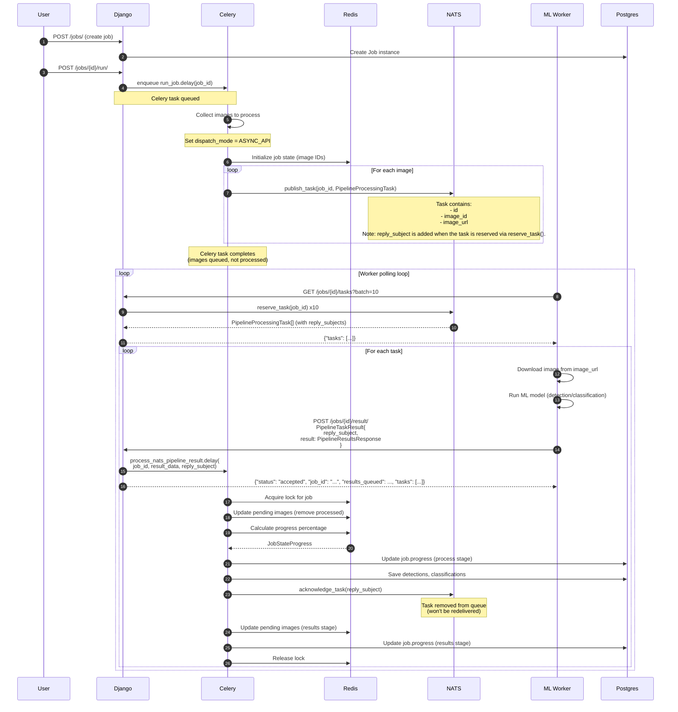

# Async ML Backend Architecture

This document describes how async ML jobs work in the Antenna system, showing the flow of data between Django, Celery workers, NATS JetStream, and external ML processing workers.

## System Components

- **Django**: Web application serving the REST API
- **Postgres**: Database for persistent storage
- **Celery Worker**: Background task processor for job orchestration
- **NATS JetStream**: Distributed task queue with acknowledgment support
- **ML Worker**: External processing service that runs ML models on images
- **Redis**: State management for job progress tracking

## Async Job Flow



## Key Design Decisions

### 1. Asynchronous Task Queue (NATS JetStream)

- **Why NATS?** Supports disconnected pull model - workers don't need persistent connections
- **Visibility Timeout (TTR)**: 300 seconds (5 minutes) - tasks auto-requeue if not ACK'd
- **Max Retries**: 5 attempts before giving up on a task
- **Per-Job Streams**: Each job gets its own stream (`job_{job_id}`) for isolation

### 2. Redis-Based State Management

- **Purpose**: Track pending images across distributed workers
- **Atomicity**: Uses distributed locks to prevent race conditions
- **Lock Duration**: 360 seconds (matches Celery task timeout)
- **Cleanup**: Automatic cleanup when job completes

### 3. Reply Subject for Acknowledgment

- NATS generates unique `reply_subject` for each reserved task
- Worker receives `reply_subject` in task data
- Worker includes `reply_subject` in result POST
- Celery acknowledges via NATS after successful save

This pattern enables:

- Workers don't need direct NATS access
- HTTP-only communication for workers
- Proper task acknowledgment through Django API

### 4. Error Handling

**Worker Errors:**

- Worker posts `PipelineResultsError` instead of `PipelineResultsResponse`
- Error is logged but task is still ACK'd (prevents infinite retries for bad data)
- Failed images tracked separately in Redis
- If worker crashes and never reports a result or error NATS will redeliver after visibility timeout

**Database Errors:**

- If `save_results()` fails, task is NOT ACK'd
- NATS will redeliver after visibility timeout
- Celery task has no retries (relies on NATS retry mechanism)

**Job Cancellation:**

- Celery task terminated immediately
- NATS stream and consumer deleted
- Redis state cleaned up

## API Endpoints

### GET /jobs/{id}/tasks

Worker endpoint to fetch tasks from NATS queue.

**Query Parameters:**

- `batch`: Number of tasks to fetch

**Response:**

```json
{
  "tasks": [
    {
      "id": "123",
      "image_id": "123",
      "image_url": "https://minio:9000/...",
      "reply_subject": "$JS.ACK.job_1.job-1-consumer.1.2.3"
    }
  ]
}
```

### POST /api/v2/jobs/{id}/result/

Worker endpoint to post processing results.

**Request Body:**

```json
{
  "reply_subject": "$JS.ACK.job_1.job-1-consumer.1.2.3",
  "result": {
    // PipelineResultsResponse or PipelineResultsError
  }
}
```
