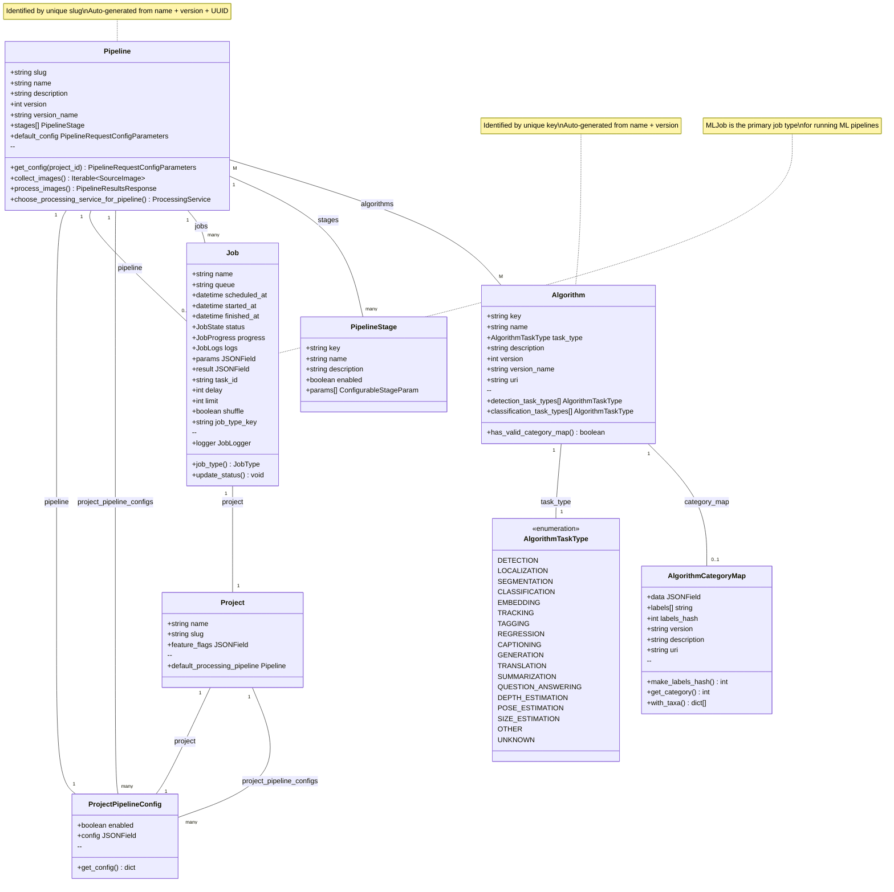

# Object Model Diagram: ML Pipeline System

## Key Relationships Summary

### Core ML Pipeline Flow:
1. **ProcessingService** → registers → **Pipeline** → contains → **Algorithm**
2. **Project** → configures → **Pipeline** through **ProjectPipelineConfig**
3. **Job** → executes → **Pipeline** → uses → **ProcessingService**

### Model Identification:
- **Pipeline**: Identified by unique `slug` (string) - auto-generated from `name + version + UUID`
- **Algorithm**: Identified by unique `key` (string) - auto-generated from `name + version`
- **Job**: Uses standard Django `id` but also has `task_id` for Celery integration

### Stage Management:
- **Pipeline** contains **PipelineStage** objects (for configuration display)
- **Job** tracks execution through **JobProgressStageDetail** objects (for runtime progress)
- Both share the same base **ConfigurableStage** schema

### Algorithm Classification:
- **Algorithm** has task types (detection, classification, etc.)
- Classification algorithms require **AlgorithmCategoryMap** for label mapping
- Detection algorithms don't require category maps

### Job Execution Flow:
1. **Job** is created with a **Pipeline** reference
2. **Pipeline** selects appropriate **ProcessingService**
3. **ProcessingService** executes algorithms and returns results
4. **Job** tracks progress through **JobProgress** and **JobProgressStageDetail**
