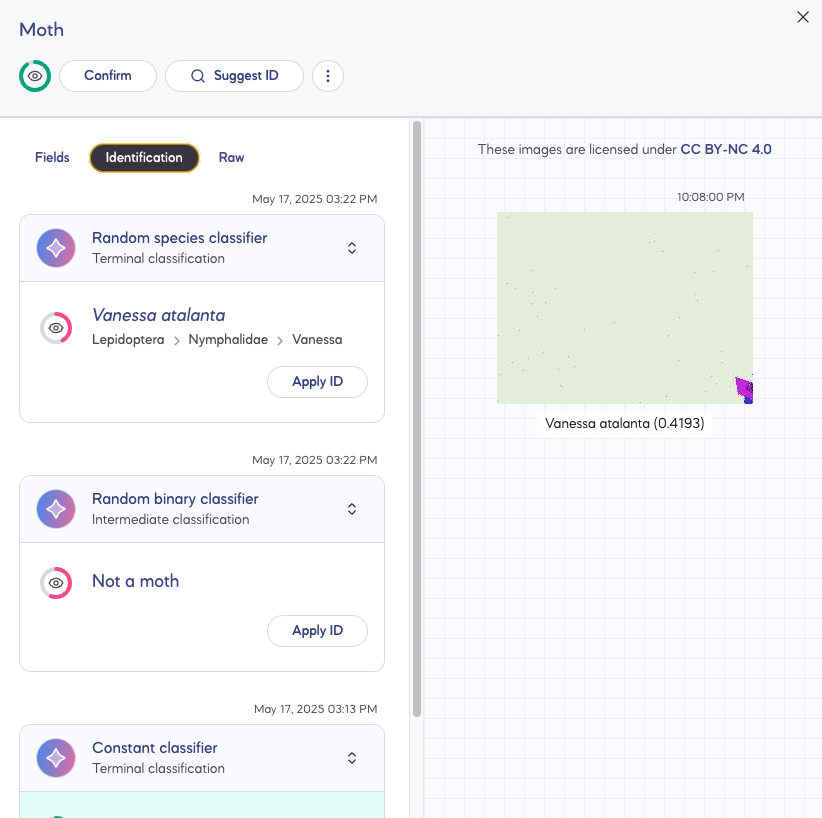
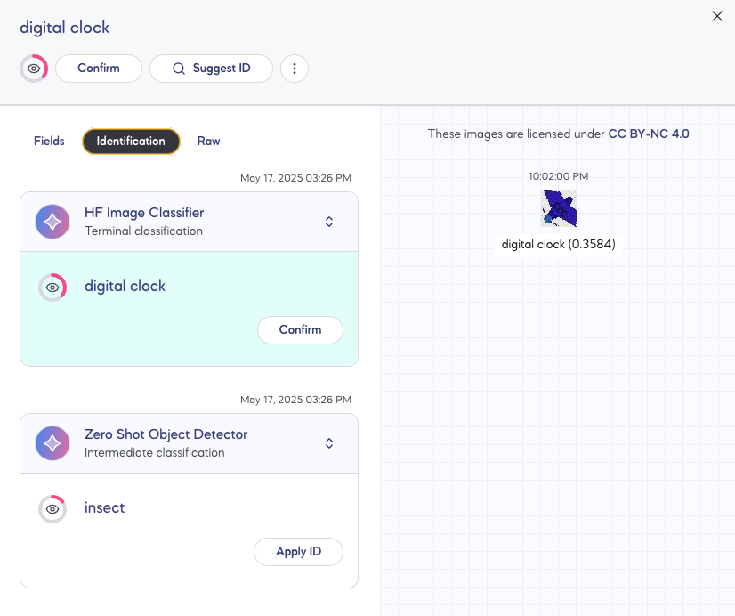
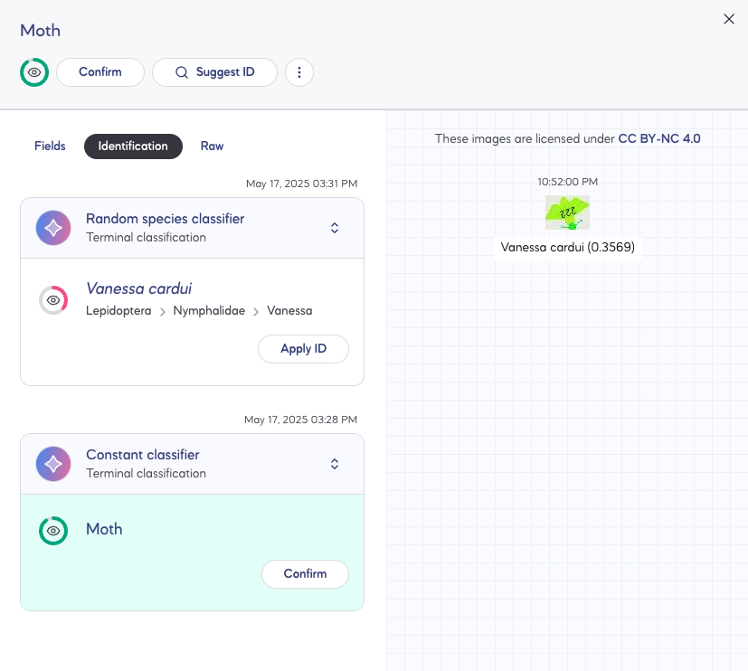

# Set-Up Custom ML Backends and Models

## Background

A processing service or ML backend is a group of pipelines used to process images. In real life, the ML backend can be hosted on a separate server where it handles processing the source images, compiling the models, and running inference.

In this directory, we define locally-run processing services as FastAPI apps. A basic ML backend has the following endpoints:
- `/info`: returns data about what pipelines and algorithms are supported by the service.
- `/livez`
- `/readyz`
- `/process`: receives source images and existing detections via a `PipelineRequest` and returns a `PipelineResponse` containing detections

`processing_services` contains 2 apps:
- `example`: demos how to add custom pipelines/algorithms.
- `minimal`: a simple ML backend for basic testing of the processing service API. This minimal app also runs within the main Antenna docker compose stack.

If your goal is to run an ML backend locally, simply copy the `example` app and follow the steps below.

## Environment Set Up

1. Update `processing_services/example/requirements.txt` with required packages (i.e. PyTorch, etc)
2. Rebuild container to install updated dependencies. Start the minimal and example ML backends: `docker compose -f processing_services/docker-compose.yml up -d --build ml_backend_example`
3. To test that everything works, register a new processing service in Antenna with endpoint URL http://ml_backend_example:2000. All ML backends are connected to the main docker compose stack using the `ml_network`.


## Add Algorithms, Pipelines, and ML Backend/Processing Services

1. Define algorithms in `processing_services/example/api/algorithms.py`.
    - Each algorithm has a `compile()` and `run()` function.
    - Make sure to update `algorithm_config_response`.
    - `compile()` function should handle loading the saved model from cache
2. Define a new pipeline class (i.e. `NewPipeline`) in `processing_services/example/api/pipelines.py`
    Implement/Update:
    - `stages` (a list of algorithms in order of execution -- typically `stages = [Localizer(), Classifier()]`)
        - For dynamic loading of stages, which is useful for passing the pipeline request's `config`, implement `get_stages()`. A good example of this is in the `ZeroShotObjectDetectorPipeline` class.
    - `batch_size` (a list of integers representing the number of entities that can be processed at a time by each stage -- i.e. [1, 1] means that the localizer can process 1 source image a time and the classifier can process 1 bounding box/detection at a time)
    - `config`
3. Implement the `run()` function. Some important considerations:
    - Always run `_get_pipeline_response` at the end of `run()` to get a valid `PipelineResultsResponse`
    - Each algorithm/stage in a pipeline should take a list of `SourceImage`s or `Detection`s and produce a list of `Detection`s (with or without classifications). The class member function `_get_detections()` handles this general stage structure; it batchifys the inputs and produces output detections.
    - 4 example pipelines are already implemented. See the table at the end of the README for examples of what detections from each pipeline look like.
        - `ZeroShotHFClassifierPipeline`
        - `ZeroShotObjectDetectorPipeline`
        - `ZeroShotObjectDetectorWithRandomSpeciesClassifierPipeline`
        - `ZeroShotObjectDetectorWithConstantClassifierPipeline`

4. Add `NewPipeline` to `processing_services/example/api/api.py`

```
from .pipelines import (
    Pipeline,
    ZeroShotHFClassifierPipeline,
    ZeroShotObjectDetectorPipeline,
    ZeroShotObjectDetectorWithConstantClassifierPipeline,
    ZeroShotObjectDetectorWithRandomSpeciesClassifierPipeline,
    NewPipeline
)
...

pipelines: list[type[Pipeline]] = [
    ZeroShotHFClassifierPipeline,
    ZeroShotObjectDetectorPipeline,
    ZeroShotObjectDetectorWithConstantClassifierPipeline,
    ZeroShotObjectDetectorWithRandomSpeciesClassifierPipeline,
    NewPipeline,
]
```
5. Update `PipelineChoice` in `processing_services/example/api/schemas.py` to include the slug of the new pipeline, as defined in `NewPipeline`'s config.

```
PipelineChoice = typing.Literal[
    "zero-shot-hf-classifier-pipeline",
    "zero-shot-object-detector-pipeline",
    "zero-shot-object-detector-with-constant-classifier-pipeline",
    "zero-shot-object-detector-with-random-species-classifier-pipeline",
    "new-pipeline-slug",
]
```
## Demo

## `minimal` Pipelines and Output Images

- `ConstantPipeline` and `ConstantDetectionRandomSpeciesPipeline`



## `example` Pipelines and Output Images

- `ZeroShotHFClassifierPipeline`


- `ZeroShotObjectDetectorWithRandomSpeciesClassifierPipeline` and `ZeroShotObjectDetectorWithConstantClassifierPipeline` (using reprocessing, skips the Zero Shot Object Detector if there are existing detections)

